# Nuri-Quant

<div align="center">

[](https://github.com/researcherhojin/nuri-quant/actions/workflows/main-ci-cd.yml)
[](https://codecov.io/gh/researcherhojin/nuri-quant)
[](LICENSE)

**[API Docs](http://localhost:8001/docs)** | **[Dashboard](http://localhost:3000)** | **[Issues](https://github.com/researcherhojin/nuri-quant/issues)**

</div>

Open-source quantitative investment platform that **proves why you should buy or sell** — not gut feeling. 21 data collectors, 10 specialist agents, and a 10-condition mechanical gate certify every recommendation before it reaches you.

## Pipeline

`make full-scan` runs 8 phases end-to-end. Phases communicate via DB/CSV — no direct imports between phases.

```mermaid
graph LR
    A["📡 <b>A · Collect</b><br/>5 core collectors<br/>stock · macro · signals"]
    B["📊 <b>B · Analyze</b><br/>portfolio · sector · risk"]
    C["🧪 <b>C · Validate</b><br/>signal backtest + scorecard<br/>+ learning memory snapshot"]
    D["🏷️ <b>D · Classify</b><br/>regime × strategy map<br/>+ multi-factor composite"]
    E["🤖 <b>E · Recommend</b><br/>candidates + 10-agent consensus<br/>+ swing scanner"]
    F["🛡️ <b>F · Certify</b><br/>price targets · rebalance<br/>SIEGE 10-gate certification"]
    G["📈 <b>G · Evidence</b><br/>5 Plotly charts"]
    H["🔔 <b>H · Notify</b><br/>Discord · Telegram"]

    A -->|"prices · macro · signals (DB)"| B
    B -->|"portfolio analysis (DB)"| C
    C -->|"signal_results.csv"| D
    D -->|"regime + factors (DB)"| E
    E -->|"recommendations (DB)"| F
    F -->|"CERTIFIED / REJECTED"| G
    G -->|"evidence HTML"| H

    style A fill:#e8eaf6,stroke:#5c6bc0,color:#1a237e
    style B fill:#e8f5e9,stroke:#66bb6a,color:#1b5e20
    style C fill:#fff3e0,stroke:#ffa726,color:#e65100
    style D fill:#e3f2fd,stroke:#42a5f5,color:#0d47a1
    style E fill:#fce4ec,stroke:#ef5350,color:#b71c1c
    style F fill:#f3e5f5,stroke:#ab47bc,color:#4a148c
    style G fill:#e0f2f1,stroke:#26a69a,color:#004d40
    style H fill:#fff9c4,stroke:#fdd835,color:#f57f17
```



<details>
<summary>Phase details (click to expand)</summary>

| Phase | Modules (`make full-scan`) | Input | Output |
|-------|---------|-------|--------|
| **A · Collect** | `stock`, `stock_kr`, `macro`, `technical`, `fear_greed` (5 core; `make collect` runs all 11) | External APIs | `prices`, `macro`, `signals` tables |
| **B · Analyze** | `portfolio`, `sector`, `risk` | DB tables | Portfolio analysis in DB |
| **C · Validate** | `signal_backtest`, `scorecard`, `memory --snapshot` | DB prices | `signal_results.csv`, `signal_scorecard.csv`, `strategy_memory` |
| **D · Classify** | `strategy_map`, `composite` | CSV + DB | Regime allocation, factor scores in DB |
| **E · Recommend** | `candidates`, `consensus` (10 agents), `swing.scanner` | DB + CSV stats | `recommendations` table |
| **F · Certify** | `price_targets`, `rebalance_advisor`, `certification` (SIEGE 10-gate) | DB recommendations | CERTIFIED / REJECTED |
| **G · Evidence** | `evidence_charts` | DB + certification | 5 Plotly HTML files in `data/reports/` |
| **H · Notify** | `notify_scan_result` | Evidence HTML | Discord/Telegram message |

</details>

## Tech Stack

**Data Collection**<br/>


> 21 collectors + 11 external sources (TipRanks · Dataroma · CBOE · CoinGecko · Reddit/WSB · ARK · ETF.com · Macrotrends · TradingEconomics · ShortInterest · FINVIZ)

**Quantitative Analysis**<br/>


**Backend**<br/>


> 60 endpoints · 27 tables (v11 migrations) · SSE streaming · JWT + bcrypt + slowapi rate limiting

**Frontend**<br/>


> 15 pages · Dark mode · Palantir-style Operator Cockpit · FreshnessBar · Pipeline Control

**LLM**<br/>


**Testing & CI/CD**<br/>


> 2,928 backend tests (98%) + 585 frontend unit + 21 E2E tests (95%) · parallel via xdist/vitest/playwright

## Getting Started

### Prerequisites (macOS Apple Silicon)

```bash
# 1. Homebrew (if not installed)
/bin/bash -c "$(curl -fsSL https://raw.githubusercontent.com/Homebrew/install/HEAD/install.sh)"

# 2. System dependencies
brew install uv ta-lib

# 3. Node.js 22 (fnm recommended)
brew install fnm
fnm install 22 && fnm use 22
echo 'eval "$(fnm env --use-on-cd)"' >> ~/.zshrc
```

### Setup

```bash
# Clone
git clone https://github.com/researcherhojin/nuri-quant.git
cd nuri-quant

# Backend
make setup                 # uv venv + deps + DB init + portfolio import

# Frontend
cd frontend && npm ci && cd ..

# Config
cp .env.example .env                                    # edit API keys (all optional)
cp config/portfolio.example.yaml config/portfolio.yaml  # edit your holdings

# Verify
make test                  # 2,928 backend tests
cd frontend && npx vitest run && cd ..  # 585 frontend tests
```

### Existing environment migration

If migrating from another machine (e.g., Mac Mini → MacBook), use `scripts/sync_dev.sh`. It rsyncs gitignored state (`.env`, `config/portfolio.yaml`, `data/portfolio.db`) plus Claude Code state (`~/.claude/projects/...` conversation history + memory + global skills/plugins/settings) — caches and runtime state are excluded.

```bash
# One-time setup on the receiving machine
sudo systemsetup -setremotelogin on             # both Macs
ssh-copy-id ehbebe@<other-mac>.local            # passwordless SSH
echo "DEV2_HOST=<other-mac>.local" >> .env

# Recurring sync (run on whichever machine has the freshest state)
scripts/sync_dev.sh push                        # this laptop → other
scripts/sync_dev.sh pull                        # other → this laptop
scripts/sync_dev.sh push --with-reports         # include data/reports/ (~136MB)
scripts/sync_dev.sh push --no-claude            # project files only, skip ~/.claude
```

The script does a SQLite WAL checkpoint before transfer, prompts before destructive overwrites, and uses `rsync --partial` for resumable delta transfers. Operate one machine at a time to avoid DB conflicts.

### Mac mini receiver — auto pull from MBP

When the MacBook is portable and Mac mini stays as the always-on receiver, install the launchd auto-pull agent on Mac mini once. After this, every `git push` from MBP is reflected on Mac mini within 5 minutes.

```bash
# On Mac mini, one-time setup
cp scripts/com.nuri-quant.autopull.plist ~/Library/LaunchAgents/
launchctl load ~/Library/LaunchAgents/com.nuri-quant.autopull.plist

# Verify (RunAtLoad=true triggers immediately)
launchctl list | grep nuri-quant.autopull
tail -f ~/Library/Logs/nuri-quant-autopull.log
```

The agent runs `scripts/auto_deploy.sh` every 5 minutes: fetch → if `origin/main` advanced, ff-only merge → analyze the diff and log warnings if `pyproject.toml`/`uv.lock` (run `uv sync`), `frontend/package*.json` (run `npm ci`), or `nuri/core/db.py` (run migrate) changed → deploy hook (placeholder for restarting 24/7 services). It is safe-by-default: refuses non-fast-forward merges, refuses to touch a dirty worktree, and silently retries on network failures.

### Run

```bash
make start                 # API (:8001) + Dashboard (:3000)
make full-scan             # 8-phase pipeline: collect → certify → notify
make quick-scan            # Fast 4-step: collect → analyze → consensus → targets (~2 min)
```

### Useful Commands

```bash
make collect               # 11 collectors (all external data)
make consensus             # 10-agent consensus + price targets
make certify               # SIEGE 10-condition certification
make test                  # pytest (2,928 tests, parallel via xdist)
make lint                  # ruff check
cd frontend && npm run test  # vitest (585 tests)

# Single test
.venv/bin/python -m pytest tests/test_db.py::TestUpsertPrices::test_insert_and_query -v
```

## Key Features

- **Evidence-based decisions** — 8,000+ historical trade backtests across 15 signals validate every recommendation
- **10-regime market classification** — 6 base (bull/bear/sideways × high/low vol) + 4 special (recovery, euphoria, stagflation, sector rotation)
- **10 specialist agents** — Weighted consensus voting with SSE reasoning trace. Risk agent holds veto power (SELL + confidence ≥ 80 overrides all)
- **SIEGE certification** — [10-condition mechanical gate](https://github.com/nutshells3/Swarm-Intelligence-Engine-with-Gated-Execution). Single failure → REJECTED
- **Investment rules UI** — Take-profit highlights (emerald/amber), VIX half-position warning, sell priority badges. O'Neil (CAN SLIM) + Minervini (SEPA), 3:1 reward-to-risk
- **Pipeline observability** — [Palantir Foundry](https://www.palantir.com/docs/foundry/data-lineage/overview)-style Data Health + [Dagster](https://docs.dagster.io/guides/observe/asset-freshness-policies) Freshness SLA
- **Superinvestor tracking** — SEC 13F filings (Buffett, Dalio, NPS Korea, Key Square, Strive)
- **Portfolio onboarding** — Dashboard UI for CRUD, CSV import/export, sample portfolio, YAML reverse sync
- **LLM reports** — Qwen3.5 evidence-based analysis with SIEGE certification

## Architecture

```
nuri/
├── core/          # DB gateway (sole sqlite3 importer), rules, events, freshness, timezone
├── collectors/    # 21 modules — BaseCollector pattern (collect → save → run)
├── analysis/      # Portfolio, risk, sector, charts, rebalance advisor, evidence
├── quant/
│   ├── regime/    # 10-regime classifier + strategy map
│   ├── validation/# Signal/superinvestor/analyst backtests + scorecard
│   ├── backtest/  # VectorBT engine + grid search optimizer
│   └── factors/   # Multi-factor scoring (momentum, value, quality)
├── trading/
│   ├── agents/    # 10 specialist agents + weighted consensus
│   ├── engine/    # SIEGE: gate, conflicts, learning memory
│   ├── strategy/  # Long/Short, mean-reversion, pairs trading
│   ├── recommend/ # Candidates, price targets, rebalance, tracker
│   ├── swing/     # Market-wide scanner + entry/exit rules
│   └── execution/ # Broker interface (Alpaca paper + DryRun)
├── api/           # FastAPI REST (60 endpoints) + SSE streaming
├── alerts/        # Discord + Telegram notifications
└── llm/           # Ollama LLM reports + SIEGE certification
```

**Design decisions:**
- **DB as sole integration point** — `nuri/core/db.py` is the only `sqlite3` importer. All modules use `query()`, `query_df()`, `upsert_*()`. Tests inject `tmp_path` for isolation.
- **Phase isolation** — 8 pipeline phases never import each other. Data flows through DB tables and CSV files only.
- **Config-driven rules** — Investment rules in `config/rules.yaml`, agent thresholds in `config/agents.yaml`. Code executes rules, never defines them.
- **Zero-cost stack** — SQLite (not Postgres), Ollama (not OpenAI), OpenBB + yfinance (not Bloomberg). No paid dependencies.

## Investment Rules

Defined in `config/rules.yaml`. Based on [O'Neil (CAN SLIM)](https://www.investors.com/) + [Minervini (SEPA)](https://www.minervini.com/) + [Disposition Effect research (Shefrin 1985)](https://onlinelibrary.wiley.com/doi/10.1111/j.1540-6261.1985.tb05002.x).

| | Growth | Value | Swing |
|---|--------|-------|-------|
| **Stop-Loss** | -7% | -10% | -5% |
| **Take-Profit 1** | +20% → sell 50% | +15% → sell 50% | +5% → sell 50% |
| **Take-Profit 2** | +40% → sell 25% | +30% → sell 25% | +10% → sell all |
| **Remainder** | Trailing -15% | Trailing -15% | — |

**Core Rules:**
- VIX > 30 → block all new buys (win rate collapses)
- Buy checklist: TipRanks ≥ Moderate Buy, superinvestors ≥ 3, PE < 100, revenue > $0, multi-factor top 50%
- Sell priority: Leveraged ETF → stop-loss breach → no superinvestors → position limit → sector limit

## References

| Source | Application |
|--------|-------------|
| [SIEGE Engine](https://github.com/nutshells3/Swarm-Intelligence-Engine-with-Gated-Execution) | 10-condition gate, certification, event journal |
| [Palantir Foundry](https://www.palantir.com/docs/foundry/data-lineage/overview) | Data Health, pipeline monitoring |
| [Dagster](https://docs.dagster.io/guides/observe/asset-freshness-policies) | Asset freshness PASS/WARN/FAIL |
| [TradingAgents](https://github.com/TauricResearch/TradingAgents) | Multi-agent consensus pattern |
| [O'Neil — CAN SLIM](https://www.investors.com/) | Stop-loss -7%, take-profit +20%/+40% |
| [Minervini — SEPA](https://www.minervini.com/) | Trailing stop, 3:1 reward-to-risk |

## License

[GNU Affero General Public License v3.0](LICENSE)
