# Nuri-Quant

<div align="center">

[](https://github.com/researcherhojin/nuri-quant/actions/workflows/main-ci-cd.yml)
[](https://codecov.io/gh/researcherhojin/nuri-quant)
[](LICENSE)

</div>

An open-source quant platform that **proves the evidence behind every investment decision**.

Every BUY/SELL recommendation runs through a **collect → analyze → consensus → certify → track** pipeline. Each decision is recorded with its market context and per-agent reasoning, then automatically scored against actual outcomes after 30/60/90 days. The system gets more accurate as outcomes accumulate — agent weights adjust within a ±30% band based on hit rate.

## Architecture

```mermaid
flowchart LR
    CFG[/"config/*.yaml<br/>rules · agents · signals · universe · siege_gates"/]:::config

    subgraph Pipeline["5-phase decision pipeline · DB-only coupling"]
        direction LR
        A(["① Collect<br/>25 collectors<br/>US · KR · macro · news · 13F · ARK"]):::collect
        B(["② Analyze<br/>22 signals (20 actionable + 2 shadow)<br/>10 regimes · 4 factors<br/>15 macro event categories"]):::analyze
        C(["③ Consensus<br/>10 agents · weighted vote<br/>risk-agent veto on FLAT"]):::consensus
        D(["④ Certify<br/>SIEGE v2 · per-asset-class expansion<br/>5 accounts × 5 asset classes"]):::certify
        E(["⑤ Track<br/>outcome 30d / 60d / 90d<br/>→ agent weight drift"]):::track

        A -- "prices · fundamentals<br/>macro · news · 13F flows" --> B
        B -- "signal_results · factors<br/>regimes · macro_events" --> C
        C -- "recommendations<br/>agent_verdicts" --> D
        D -- "certifications · conditions<br/>evidence + portfolio_hash" --> E
        E -. "agent weight drift (±30%)" .-> C
    end

    DB[("SQLite WAL · 32 tables<br/>pipeline_events · certifications<br/>freshness SLA · audit trail")]:::db

    CFG -. "policies<br/>(YAML loaders in nuri/core)" .-> Pipeline
    Pipeline -. persist .-> DB

    classDef config fill:#1e293b,stroke:#64748b,color:#e2e8f0
    classDef collect fill:#064e3b,stroke:#10b981,color:#ecfdf5
    classDef analyze fill:#1e3a8a,stroke:#3b82f6,color:#dbeafe
    classDef consensus fill:#581c87,stroke:#a855f7,color:#f3e8ff
    classDef certify fill:#7c2d12,stroke:#f97316,color:#ffedd5
    classDef track fill:#831843,stroke:#ec4899,color:#fce7f3
    classDef db fill:#0f172a,stroke:#334155,color:#cbd5e1
```



Phases never import each other — they communicate through SQLite tables and CSV files. Rerun an upstream phase and downstream refreshes automatically. Policies live in `config/*.yaml`, never hardcoded. Per-phase detail and DB schema: [`docs/ARCHITECTURE.md`](docs/ARCHITECTURE.md). SIEGE certification spec: [`docs/SIEGE_V2.md`](docs/SIEGE_V2.md).

### Architectural principles

The system rests on five enduring decisions. Recent feature additions and tuning history live in [`docs/STRATEGY.md`](docs/STRATEGY.md) §3 (Architecture decisions) and `git log`.

| # | Principle | What it means in practice |
|---|-----------|---------------------------|
| 1 | **Sole SQLite gateway** | `nuri/core/db.py` is the only `sqlite3` importer (hook-enforced — every other module uses `query()` / `upsert_*()` / `get_db()` with optional `db_path=` for test isolation). 32 tables, WAL mode. |
| 2 | **Config over code** | Stop-loss thresholds, agent weights, signal metadata, SIEGE gate policies — all in `config/*.yaml`. Changing a rule or adding a market means editing YAML, never Python. |
| 3 | **Loose phase coupling** | Pipeline phases communicate via DB tables / CSV only. No cross-phase imports. Re-run any upstream phase and downstream consumers refresh. |
| 4 | **3-D SIEGE certification** | Gates apply per `Account (strategy)` × `Asset Class (us_equity / kr_equity / kr_index / commodity / bond)` × `Execution Market`. 1 error-grade fail → REJECTED, no manual override. Inspired by [nutshells3/SIEGE](https://github.com/nutshells3/Swarm-Intelligence-Engine-with-Gated-Execution). |
| 5 | **Alpha vs portfolio action axes** | `recommendations` carries orthogonal `alpha_action ∈ {LONG, SHORT, FLAT}` and `portfolio_action ∈ {REBALANCE, TRIM, HEDGE, NONE}`. Concentration violations emit `portfolio_action=REBALANCE` only — never urgent SELL. Stop-loss breach is the only mechanical that emits `alpha_action=FLAT`. |

### Code layout (by pipeline phase)

| Phase | Path | Role |
|-------|------|------|
| **Collect** | `nuri/collectors/` | 25 collectors (BaseCollector pattern). US: yfinance / OpenBB. KR: pykrx + KOSPI / KOSDAQ index. Macro: FRED / yfinance. News: GoogleNews RSS. KIS Open API: `kis_realtime` (잔고/시세) + `kis_analyst_opinion` (애널리스트 의견). |
| **Analyze** | `nuri/quant/regime/` | Regime classifier (10 regimes), macro score (9 indicators), event score (15 categories). |
|  | `nuri/quant/validation/` | Signal backtest engine over `config/signals.yaml` (20 actionable + 2 shadow precursors), superinvestor / analyst backtest, scorecard. |
|  | `nuri/quant/factors/` | Multi-factor scoring — momentum / value / quality / composite. |
| **Consensus** | `nuri/trading/agents/` | 10 specialist agents + weighted vote. Risk-agent veto on `alpha_action==FLAT`. Korean Market Agent reads `macro_events`. |
| **Certify** | `nuri/trading/engine/` | SIEGE v2 (3-D) — per-asset-class expansion, conflict detection, evidence trail, learning memory. |
|  | `nuri/trading/recommend/` | Candidates, price targets, rebalance advisor, outcome tracker (30 / 60 / 90d). |
| **Serve** | `nuri/api/` | FastAPI REST + SSE on **:8001** (69 endpoints incl. `/actions`, `/opportunities`, `/market-context`, `/coverage`). Swagger at `/docs`. |
|  | `frontend/` | Next.js 16 + React 19 + Tailwind 4 + shadcn/ui on **:3000** (17 routes, Action-First dashboard, dark theme). |
| **Foundation** | `nuri/core/` | `db.py` (sole SQLite gateway) · `events.py` (journal) · `freshness.py` (SLA) · `timezone.py` (KST) · `rules.py` · `signal_config.py` · `axis.py` (alpha/portfolio helpers). |
|  | `config/*.yaml` | `rules` · `agents` · `signals` · `universe` · `stock_types` · `portfolio` (gitignored) · `kis/` (gitignored credentials). |
| **LLM gateway** | `nuri/llm/` | `openai_client.py` (sole external entry, audit-logged) · event classifier · LLM daily report (OpenAI primary, llama.cpp / Ollama fallback). |

## Dashboard

The dashboard at `:3000/` answers **"what should I do today?"** — an Action-First design that prioritizes actionable intelligence over raw data. Pension/IRP holdings are filtered out (monthly rebalancing, not daily).

1. **Hero** — 4 stats: 총 자산 · 오늘 P&L · 누적 수익률 · 승률
2. **System Health** — 4 cards: SIEGE score · Regime · Macro score · Data freshness (links to detail pages)
3. **Macro Events** — Recent high-impact news with 한국어 category labels (지정학/실적/유가 등), deduplicated
4. **Action Items** — 🔴 즉시 실행 (SIEGE violations, stop-loss) · 🟡 오늘 확인 (take-profit, short squeeze) · ✅ 유지 (compact chips)
5. **Market context strip** — VIX · 심리 · 경제 · 실제/권장 비중
6. **Composition** — Recharts donut + tabs (자산/섹터/계좌) + rich legend
7. **Holdings table** — sorted by `positionPct` desc, top 8 + expand toggle
8. **Opportunity Explorer** — top 3 non-portfolio tickers with pros/cons/verdict + "10-Agent 분석" button + /scan link

Korean tickers show names (삼성전자) instead of numbers (005930.KS). For row-level decisions see `/portfolio` and `/advisor`.

## Tech Stack

| Layer | Stack |
|-------|-------|
| **Backend** | Python 3.12 · FastAPI · SQLite (WAL) · uv |
| **Frontend** | Next.js 16 · React 19 · Tailwind 4 · shadcn/ui |
| **Quant** | pandas · TA-Lib · VectorBT · OpenBB · Riskfolio-Lib · yfinance |
| **CI/CD** | GitHub Actions · pytest (xdist + shard) · Vitest · Playwright · Ruff · Codecov · Trivy |

### LLM (optional, off by default)

All LLM integrations are **wired but inactive** unless you set the corresponding environment variable. The system runs without any LLM and falls back to regex/rule-based logic. See [`docs/STRATEGY.md`](docs/STRATEGY.md#443-외부-llm-egress-policy-152) §4.4.3 for the egress policy.

| Provider | Purpose | Activation | Data class |
|----------|---------|------------|------------|
| **OpenAI gpt-5.4-nano** | RSS headline classification | `OPENAI_API_KEY` set | Tier 0 (public news). ~$3.51/yr at 100 headlines/day |
| **OpenAI gpt-5.4-nano** | Daily LLM report (`make report-llm`) — primary since 2026-04-14 | `OPENAI_API_KEY` + `OPENAI_ZDR_APPROVED=1` | Tier 2 (portfolio) — ZDR required. ~$0.10/yr at 1 call/day |
| **llama.cpp** (local) | Daily LLM report fallback | `LLAMA_MODEL_PATH` set | Tier 2 — local only |
| **Ollama** (local) | Daily LLM report fallback | `OLLAMA_HOST` set + Ollama running | Tier 2 — local only |

The egress policy is enforced by `nuri/llm/openai_client.py`: a single wrapper logs every external call to the `external_llm_calls` table (timestamp/model/tokens, **no content**), and `NURI_DISABLE_EXTERNAL_LLM=1` raises immediately.

## Getting Started

```bash
# Prerequisites: Python 3.12, uv, ta-lib, Node 22
brew install uv ta-lib fnm && fnm install 22

# Setup
git clone https://github.com/researcherhojin/nuri-quant.git && cd nuri-quant
make setup                                              # backend (uv venv + deps + DB init + git hooks)
cd frontend && npm ci && cd ..                          # frontend
cp .env.example .env                                    # API keys (all optional)
cp config/portfolio.example.yaml config/portfolio.yaml  # your holdings (gitignored)

# Run
make start          # API (:8001) + Dashboard (:3000)
make full-scan      # 8-phase pipeline end-to-end
make consensus      # 10-agent analysis + decision recording
make certify        # SIEGE v2 certification (asset-class per-expansion)
make scan           # Daily scan (us_core, 85 tickers)
make scan-extended  # Weekly scan (us_core + S&P 500, 543 tickers)
```

### Test commands

```bash
make test       # full suite (3,381 backend across 153 files + 984 frontend across 67 files + 38 e2e)
make test-fast  # backend only, slow tests excluded (~24s)
make test-slow  # backend slow tests only (LLM gather_context, scheduler)
```

### Production deployment

The reference operator setup runs across two Apple Silicon Macs (MBP dev → Mac mini 24/7 receiver) with `make deploy-mini` 1-command sync. Full operator runbook (topology, deploy steps, scheduler control, recovery): [`docs/OPERATIONS.md`](docs/OPERATIONS.md).

## Investment Rules

Rules live in `config/rules.yaml` (loaded via `nuri/core/rules.py`); code never hardcodes them. Sources: O'Neil (CAN SLIM), Minervini (SEPA), Shefrin & Statman (1985, 처분효과 / disposition effect).

| Strategy | Stop-loss | Risk profile |
|----------|-----------|-------|
| `core` | -7% | Default — strict O'Neil discipline |
| `active` | -10% | Cut losses early, auto-trailing-stop arms at +15% |
| `swing` | -15% | Short-term 5–20d rotations |
| `long_term` | -20% | Buy-and-hold ETFs |
| `pension` | -30% | Long-horizon retirement allocations |

Take-profit ladders (growth: +20% / +40% / -15% trailing; value: +15% / +30% / -15%) and hard gates (VIX > 30 blocks new buys, SIEGE v2 certification rejects on any error-grade gate fail) apply on top. Full tables with per-class thresholds and the full rationale: [`docs/STRATEGY.md §3.4-§3.5, §6`](docs/STRATEGY.md) and [`config/rules.yaml`](config/rules.yaml).

## References

| Source | Usage |
|--------|-------|
| [SIEGE Engine](https://github.com/nutshells3/Swarm-Intelligence-Engine-with-Gated-Execution) | Policy-driven gate certification (v2: asset-class expansion), safety lattice, iterative learning |
| [OAE](https://github.com/nutshells3/orchestration-assurance-engine) | Claim trace, evidence lineage, audit pipeline |
| [safeslice](https://github.com/nutshells3/safeslice) | Statistical reliability bounds, witness cliff detection (Phase 4 target) |
| [fwp](https://github.com/nutshells3/fwp) | Protocol seam pattern, governed job lifecycle |
| [Palantir Foundry](https://www.palantir.com/docs/foundry/data-lineage/overview) | Decision Intelligence pattern |
| [Dagster](https://docs.dagster.io/guides/observe/asset-freshness-policies) | Freshness SLA (PASS/WARN/FAIL) |
| [TradingAgents](https://github.com/TauricResearch/TradingAgents) | Multi-agent consensus pattern |
| [VectorBT](https://vectorbt.dev/) | Vectorized backtest |
| [Riskfolio-Lib](https://riskfolio-lib.readthedocs.io/) | Portfolio optimization |
| [OpenBB](https://docs.openbb.co/) | Unified financial data abstraction |

## Further Documentation

- [`docs/STRATEGY.md`](docs/STRATEGY.md) — project philosophy, architectural decisions, investment rules, roadmap
- [`docs/KIS_INTEGRATION.md`](docs/KIS_INTEGRATION.md) — KIS (Korea Investment & Securities) Open API integration
- [`CLAUDE.md`](CLAUDE.md) — Claude Code agent guide (commands, architecture, gotchas)
- [`CONTRIBUTING.md`](CONTRIBUTING.md) — development workflow, PR discipline
- [`SECURITY.md`](SECURITY.md) — security policy, LLM egress rules, credential handling

## License

[AGPL-3.0](LICENSE)
