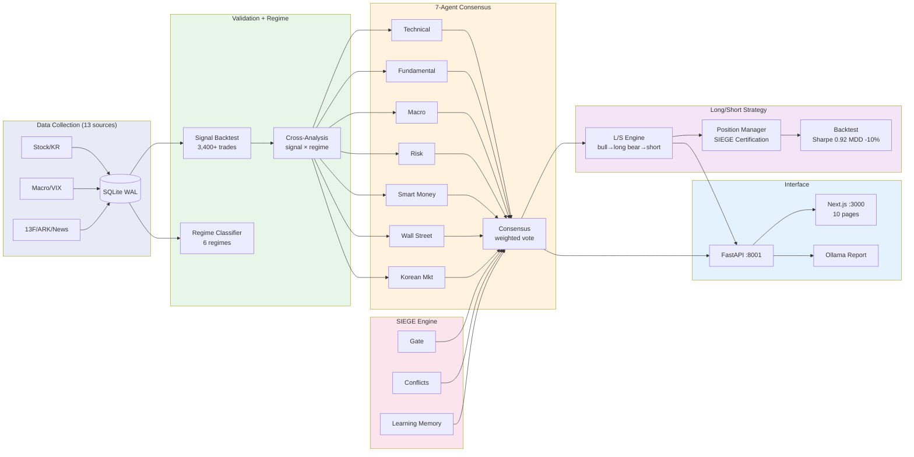

# Nuri-Quant

<div align="center">

[](https://www.python.org/)
[]()
[](LICENSE)
[](https://www.sqlite.org/)

**[Docs](CLAUDE.md)** | **[API Swagger](http://localhost:8001/docs)** | **[Dashboard](http://localhost:3000)** | **[Issues](https://github.com/researcherhojin/nuri-quant/issues)**

</div>

Open-source quant investment platform. Collects data from 13 free sources, validates signals with backtesting, classifies market regimes, and recommends trades via 7-agent consensus — with a Next.js dashboard and LLM-powered reports.

## Tech Stack

**Data**: OpenBB, yfinance, pykrx, edgartools, TA-Lib
**Quant**: pandas, Riskfolio-Lib, VectorBT, QuantStats, Plotly
**Interface**: FastAPI, Next.js 16, shadcn/ui, Tailwind 4, Ollama
**Infra**: SQLite (WAL), APScheduler, Discord, GitHub Actions CI (lint + test + tsc + PR checks + Trivy security scan)

## Getting Started

```bash
# Prerequisites: Python 3.12, uv, brew install ta-lib
git clone https://github.com/researcherhojin/nuri-quant.git && cd nuri-quant
make setup                                    # venv + deps + DB init + portfolio import

# Collect 5 years of data
python -m nuri.collectors.stock --period 5y   # US stocks (OpenBB)
python -m nuri.collectors.stock_kr --days 1825 # Korean stocks (pykrx)
make collect                                  # macro/technical/fear&greed/ARK

# Validate + analyze + recommend
make validate                                 # signal backtest + scorecard
make regime                                   # market regime + strategy map
make recommend                                # candidates + tracking
make verify                                   # full report → data/reports/YYYY-MM-DD/
```

### Commands

```bash
# Trading
make consensus      # 7-agent analysis on portfolio
make scan           # market-wide scanner (89 US tickers)
make swing          # scan + agent consensus → entry
make strategy       # L/S strategy + regime monitor
make backtest-ls    # 5.4yr backtest + Monte Carlo
make optimize       # grid search parameter tuning
make mean-reversion # mean-reversion scan + backtest
make pairs          # pairs trading scan + backtest

# Data
make wallstreet     # analyst ratings + earnings + insider
make filings        # SEC 10-K key metrics

# Infrastructure
make lint           # ruff check
make test           # 161 unit tests
make gate           # pipeline readiness check
make start          # API(:8001) + Dashboard(:3000)
make pre-deploy     # config/DB/gate/frontend/port 검증
make ports          # port status (8001/3000/11434)
make update-counts  # README 테스트 수 자동 업데이트
```

## Architecture

```
nuri/
├── core/              # DB (sole sqlite3 entry), rules
├── collectors/        # 16 data collectors (BaseCollector pattern)
├── analysis/          # Pure analysis: portfolio, risk, sector, charts, sentiment
├── quant/             # Quantitative pipeline
│   ├── regime/        # 6-regime classifier, macro score, strategy map
│   ├── validation/    # Signal/superinvestor/analyst backtest, scorecard
│   ├── backtest/      # VectorBT engine, grid search optimizer
│   └── factors/       # Multi-factor scoring (momentum, value, quality)
├── trading/           # Trading execution
│   ├── agents/        # 7 agents + weighted consensus
│   ├── engine/        # SIEGE: gate, conflicts, learning memory
│   ├── strategy/      # L/S, mean-reversion, pairs trading
│   ├── recommend/     # Candidates, rebalance, tracker
│   ├── swing/         # Market-wide scanner
│   └── execution/     # Broker interface (Alpaca paper + DryRun)
├── api/               # FastAPI REST + SSE stream
├── alerts/            # Discord daily report
└── llm/               # Ollama LLM report
```



## Key Features

- **7-Agent Consensus** — Technical, Fundamental, Macro, Risk, Smart Money, Wall Street, Korean Market agents. Weighted voting with risk agent veto power
- **Long/Short Strategy** — Regime-based direction switching with SIEGE Certification Gate. Backtest: +62% return, Sharpe 0.92, MDD -10%
- **SIEGE Engine** — Gated Execution (10 conditions), Conflict Detection (BUY+SELL → HOLD), Learning Memory (drift auto-penalty)
- **Parameter Optimization** — Grid search for RSI/MACD/BB thresholds and holding periods
- **Multi-Strategy** — L/S regime switching, Mean-Reversion (BB+RSI), Pairs Trading (correlation Z-score)
- **Dashboard** — Next.js 16 with SSE real-time updates, Recharts price charts, portfolio management, mobile responsive

## Investment Rules

Defined in `config/rules.yaml`, enforced across all modules:

| Rule | Limit |
|------|-------|
| Single position | ≤ 15% |
| Sector exposure | ≤ 35% |
| Per-stock stop loss | -20% |
| Portfolio stop | -10% drawdown |
| Leverage ETF ban | TSLL, TQQQ, SQQQ, UPRO, SPXU |

## Completed (2026-03-27)

<details>
<summary>이번 스프린트에서 완료한 작업 (클릭하여 펼치기)</summary>

**버그 수정**: API URL 8000→8001, Badge→StatusBadge 통일, 13개 모듈 stale docstring 경로, deprecated pandas `fill_method`

**신규 기능**: 7-agent 체계 (Korean Market Agent), Mean-Reversion + Pairs Trading 전략, 파라미터 Grid Search 옵티마이저, Alpaca 페이퍼 트레이딩 스켈레톤, SSE 실시간 스트림 + LiveIndicator, Recharts 가격 차트, 포트폴리오 관리 UI, 대시보드 로그인 인증, 에러 바운더리, 모바일 반응형, 동적 에이전트 가중치 (recommendations 기반)

**인프라**: ruff 린터, GitHub Actions CI (lint + test + tsc + PR checks + Trivy 보안 스캔), DB 마이그레이션 버전 관리, API 통합 테스트 25건, pre-deploy 검증 스크립트, port 관리, 테스트 수 자동 업데이트

**리팩토링**: 모듈 구조 재설계 (`quant/`, `trading/engine/`), 레거시 shim 삭제, MIT→Apache 2.0, CLAUDE.md + README 전면 재작성

**테스트**: 105 → 161 tests (56 추가)
</details>

## Roadmap — Security & Production Readiness

보안 감사 (OWASP + STRIDE) 및 아키텍처 리뷰 결과 기반.

### CRITICAL (Week 1)

- [ ] **API 인증 미들웨어** — FastAPI 전 엔드포인트에 JWT/API key 인증. 현재 POST/DELETE 포함 모든 라우트가 무인증
- [ ] **비밀번호 해싱** — 평문 비교 → bcrypt + constant-time compare. 쿠키에 해시 토큰 사용
- [ ] **Rate Limiting** — `slowapi` 도입. `/api/auth` 5회/15분, DELETE 10회/시간, GET 1000회/분
- [ ] **CORS 강화** — `allow_headers=["*"]` 제거, 프로덕션 도메인만 허용
- [ ] **브로커 입력 검증** — ticker whitelist, quantity 범위, side/type Enum 제한

### HIGH (Week 2)

- [ ] **감사 로깅** — 모든 쓰기 작업에 타임스탬프 + 사용자 ID 기록 (append-only audit 테이블)
- [ ] **Monte Carlo 수정** — 현재 regime 순서 랜덤화 → block bootstrap (20일 블록)로 변경
- [ ] **Partial fill 처리** — Alpaca 응답에서 filled_qty/unfilled_qty 분리 추적
- [ ] **DB 마이그레이션 원자성** — `BEGIN IMMEDIATE` 트랜잭션으로 DDL + version insert 묶기
- [ ] **수집 실패 처리** — >10% ticker 실패 시 partial save 거부 (asymmetric data age 방지)
- [ ] **보안 헤더** — Next.js에 CSP, X-Frame-Options, HSTS 추가. 쿠키에 SameSite=Strict

### MEDIUM (Week 3-4)

- [ ] **데이터 신선도 검증** — 레짐 분류 전 SPY 데이터 age 체크 (max 24h)
- [ ] **적응형 히스테리시스** — VIX 25+ 시 5일→2일로 레짐 전환 속도 증가
- [ ] **한국 에이전트 검증** — FX 임계값(1400/1250) 회귀분석 기반 캘리브레이션
- [ ] **SSE 캐시** — DB 직접 조회 → 메모리 캐시 (60초 갱신)로 변경
- [ ] **에러 응답 정리** — 내부 에러 메시지 클라이언트 노출 차단 (generic HTTP 500 반환)
- [ ] **차트 고도화** — Recharts에 RSI/MACD/BB 오버레이 + 시그널 마커
- [ ] **알림 확장** — Telegram 봇, 레짐 전환 push 알림

## License

[Apache License 2.0](LICENSE)
