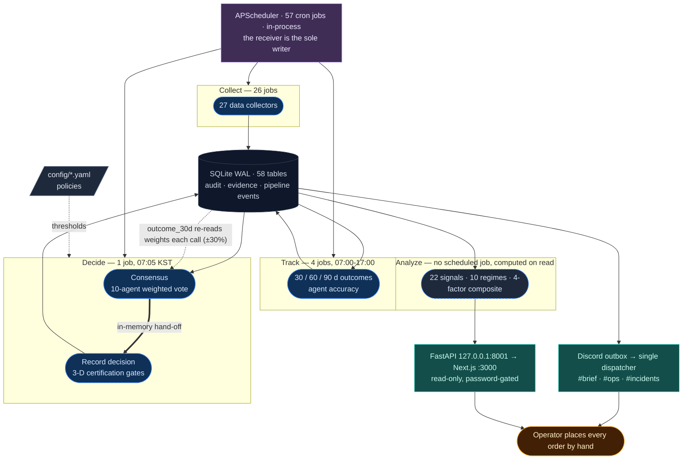

# Nuri-Quant

<div align="center">

[](https://github.com/researcherhojin/nuri-quant/actions/workflows/main-ci-cd.yml)
[](https://codecov.io/gh/researcherhojin/nuri-quant)
[](LICENSE)

**Quant platform that proves the evidence behind every investment decision.**

</div>

Every BUY / SELL recommendation moves through five stages — **collect → analyze → consensus → certify → track** — coupled through SQLite tables rather than chained by an orchestrator. Each decision records its market context and per-agent reasoning, then scores itself against the realized outcome at 30 / 60 / 90 days. Agent weights adjust from the 30-day hit rate, bounded to ±30% of their configured base.

## Table of Contents

- [Security](#security)
- [Background](#background)
- [Install](#install)
- [Usage](#usage)
- [Investment Rules](#investment-rules)
- [LLM Integration](#llm-integration)
- [Deployment](#deployment)
- [Tech Stack](#tech-stack)
- [Project Stats](#project-stats)
- [Documentation](#documentation)
- [Maintainers](#maintainers)
- [Acknowledgements](#acknowledgements)
- [Contributing](#contributing)
- [License](#license)

## Security

The repository is public and the platform reads a real portfolio. Two controls follow — one mechanical, one not, and the difference matters.

**Personal financial data cannot reach the repo — mechanically.** `scripts/verify/check_privacy_leak.py` runs as a pre-push hook and as the required `Privacy Leak Scan` CI job. It blocks Korean broker names and their romanized variants, monetary literals of 7 digits or more sitting near keys like `total_invested` or `cash_balance`, and ticker-with-signed-percentage combinations. `config/portfolio.yaml` is gitignored and never scanned; fixtures use placeholders (`Brokerage Alpha`, round-million values).

**Portfolio data reaching an external model is blocked by convention, not by a hook.** `nuri/llm/openai_client.py` is the single external-LLM entry point, and everything enforced there is real: each call is logged to `external_llm_calls` (timestamp / model / tokens, never content), portfolio-bearing prompts require `OPENAI_ZDR_APPROVED=1`, and `NURI_DISABLE_EXTERNAL_LLM=1` raises before any request leaves the process. But nothing stops a new module from importing `openai` directly — unlike the `sqlite3` sole-importer rule, which an AST sweep in CI enforces, a stray `import openai` passes CI silently and is caught only in review.

In production the API binds `127.0.0.1`, not `0.0.0.0`. The Next.js proxy is the only reachable surface and sits behind a password gate. Reporting, accepted risks, and the full control list: [`SECURITY.md`](SECURITY.md).

## Background

### What this system claims — and what it does not

The point of the project is that a recommendation is auditable, not that it is right. Two constraints follow, and both are enforced rather than aspirational:

- **It recommends; it never trades.** A broker adapter with a working `submit_order` does exist (`nuri/trading/execution/broker.py`), but **nothing calls it** — its only callers are its own tests, and it defaults to Alpaca's paper endpoint. The pipeline terminates at a recommendation and an alert; the operator places every order by hand. Wiring execution back in requires a `docs/STRATEGY.md` amendment, not a code change alone (§7.1).
- **No edge is claimed.** `GET /api/alpha` returns `edge_status: "NOT_MEASURABLE"` unconditionally, and it will keep doing so until a pre-registered test passes. The criteria were fixed on 2026-07-08 and cannot be amended before the evaluation date: **a minimum of 200 US BUY decisions, benchmark SPY, ticker-block permutation p below 0.05, evaluated 2027-06-30** (§3.11). Until then, capital following system recommendations is capped inside an experiment sleeve, and the tracking numbers on the dashboard are labeled tracking-completeness, not performance.

If you are looking for a backtested strategy with a published Sharpe ratio, this is not that. It is the measurement apparatus you would need before you could honestly publish one.

### How it works



**Nothing chains the stages.** There is no orchestrator: `nuri/scheduler.py` registers 57 independent APScheduler jobs, and a stage becomes runnable when its inputs happen to be in the database. That is what makes any stage re-runnable in isolation, and it is also why the cron order does not match the reading order — outcome tracking runs at 07:02, three minutes *before* the consensus job at 07:05 that consumes what it wrote the previous day.

| Stage | Scheduled as | Reads | Writes |
|-------|--------------|-------|--------|
| **Collect** | 26 jobs, `*/5` during market hours down to weekly | external APIs | `prices` · `fundamentals` · `macro` · `news` |
| **Analyze** | **no job** — 22 per-ticker signals · 10 regimes (6 base + 4 special) · 4-factor composite are computed when a report or an endpoint asks | `prices` · `macro` | nothing (`news.sentiment` aside) |
| **Consensus** | `consensus`, `5 7 * * *` | `recommendations.outcome_30d` (for weights) · collector tables | `recommendations` with `agent_verdicts` JSON |
| **Certify** | **no job of its own** — `record_decisions` runs inside the consensus job; the `certifications` table is written by `premarket_brief` (`0 9 * * 1-5`) | consensus result **in memory** | `decisions` · `agent_decisions` · `certifications` |
| **Track** | 4 jobs — `decision_pnl` `0 7`, `recommendation_outcomes` `2 7`, `alpha_tracking` `0 17`, `agent_accuracy` weekly | `recommendations` · `prices` | `outcome_{30,60,90}d` · `decision_outcomes` · `strategy_memory` |

Two things in that table are worth stating plainly rather than burying.

**Consensus hands off to certification in memory, not through the database.** The scheduler calls `analyze_portfolio()` and passes the resulting objects straight into `record_decisions(results)` (`nuri/scheduler.py`). Every other stage boundary is DB-mediated; this one is not, and it is the reason `decisions` sat frozen for three and a half months when automation replaced the CLI path and dropped that one call (#897).

**Cross-stage isolation holds in one narrow sense, and only that sense is enforced.** The stages map to `nuri/collectors`, `nuri/analysis`, `nuri/trading/agents`, `nuri/trading/engine` and `nuri/trading/recommend` — a mapping no document stated until #922 wrote it down, which is why the older, stronger claim ("DB tables / CSV only") was not merely false but unfalsifiable. An AST sweep finds 17 imports crossing those boundaries over 15 distinct (file, module) pairs. Every one is a deferred function-body import and none is module-level, which is the only sense in which the rule holds: there is no load-time coupling, but each one is a live call path. `certify` and `track` are mutually dependent (`engine/conflicts.py` calls `recommend/candidates.screen_candidates`, which calls `engine/conflicts.detect_conflicts` back) and survive only because of the deferral — hoisting either import breaks the load. `recommend/holdings_monitor.py` states in its own docstring that the local import exists "to avoid a circular import at module load time". `tests/core/test_cross_stage_imports.py` is the gate: it fails on any module-level crossing import, on a crossing pair missing from the allowlist, and on an allowlist entry whose dependency has since been removed, so the list cannot quietly go stale in either direction.

The factor composite (`nuri/quant/factors/composite.py`) blends four terms — momentum 0.30, value 0.25, quality 0.25, sentiment 0.20. The first three are per-ticker scorers; sentiment is a single market-wide Fear & Greed value applied to every ticker alike, so it moves the score's level rather than its ranking.

That composite is then one input among several to the BUY-candidate scorer (`config/buy_signals.yaml`), which also weighs 5-day momentum, RSI, and 30-day breakout. Two further channels — cross-sectional relative strength and dollar-volume surge — are wired into that same formula at **weight 0**: they are computed and surfaced as evidence but contribute nothing to the score, and they stay that way until a walk-forward test justifies promoting them.

Two signal registries exist and are deliberately not merged. The 22 in `config/signals.yaml` are **per-ticker and actionable**; `nuri/quant/validation/market_signals.py` holds 2 **market-wide shadow** signals (yield-curve inversion, HY-OAS widening) that carry `actionable: false` and surface as warnings only.

Detail: [`docs/ARCHITECTURE.md`](docs/ARCHITECTURE.md). Certification spec: [`docs/CERTIFICATION_SPEC.md`](docs/CERTIFICATION_SPEC.md).

### Two decision axes, never conflated

A rule that fires because a position is too large is not the same as a rule that fires because a thesis broke. Mixing them is what produces a panicked sale of a good position, so the distinction is structural (`nuri/core/axis.py`):

| Axis | Values | Fires on |
|---|---|---|
| **alpha** | `LONG` / `SHORT` / `FLAT` | Thesis change. Stop-loss breach is the **only** mechanical path to `FLAT`. |
| **portfolio** | `REBALANCE` / `TRIM` / `HEDGE` | Sizing. Concentration, sector cap, and experiment-sleeve breaches resolve here — never as an urgent SELL. |

The risk veto triggers on `alpha_action == FLAT`. A portfolio-axis violation cannot trigger it.

## Install

```bash
# Prerequisites: Python 3.12, uv, ta-lib, Node 22
brew install uv ta-lib fnm && fnm install 22

git clone https://github.com/researcherhojin/nuri-quant.git && cd nuri-quant
make setup                                              # backend deps + DB init + git hooks
cd frontend && npm ci && cd ..                          # frontend
cp .env.example .env                                    # API keys (all optional)
cp config/portfolio.example.yaml config/portfolio.yaml  # your holdings (gitignored)

make start          # API on :8001 + Dashboard on :3000
```

Visit **`:3000`** for the Action-First dashboard or **`:8001/docs`** for OpenAPI.

Every API key is optional. Collectors whose credentials are absent skip themselves and log the skip; the pipeline completes without them.

## Usage

### Daily commands

```bash
make full-scan      # every stage in order, 9 labelled steps (A-H)
make consensus      # 10-agent analysis + decision recording
make certify        # Certification (3-D gates)
make scan           # Daily swing scan (us_core, 85 tickers)
make scan-extended  # Weekly swing scan (us_core + S&P 500 extension, 543 tickers)

make test-fast      # backend, slow tests excluded
make test           # full backend suite (adds 27 slow-marked tests)
make ci-cov         # combine CI shard artifacts — ground-truth coverage

make verify-quick   # pre-commit smoke gate
make verify-all     # pre-push gate: tests + lint + frontend
make help           # full target list with categories
```

### Dashboard

The dashboard at `:3000/` answers **"what should I do today?"** — Action-First design that surfaces actionable intelligence ahead of raw data. Pension / IRP holdings are filtered out, since a monthly rebalance is not a daily decision.

| Section | Purpose |
|---------|---------|
| **Hero** | 4-stat ribbon — 총 자산 · 오늘 P&L · 누적 수익률 · 승률 |
| **System Health** | Certification score · Regime · Macro score · Data freshness |
| **Action Items** | 🔴 즉시 실행 (stop-loss, Certification veto) · 🟡 오늘 확인 (take-profit, squeeze) · 🟦 리밸런스 · ✅ 유지 |
| **Macro Events** | Deduplicated high-impact headlines with 한국어 categories |
| **Composition** | Donut chart — 자산 / 섹터 / 계좌 tabs |
| **Holdings table** | Sorted by `positionPct` desc · top 8 + expand |
| **Opportunity Explorer** | Top 3 non-portfolio tickers · pros / cons / verdict |

Korean tickers display as names (삼성전자) instead of codes (005930.KS). 18 routes total.

## Investment Rules

Rules live in [`config/rules.yaml`](config/rules.yaml) (loaded via `nuri/core/rules.py`) — code never hardcodes them. Sources: O'Neil (CAN SLIM), Minervini (SEPA), Shefrin & Statman (1985, 처분효과 / disposition effect).

| Strategy | Stop-loss | Profile |
|----------|-----------|---------|
| `core` | -7% | Default — strict O'Neil discipline |
| `active` | -10% | Cut losses early |
| `swing` | -15% | Short-term rotations (≤ 7 trading days) |
| `long_term` | -20% | Buy-and-hold ETFs |
| `pension` | -30% | Long-horizon retirement allocations |

Take-profit ladders sit on top: growth takes +20% / +40% then trails at -15%; value takes +15% / +30% then trails at -15%. Two hard gates apply regardless of strategy — VIX above 30 blocks new buys (25–30 halves the position), and Certification rejects any error-grade fail with no manual override. Full thresholds and rationale: [`docs/STRATEGY.md §3.4-§3.5, §6`](docs/STRATEGY.md).

Rule changes follow an escalation ladder rather than landing at full strength: **surface** evidence → **soft penalty** (deterministic downgrade) → **hard veto** (action block on downside risk) → **symmetric amplifier**. Promotion between rungs requires a STRATEGY PR with backtest evidence, and a rung has been walked back before — a 50-day-MA leader exit was disabled in #800 after a 197-ticker walk-forward failed to reproduce the 17-ticker result it was built on.

## LLM Integration

LLM integrations are **wired but inactive** unless you set the corresponding env var. The system runs without any LLM and falls back to regex / rule-based logic. Egress policy: [`docs/STRATEGY.md §4.4.3`](docs/STRATEGY.md).

| Provider | Purpose | Activation | Data tier |
|----------|---------|------------|-----------|
| **OpenAI gpt-5.4-nano** | RSS headline classification | `OPENAI_API_KEY` | Tier 0 (public). $3.51/yr at 100 headlines/day |
| **OpenAI gpt-5.4-nano** | Daily LLM report | `OPENAI_API_KEY` + `OPENAI_ZDR_APPROVED=1` | Tier 2 (portfolio). $0.10/yr at 1 report/day |
| **llama.cpp** (local) | Daily LLM report fallback | `LLAMA_MODEL_PATH` | Tier 2 — local only |
| **Ollama** (local) | Daily LLM report fallback | `OLLAMA_HOST` | Tier 2 — local only |

`nuri/llm/openai_client.py` is the only module permitted to import `openai`. Every external call is logged to the `external_llm_calls` table (timestamp / model / tokens — **never content**), portfolio-bearing prompts require the explicit ZDR flag, and `NURI_DISABLE_EXTERNAL_LLM=1` raises before any request leaves the process.

## Deployment

The reference setup is two machines by role: a development host, and an always-on receiver that runs the scheduler. `make deploy-mini` syncs them in one command. The receiver is the sole writer; the development host treats its database as a read replica, so adjudication records have exactly one ledger of record.

Production binds the API to `127.0.0.1`. The dashboard proxy is the only public surface and sits behind a password gate.

## Tech Stack

**Backend**


**Frontend**


**Quant**


**CI/CD**


## Project Stats

Measured against `main` on 2026-07-29. Counts marked ✅ are verified on every PR by `make verify-doc-counts`, which fails CI when a number here drifts from the code.

| Metric | Value | |
|--------|-------|---|
| **Backend tests** | 7,519 collected across 345 files | |
| **Backend statement coverage** | 99% — 17 of 23,311 statements uncovered across 9 files, 81 partial branches (`make ci-cov`, 2026-08-14; Codecov `backend` flag is the CI ground truth) | |
| **Frontend tests** | 1,449 across 127 files — 100% statement coverage | |
| **E2E tests** | 57 across 8 Playwright specs | |
| **Pipeline stages** | 5 as a data model; 2 of them (analyze, certify) have no scheduler job of their own | |
| **Data collectors** | 27 collectors (BaseCollector pattern) | ✅ |
| **Specialist agents** | 10 (consensus vote, weights sum to 1.0) | |
| **Actor fleet** | 15 registered actors + 3 infrastructure helpers | |
| **Scheduler jobs** | 57 cron entries (APScheduler, in-process) | |
| **Strategy regimes** | 10 regimes (6 base + 4 special) | ✅ |
| **Trading signals** | 22 per-ticker (actionable) + 2 market-wide (shadow) | |
| **API endpoints** | 72 (FastAPI on `:8001`) | |
| **Frontend routes** | 18 (Next.js on `:3000`) | |
| **DB tables** | SQLite WAL · 58 tables (56 forward-only migrations) | ✅ |
| **DB submodules** | 11 — `nuri/core/db/` is the sole `sqlite3` importer, enforced by an AST sweep in CI | |

## Documentation

- [`docs/STRATEGY.md`](docs/STRATEGY.md) — project philosophy, architectural decisions, investment rules. Canonical when documents disagree.
- [`docs/ARCHITECTURE.md`](docs/ARCHITECTURE.md) — detailed code / DB layout, schema, env vars, CI/CD
- [`docs/CERTIFICATION_SPEC.md`](docs/CERTIFICATION_SPEC.md) — 3-D certification spec
- [`docs/KIS_INTEGRATION.md`](docs/KIS_INTEGRATION.md) — KIS (Korea Investment & Securities) Open API
- [`CONTRIBUTING.md`](CONTRIBUTING.md) — development workflow, PR discipline
- [`SECURITY.md`](SECURITY.md) — security policy, LLM egress rules
- [`CLAUDE.md`](CLAUDE.md) / [`AGENTS.md`](AGENTS.md) — agent guides (Claude Code / Cursor / Copilot)

## Maintainers

[@researcherhojin](https://github.com/researcherhojin) — sole maintainer. This is a personal investment platform; the contribution rules exist mainly because coding agents work in this repo and need mechanical guardrails.

## Acknowledgements

| Source | Usage |
|--------|-------|
| [SIEGE Engine](https://github.com/nutshells3/Swarm-Intelligence-Engine-with-Gated-Execution) | Policy-driven gate certification (v2: asset-class expansion), safety lattice |
| [OAE](https://github.com/nutshells3/orchestration-assurance-engine) | Claim trace, evidence lineage, audit pipeline |
| [safeslice](https://github.com/nutshells3/safeslice) | Statistical reliability bounds, witness cliff detection |
| [fwp](https://github.com/nutshells3/fwp) | Protocol seam pattern, governed job lifecycle |
| [Palantir Foundry](https://www.palantir.com/docs/foundry/data-lineage/overview) | Decision Intelligence pattern |
| [Dagster](https://docs.dagster.io/guides/observe/asset-freshness-policies) | Freshness SLA (PASS/WARN/FAIL) |
| [TradingAgents](https://github.com/TauricResearch/TradingAgents) | Multi-agent consensus pattern |
| [López de Prado](https://www.wiley.com/en-us/Advances+in+Financial+Machine+Learning-p-9781119482086) · [Riskfolio-Lib](https://riskfolio-lib.readthedocs.io/) · [OpenBB](https://docs.openbb.co/) | Walk-forward null-safe gate · optimization · data |

Academic foundations: O'Neil _CAN SLIM_, Minervini _SEPA_, Shefrin & Statman 1985 (disposition effect), Markowitz, Damodaran, Bernstein.

## Contributing

Open an issue before writing code so scope can be agreed first — read [`docs/STRATEGY.md`](docs/STRATEGY.md) before proposing any non-trivial change, since it is canonical when documents disagree. PRs are accepted.

CI gates every PR on `Commit count gate (≤ 3)`, `Privacy Leak Scan`, `Doc Count Drift Check`, `codecov/patch`, CodeQL, and Trivy. One issue per PR and English Conventional Commit subjects are conventions the review enforces, not jobs — see [`CONTRIBUTING.md`](CONTRIBUTING.md) for the full workflow.

Changing an investment rule, or promoting an escalation-ladder rung, additionally requires a `docs/STRATEGY.md` amendment with backtest evidence. A code change alone is not sufficient, and rungs have been walked back on evidence before.

## License

[AGPL-3.0](LICENSE)
