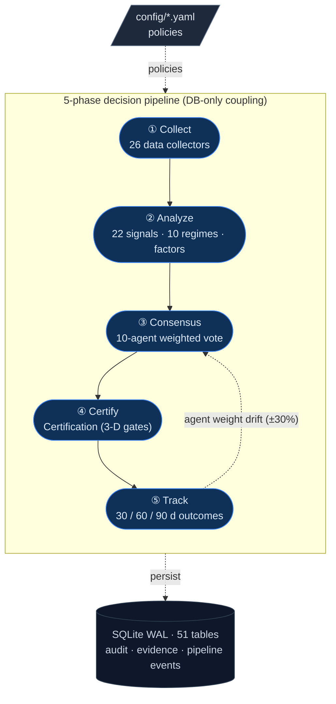

# Nuri-Quant

<div align="center">

[](https://github.com/researcherhojin/nuri-quant/actions/workflows/main-ci-cd.yml)
[](https://codecov.io/gh/researcherhojin/nuri-quant)
[](LICENSE)

**Quant platform that proves the evidence behind every investment decision.**

</div>

Every BUY / SELL recommendation runs through a 5-phase pipeline — **collect → analyze → consensus → certify → track**. Each decision records its market context and per-agent reasoning, then auto-scores against actual outcomes after 30 / 60 / 90 days. Agent weights drift ±30% based on hit rate.

## Why Nuri-Quant?

- 🧠 **Evidence-first** — every recommendation includes per-agent reasoning, gate certification trail, and 30 / 60 / 90 d outcome tracking. No black-box scores.
- 🔁 **Self-correcting** — agent weights adjust based on actual prediction accuracy, not hand-tuning.
- 🛡️ **3-D certification** — gates apply per `Account × Asset Class × Market`. One error-grade fail → REJECTED, no manual override.
- 🔓 **Open data flow** — phases coupled only via SQLite tables. Re-run any phase, downstream consumers refresh automatically.
- ✅ **Tested rigorously** — 5,865 backend tests, **100% statement coverage** (CI verified, 2026-05-06).

## Quick Start

```bash
# Prerequisites: Python 3.12, uv, ta-lib, Node 22
brew install uv ta-lib fnm && fnm install 22

git clone https://github.com/researcherhojin/nuri-quant.git && cd nuri-quant
make setup                                              # backend deps + DB init + git hooks
cd frontend && npm ci && cd ..                          # frontend
cp .env.example .env                                    # API keys (all optional)
cp config/portfolio.example.yaml config/portfolio.yaml  # your holdings (gitignored)

make start          # API on :8001 + Dashboard on :3000
```

Visit **`:3000`** for the Action-First dashboard or **`:8001/docs`** for OpenAPI.

## How It Works



| Phase | What it does | Key outputs |
|-------|--------------|-------------|
| ① **Collect** | 26 collectors — yfinance / OpenBB · pykrx (KR) · FRED · GoogleNews · KIS Open API | `prices` · `fundamentals` · `macro` · `news` |
| ② **Analyze** | 22 signals (20 actionable + 2 shadow) · 10 regimes (6 base + 4 special) · 3 factor scorers | `signals` · `factors` · `regime_transitions` |
| ③ **Consensus** | 10 specialist agents · weighted vote · risk-veto on `alpha_action==FLAT` | `recommendations` (with `agent_verdicts` JSON) |
| ④ **Certify** | Certification — `Account × Asset Class × Market` · 1 error-grade fail → REJECTED | `certifications` (with evidence trail) |
| ⑤ **Track** | 30 / 60 / 90 d outcome scoring · agent accuracy snapshot · weight drift ±30% | `outcome_{30,60,90}d` · `strategy_memory` |

Phases never import each other — communication is via SQLite tables / CSV only. Detail: [`docs/ARCHITECTURE.md`](docs/ARCHITECTURE.md). Certification spec: [`docs/CERTIFICATION_SPEC.md`](docs/CERTIFICATION_SPEC.md).

## Dashboard

The dashboard at `:3000/` answers **"what should I do today?"** — Action-First design that surfaces actionable intelligence ahead of raw data. Pension / IRP holdings filtered (monthly rebalance ≠ daily decision).

| Section | Purpose |
|---------|---------|
| **Hero** | 4-stat ribbon — 총 자산 · 오늘 P&L · 누적 수익률 · 승률 |
| **System Health** | Certification score · Regime · Macro score · Data freshness |
| **Action Items** | 🔴 즉시 실행 (stop-loss, Certification veto) · 🟡 오늘 확인 (take-profit, squeeze) · 🟦 리밸런스 · ✅ 유지 |
| **Macro Events** | Deduplicated high-impact headlines with 한국어 categories |
| **Composition** | Donut chart — 자산 / 섹터 / 계좌 tabs |
| **Holdings table** | Sorted by `positionPct` desc · top 8 + expand |
| **Opportunity Explorer** | Top 3 non-portfolio tickers · pros / cons / verdict |

Korean tickers display as names (삼성전자) instead of codes (005930.KS). 17 routes total.

## Investment Rules

Rules live in [`config/rules.yaml`](config/rules.yaml) (loaded via `nuri/core/rules.py`) — code never hardcodes them. Sources: O'Neil (CAN SLIM), Minervini (SEPA), Shefrin & Statman (1985, 처분효과 / disposition effect).

| Strategy | Stop-loss | Profile |
|----------|-----------|---------|
| `core` | -7% | Default — strict O'Neil discipline |
| `active` | -10% | Cut losses early, trailing-stop arms at +15% |
| `swing` | -15% | Short-term 5–20d rotations |
| `long_term` | -20% | Buy-and-hold ETFs |
| `pension` | -30% | Long-horizon retirement allocations |

Take-profit ladders (growth: +20% / +40% / -15% trailing; value: +15% / +30% / -15%) and hard gates (VIX > 30 blocks new buys; Certification rejects any error-grade fail) apply on top. Full thresholds & rationale: [`docs/STRATEGY.md §3.4-§3.5, §6`](docs/STRATEGY.md).

## LLM Integration (optional, off by default)

LLM integrations are **wired but inactive** unless you set the corresponding env var. The system runs without any LLM and falls back to regex / rule-based logic. Egress policy: [`docs/STRATEGY.md §4.4.3`](docs/STRATEGY.md).

| Provider | Purpose | Activation | Data tier |
|----------|---------|------------|-----------|
| **OpenAI gpt-5.4-nano** | RSS headline classification | `OPENAI_API_KEY` | Tier 0 (public). ~$3.51/yr |
| **OpenAI gpt-5.4-nano** | Daily LLM report | `OPENAI_API_KEY` + `OPENAI_ZDR_APPROVED=1` | Tier 2 (portfolio). ~$0.10/yr |
| **llama.cpp** (local) | Daily LLM report fallback | `LLAMA_MODEL_PATH` | Tier 2 — local only |
| **Ollama** (local) | Daily LLM report fallback | `OLLAMA_HOST` | Tier 2 — local only |

The egress policy is enforced by `nuri/llm/openai_client.py`: a single wrapper logs every external call to the `external_llm_calls` table (timestamp / model / tokens, **no content**); `NURI_DISABLE_EXTERNAL_LLM=1` raises immediately.

## Tech Stack

**Backend**


**Frontend**


**Quant**


**CI/CD**


## Project Stats

| Metric | Value |
|--------|-------|
| **Backend tests** | 5,865 (255 files) — **100% statement coverage** |
| **Frontend tests** | 1,014 (82 files) |
| **E2E tests** | 57 (Playwright, 8 specs) |
| **Pipeline phases** | 5 (collect / analyze / consensus / certify / track) |
| **Data collectors** | 26 collectors (BaseCollector pattern) |
| **Specialist agents** | 10 |
| **Strategy regimes** | 10 (6 base + 4 special) |
| **Trading signals** | 22 (20 actionable + 2 shadow) |
| **API endpoints** | 69 (FastAPI on `:8001`) |
| **Frontend routes** | 17 (Next.js on `:3000`) |
| **DB tables** | 51 (44 forward-only migrations) |
| **DB submodules** | 11 (sole `sqlite3` importer in `nuri/core/db/`) |

## Common Commands

```bash
make full-scan      # 5-phase pipeline end-to-end
make consensus      # 10-agent analysis + decision recording
make certify        # Certification (3-D gates)
make scan           # Daily scan (us_core, 85 tickers)
make scan-extended  # Weekly scan (S&P 500, 543 tickers)

make test           # full test suite
make test-fast      # backend, slow tests excluded (~24s, PR CI)
make ci-cov         # CI artifact combine — Codecov ground-truth coverage

make help           # full target list with categories
```

## Deployment

The reference operator setup runs across two Apple Silicon Macs (MBP dev → Mac mini 24/7 receiver) with `make deploy-mini` 1-command sync.

## Documentation

- [`docs/STRATEGY.md`](docs/STRATEGY.md) — project philosophy, architectural decisions, investment rules
- [`docs/ARCHITECTURE.md`](docs/ARCHITECTURE.md) — detailed code / DB layout, schema, env vars, CI/CD
- [`docs/CERTIFICATION_SPEC.md`](docs/CERTIFICATION_SPEC.md) — 3-D certification spec
- [`docs/KIS_INTEGRATION.md`](docs/KIS_INTEGRATION.md) — KIS (Korea Investment & Securities) Open API
- [`CONTRIBUTING.md`](CONTRIBUTING.md) — development workflow, PR discipline
- [`SECURITY.md`](SECURITY.md) — security policy, LLM egress rules
- [`CLAUDE.md`](CLAUDE.md) / [`AGENTS.md`](AGENTS.md) — agent guides (Claude Code / Cursor / Copilot)

## References

| Source | Usage |
|--------|-------|
| [SIEGE Engine](https://github.com/nutshells3/Swarm-Intelligence-Engine-with-Gated-Execution) | Policy-driven gate certification (v2: asset-class expansion), safety lattice |
| [OAE](https://github.com/nutshells3/orchestration-assurance-engine) | Claim trace, evidence lineage, audit pipeline |
| [safeslice](https://github.com/nutshells3/safeslice) | Statistical reliability bounds, witness cliff detection |
| [fwp](https://github.com/nutshells3/fwp) | Protocol seam pattern, governed job lifecycle |
| [Palantir Foundry](https://www.palantir.com/docs/foundry/data-lineage/overview) | Decision Intelligence pattern |
| [Dagster](https://docs.dagster.io/guides/observe/asset-freshness-policies) | Freshness SLA (PASS/WARN/FAIL) |
| [TradingAgents](https://github.com/TauricResearch/TradingAgents) | Multi-agent consensus pattern |
| [VectorBT](https://vectorbt.dev/) · [Riskfolio-Lib](https://riskfolio-lib.readthedocs.io/) · [OpenBB](https://docs.openbb.co/) | Backtest · optimization · data |

Academic foundations: O'Neil _CAN SLIM_, Minervini _SEPA_, Shefrin & Statman 1985 (disposition effect), Markowitz, Damodaran, Bernstein.

## License

[AGPL-3.0](LICENSE)
