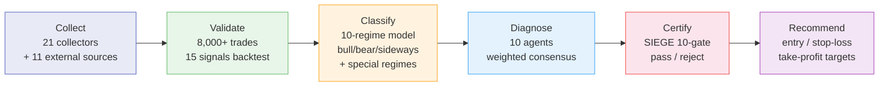

# Nuri-Quant

<div align="center">

[](https://github.com/researcherhojin/nuri-quant/actions/workflows/main-ci-cd.yml)
[](https://codecov.io/gh/researcherhojin/nuri-quant)
[](LICENSE)

**[API Docs](http://localhost:8001/docs)** | **[Dashboard](http://localhost:3000)** | **[Issues](https://github.com/researcherhojin/nuri-quant/issues)**

</div>

Open-source quantitative investment platform that **proves why you should buy or sell** — not gut feeling. 21 data collectors, 10 specialist agents, and a 10-condition mechanical gate certify every recommendation before it reaches you.

## Pipeline



## Tech Stack

**Data Collection**<br/>


> 21 collectors + 11 external sources (TipRanks · Dataroma · CBOE · CoinGecko · Reddit/WSB · ARK · ETF.com · Macrotrends · TradingEconomics · ShortInterest · FINVIZ)

**Quantitative Analysis**<br/>


**Backend**<br/>


> 53 endpoints · 29 tables (v11 migrations) · SSE streaming · JWT + bcrypt + slowapi rate limiting

**Frontend**<br/>


> 14 pages · Dark mode · Palantir-style Operator Cockpit · FreshnessBar · Pipeline Control

**LLM**<br/>


**CI/CD & Testing**<br/>


## Getting Started

**Prerequisites**: Python 3.12, [uv](https://docs.astral.sh/uv/), `brew install ta-lib`, Node 22 (for frontend)

```bash
git clone https://github.com/researcherhojin/nuri-quant.git && cd nuri-quant
make setup                 # venv + deps + DB init + portfolio import
cp .env.example .env
cp config/portfolio.example.yaml config/portfolio.yaml  # edit your holdings
make full-scan             # 8-phase pipeline: collect → certify → recommend → notify
```

### Useful Commands

```bash
make full-scan             # Full 8-stage pipeline
make quick-scan            # Collect → analyze → consensus → targets (~2 min)
make consensus             # 10-agent consensus + price targets
make certify               # SIEGE 10-condition certification
make start                 # API (:8001) + Dashboard (:3000)
make test                  # pytest (929 tests, 48 files)
make lint                  # ruff check

# Single test
.venv/bin/python -m pytest tests/test_db.py::TestUpsertPrices::test_insert_and_query -v
```

## Key Features

- **Evidence-based decisions** — 8,000+ historical trade backtests across 15 signals validate every recommendation
- **10-regime market classification** — 6 base (bull/bear/sideways × high/low vol) + 4 special (recovery, euphoria, stagflation, sector rotation)
- **10 specialist agents** — Weighted consensus voting. Risk agent holds veto power (SELL + confidence ≥ 80 overrides all)
- **SIEGE certification** — [10-condition mechanical gate](https://github.com/nutshells3/Swarm-Intelligence-Engine-with-Gated-Execution). Single failure → REJECTED
- **Investment rules** — O'Neil (CAN SLIM) + Minervini (SEPA). 3:1 reward-to-risk ratio, -7% stop / +20%/+40% targets
- **Pipeline observability** — [Palantir Foundry](https://www.palantir.com/docs/foundry/data-lineage/overview)-style Data Health + [Dagster](https://docs.dagster.io/guides/observe/asset-freshness-policies) Freshness SLA
- **Superinvestor tracking** — SEC 13F filings (Buffett, Dalio, NPS Korea, Key Square, Strive)
- **Portfolio onboarding** — Dashboard UI for CRUD, CSV import/export, sample portfolio, YAML reverse sync
- **LLM reports** — Qwen3.5 evidence-based analysis with SIEGE certification

## Investment Rules

Defined in `config/rules.yaml`. Based on [O'Neil (CAN SLIM)](https://www.investors.com/) + [Minervini (SEPA)](https://www.minervini.com/) + [Disposition Effect research (Shefrin 1985)](https://onlinelibrary.wiley.com/doi/10.1111/j.1540-6261.1985.tb05002.x).

| | Growth | Value | Swing |
|---|--------|-------|-------|
| **Stop-Loss** | -7% | -10% | -5% |
| **Take-Profit 1** | +20% → sell 50% | +15% → sell 50% | +5% → sell 50% |
| **Take-Profit 2** | +40% → sell 25% | +30% → sell 25% | +10% → sell all |
| **Remainder** | Trailing -15% | Trailing -15% | — |

**Core Rules:**
- VIX > 30 → block all new buys (win rate collapses)
- Buy checklist: TipRanks ≥ Moderate Buy, superinvestors ≥ 3, PE < 100, revenue > $0, multi-factor top 50%
- Sell priority: Leveraged ETF → stop-loss breach → no superinvestors → position limit → sector limit

## References

| Source | Application |
|--------|-------------|
| [SIEGE Engine](https://github.com/nutshells3/Swarm-Intelligence-Engine-with-Gated-Execution) | 10-condition gate, certification, event journal |
| [Palantir Foundry](https://www.palantir.com/docs/foundry/data-lineage/overview) | Data Health, pipeline monitoring |
| [Dagster](https://docs.dagster.io/guides/observe/asset-freshness-policies) | Asset freshness PASS/WARN/FAIL |
| [TradingAgents](https://github.com/TauricResearch/TradingAgents) | Multi-agent consensus pattern |
| [O'Neil — CAN SLIM](https://www.investors.com/) | Stop-loss -7%, take-profit +20%/+40% |
| [Minervini — SEPA](https://www.minervini.com/) | Trailing stop, 3:1 reward-to-risk |

## License

[GNU Affero General Public License v3.0](LICENSE)
