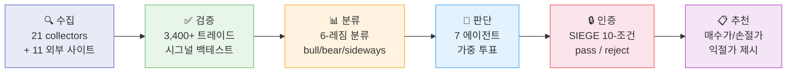

# Nuri-Quant (누리퀀트)

<div align="center">

[](https://www.python.org/)
[]()
[](LICENSE)
[]()
[]()
[](https://codecov.io/gh/researcherhojin/nuri-quant)

**[API Swagger](http://localhost:8001/docs)** · **[Dashboard](http://localhost:3000)** · **[Strategy](docs/STRATEGY.md)** · **[Issues](https://github.com/researcherhojin/nuri-quant/issues)**

</div>

주식을 사거나 팔 때, 근거 없이 감으로 하고 있지 않나요?

Nuri-Quant은 **"왜 이 종목을 사야/팔아야 하는지"를 데이터로 증명**하는 오픈소스 퀀트 투자 플랫폼입니다. 21개 수집기로 데이터를 모으고, 3,400건 이상의 과거 트레이드로 시그널을 검증하고, 7개 전문 에이전트가 독립적으로 분석한 뒤 투표하고, 10개 규칙을 기계적으로 검증해서 — 최종 추천이 나옵니다.

## 어떻게 작동하나요?



**각 단계를 풀어 설명하면:**

1. **수집** — 미국/한국 주가, 매크로 지표, Fear&Greed, 13F 보유현황, 애널리스트 목표가를 매일 자동 수집. 추가로 TipRanks, Dataroma, CBOE, CoinGecko, Reddit/WSB 등 11개 외부 사이트 데이터도 DB에 저장.

2. **검증** — "이 시그널이 과거에 돈을 벌어줬는가?" 3,400건 이상의 과거 트레이드로 백테스트. 승률, Profit Factor, 레짐별 성과를 측정. **성과가 최근 급락한 시그널은 자동으로 신뢰도 하향** (Learning Memory).

3. **분류** — SPY 가격, SMA50/200, VIX를 기반으로 현재 시장을 6개 레짐 중 하나로 분류. 레짐에 따라 롱/숏/현금 비중이 자동으로 조절됨. VIX 25+ 시 레짐 전환 속도가 빨라짐 (적응형 히스테리시스).

4. **판단** — 7개 전문 에이전트가 **각자 독립적으로** 분석. Technical(RSI/MACD), Fundamental(PE/ROE), Macro(레짐), Risk(손절/변동성), Smart Money(13F), Wall Street(애널리스트), Korean Market(FX/KOSPI). 가중 투표로 최종 결정. **Risk 에이전트는 거부권 보유** — confidence 80 이상이면 전원 BUY여도 SELL 강제.

5. **인증** — [SIEGE Engine](https://github.com/nutshells3/Swarm-Intelligence-Engine-with-Gated-Execution) 아키텍처 기반. 추천이 실행되기 전 10개 규칙을 기계적으로 검증 (종목 비중, 섹터 한도, 손절선, 레버리지 금지, VIX 게이트, 외부 데이터 충분성, 충돌 해소, drift 안전성). **하나라도 error면 REJECTED.**

6. **추천** — 모든 검증을 통과한 종목에 대해 **구체적 가격 제시**: 매수가, 손절가(-7%), 1차 익절(+20%, 50% 매도), 2차 익절(+40%, 25% 매도), 트레일링 스톱(-15%).

## Quick Start

```bash
# Prerequisites: Python 3.12, uv, brew install ta-lib
git clone https://github.com/researcherhojin/nuri-quant.git && cd nuri-quant
make setup         # venv + deps + DB init + portfolio import
cp .env.example .env
cp config/portfolio.example.yaml config/portfolio.yaml  # 본인 포트폴리오 편집
make full-scan     # 전체 파이프라인 실행 (수집→검증→분류→판단→인증→추천→시각화→알림)
```

<details>
<summary><b>전체 명령어</b></summary>

| Command | 언제 쓰나 |
|---------|----------|
| `make full-scan` | **매일 장 마감 후.** 전체 파이프라인 8단계 실행 |
| `make quick-scan` | **빠르게 확인.** 수집→분석→합의→타겟 (~2분) |
| `make consensus` | **특정 종목 판단.** 7에이전트 합의 + 가격 타겟 |
| `make certify` | **규칙 준수 확인.** SIEGE 10-condition 인증 |
| `make targets` | **매매 전.** 전 종목 매수가/손절가/익절가 |
| `make rebalance` | **포폴 정리.** 규칙 위반 감지 + 매도 수량 |
| `make evidence` | **근거 확인.** 5개 Plotly 증거 차트 |
| `make report-llm` | **리포트 생성.** Qwen3.5 LLM 증거 기반 리포트 |
| `make backtest-rules` | **규칙 검증.** 기존 vs 규칙 적용 성과 A/B 비교 |
| `make start` | **개발.** API(:8001) + Dashboard(:3000) 동시 실행 |
| `make test` | **커밋 전.** pytest 503 tests (58% coverage) |

</details>

## 투자 규칙

투자 규칙은 `config/rules.yaml`에 정의되며, 코드 수정 없이 규칙만 바꿀 수 있습니다.

**"왜 이 규칙인가?"** — [O'Neil (CAN SLIM)](https://www.investors.com/)과 [Minervini (SEPA)](https://www.minervini.com/)의 검증된 매매 방법론 + [학술 연구](https://onlinelibrary.wiley.com/doi/10.1111/j.1540-6261.1985.tb05002.x) (처분효과: 수익 종목을 너무 일찍 파는 편향)를 기반으로 합니다. 11년 백테스트에서 **15-20% 트레일링 스톱이 최적 수익** (73.9% 누적)임을 확인했습니다.

| | 성장주 | 가치주 | 스윙 |
|---|--------|-------|------|
| **손절** | -7% (즉시 청산) | -10% | -5% |
| **1차 익절** | +20% → 50% 매도 | +15% → 50% 매도 | +5% → 50% 매도 |
| **2차 익절** | +40% → 25% 매도 | +30% → 25% 매도 | +10% → 전량 |
| **나머지** | 트레일링 -15% | 트레일링 -15% | — |

**"왜 VIX 30에서 매수를 막나?"** — VIX 30 이상은 시장 극단 공포 구간. 이 구간에서 매수 시그널의 최근 승률이 급락(bb_bounce 59%→25%, macd_golden 37%→11%)하는 것을 Learning Memory가 감지합니다.

**매수 전 체크리스트** — 이 5가지를 모두 통과해야 매수 자격:
1. TipRanks ≥ Moderate Buy (애널리스트 합의)
2. 슈퍼투자자 3명+ 보유 (dataroma.com)
3. PE < 100 (투기 경고 필터)
4. 매출 > $0 (프리레비뉴 기업 제외)
5. 멀티팩터 상위 50%

**포트폴리오 정리 시 매도 순서** — 가장 위험한 것부터:
1. 레버리지 ETF (시간이 적, volatility decay)
2. 손절선 초과 종목 (-7% 이상 손실)
3. 슈퍼투자자 0명 + 적자 기업 (기관 관심 없음)
4. 비중 한도 초과 (15% 이상)
5. 섹터 한도 초과 (35% 이상)

## 백테스트 검증 결과

규칙 적용 전후 A/B 비교 (`make backtest-rules`):

| 지표 | 규칙 없음 | 규칙 적용 | 변화 |
|------|----------|----------|------|
| **Total Return** | +62.1% | +108.3% | **+46.2%p** |
| **Sharpe Ratio** | 0.91 | 1.84 | **+0.93** |
| **Max Drawdown** | -10.2% | -5.6% | **절반으로 감소** |

## Tech Stack

<details>
<summary><b>전체 기술 스택</b></summary>

**Data** (21 collectors) — OpenBB · yfinance · pykrx · edgartools · FRED · TA-Lib · BTC/Gold<br/>
**External** (11 sites) — TipRanks · Dataroma · Macrotrends · ARK · ETF.com · TradingEcon · Short Interest · CBOE · CoinGecko · FINVIZ · Reddit/WSB<br/>
**Quant** — pandas · Riskfolio-Lib · VectorBT · QuantStats · scikit-learn · cvxpy<br/>
**Backend** (51 endpoints) — FastAPI · uvicorn · Pydantic · SSE stream<br/>
**Frontend** (15 pages) — Next.js 16 · React 19 · Tailwind 4 · shadcn/ui · Recharts · React Flow<br/>
**LLM** — Ollama · Qwen3.5 (35B-A3B MoE, thinking model)<br/>
**DB** — SQLite WAL · 27 tables · audit log<br/>
**Security** — JWT · bcrypt · slowapi · CSP/HSTS · audit log<br/>
**CI/CD** — GitHub Actions · ruff + pytest + tsc · Codecov · Trivy

</details>

## 레퍼런스

이 프로젝트에 사용된 이론, 아키텍처, 오픈소스의 출처:

| 출처 | 적용 부분 | 코드 위치 |
|------|----------|----------|
| [O'Neil CAN SLIM](https://www.investors.com/) | 손절 -7%, 익절 +20%/+40%, 8주 규칙 | `config/rules.yaml` |
| [Minervini SEPA](https://www.minervini.com/) | 트레일링 스톱, 3:1 손익비 | `config/rules.yaml` |
| [SIEGE](https://github.com/nutshells3/Swarm-Intelligence-Engine-with-Gated-Execution) | 10-condition gate, certification | `nuri/trading/engine/` |
| [처분효과](https://onlinelibrary.wiley.com/doi/10.1111/j.1540-6261.1985.tb05002.x) (Shefrin 1985) | 수익 종목 조기 매도 편향 경고 | 익절 규칙 근거 |
| [Riskfolio-Lib](https://riskfolio-lib.readthedocs.io/) | MVO/Risk Parity 최적화 | `nuri/analysis/rebalance.py` |
| [VectorBT](https://vectorbt.dev/) | 벡터 기반 백테스트 | `nuri/quant/backtest/` |
| [TradingAgents](https://github.com/TauricResearch/TradingAgents) | 멀티에이전트 합의 패턴 참고 | `nuri/trading/agents/` |
| [OpenAlice](https://github.com/TraderAlice/OpenAlice) | Trading-as-Git 패턴 참고 | `nuri/core/db.py` |
| [Ghostfolio](https://github.com/ghostfolio/ghostfolio) | 대시보드 UX 참고 | `frontend/` |
| [React Flow](https://reactflow.dev/) | 파이프라인 DAG 시각화 | `frontend/src/app/pipeline/` |

## License

[GNU Affero General Public License v3.0](LICENSE)
