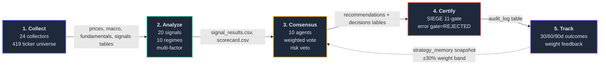

# Nuri-Quant

<div align="center">

[](https://github.com/researcherhojin/nuri-quant/actions/workflows/main-ci-cd.yml)
[](https://codecov.io/gh/researcherhojin/nuri-quant)
[](LICENSE)

</div>

An open-source quant platform that **proves the evidence behind every investment decision**.

Every BUY/SELL recommendation runs through a **collect → analyze → consensus → certify → track** pipeline. Each decision is recorded with its market context and per-agent reasoning, then automatically scored against actual outcomes after 30/60/90 days. The system gets more accurate as outcomes accumulate — agent weights adjust within a ±30% band based on hit rate.

## Architecture

The pipeline has **8 phases** organized into 5 conceptual stages. Phases never import each other — they communicate **only through DB tables and CSV files** (loose coupling, see [`docs/STRATEGY.md`](docs/STRATEGY.md#23-느슨한-결합-loose-coupling-via-data) §2.3). Re-running an upstream phase automatically refreshes downstream consumers.



### Key architectural decisions

- **`nuri/core/db.py` is the sole SQLite gateway** — the only module that imports `sqlite3`. Every other module reads/writes through `query()`, `query_df()`, `upsert_*()`, `get_db()`. This makes WAL conflicts, transactions, schema migrations, and test isolation tractable. 31 tables total.
- **Config-driven, code-static** — all thresholds, rules, and signal metadata live in `config/*.yaml`. Changing a stop-loss percentage means editing YAML, not Python. See `rules.yaml`, `agents.yaml`, `signals.yaml`, `universe.yaml`.
- **DB-only integration between phases** — the only cross-phase coupling is data, not function calls. This is what makes the system rerun-safe and scheduler-friendly.

### Code layout

| Path | Pipeline phase | Role |
|------|----------------|------|
| `nuri/collectors/` | 1. Collect | 24 collectors. Each subclasses `BaseCollector(collect → save)`. Sources: OpenBB, pykrx, FRED, edgartools, FINVIZ, KIS Open API |
| `nuri/quant/` | 2. Analyze | Signal backtest (20 signals), regime classifier (6 base + 4 special), multi-factor scoring, VectorBT |
| `nuri/trading/agents/` | 3. Consensus | 10 specialist agents + weighted consensus. Risk agent has SELL veto at confidence ≥ 80 |
| `nuri/trading/engine/` | 4. Certify | SIEGE 11-gate certification, conflict detection, learning memory |
| `nuri/trading/recommend/` | 4-5 | Candidates, price targets, rebalance advisor, outcome tracker |
| `nuri/api/` | Serve | FastAPI REST + SSE streaming on **:8001** |
| `frontend/` | Serve | Next.js 16 dashboard on **:3000** (16 pages, dark theme, Tailwind 4 + shadcn/ui) |
| `nuri/core/db.py` | All | **Sole** SQLite gateway. 31 tables, WAL mode |
| `config/*.yaml` | All | Thresholds, rules, signal metadata, scan universe |

## Dashboard

The dashboard at `:3000/` is a **composition-first overview**, not a row-level decision tool. Inspired by Snowball Analytics' Korean retail layout. Vertical hierarchy:

1. **Hero** — 4 stats: 총 자산 · 오늘 P&L · 누적 수익률 · 승률 (winners/losers ratio)
2. **Market context strip** — verdict · trend · VIX · 심리 · 경제 · 실제/권장 비중 (1 row, null-safe)
3. **Status strips** — collapsible 알림 / 이벤트 / 신규 후보
4. **Composition section** — Recharts donut (320px, standard 12-o'clock clockwise) + tabs (자산/섹터/계좌) + rich legend (label · meta · $value · weight % · daily delta)
5. **Mini cards strip** — Movers + 집중도 (HHI)
6. **Holdings table (drilldown)** — sorted by `positionPct` desc, top 8 visible by default with `?holdings=expanded` toggle

The composition section is the visual centerpiece. Holdings table is demoted to drilldown — the dashboard's structural job is "where is my money + how is it doing", not "act on every row". For row-level decisions see `/portfolio` and `/advisor`.

## Tech Stack

| Layer | Stack |
|-------|-------|
| **Backend** | Python 3.12 · FastAPI · SQLite (WAL) · uv |
| **Frontend** | Next.js 16 · React 19 · Tailwind 4 · shadcn/ui |
| **Quant** | pandas · TA-Lib · VectorBT · OpenBB · Riskfolio-Lib · yfinance |
| **CI/CD** | GitHub Actions · pytest (xdist + shard) · Vitest · Playwright · Ruff · Codecov · Trivy |

### LLM (optional, off by default)

Both LLM integrations are **wired but inactive** unless you set the corresponding environment variable. The system runs without any LLM and falls back to regex/rule-based logic. See [`docs/STRATEGY.md`](docs/STRATEGY.md#443-외부-llm-egress-policy-152) §4.4.3 for the egress policy.

| Provider | Purpose | Activation | Data class |
|----------|---------|------------|------------|
| **Ollama** (local) | Daily LLM report (`make report-llm`) | `OLLAMA_HOST` set + Ollama running locally | Tier 2 (portfolio) — local only, never leaves machine |
| **OpenAI gpt-5.4-nano** | RSS headline classification | `OPENAI_API_KEY` set | Tier 0 (public news only). ~$3.51/yr at 100 headlines/day |

The egress policy is enforced by `nuri/llm/openai_client.py`: a single wrapper logs every external call to the `external_llm_calls` table (timestamp/model/tokens, **no content**), and `NURI_DISABLE_EXTERNAL_LLM=1` raises immediately.

## Getting Started

```bash
# Prerequisites: Python 3.12, uv, ta-lib, Node 22
brew install uv ta-lib fnm && fnm install 22

# Setup
git clone https://github.com/researcherhojin/nuri-quant.git && cd nuri-quant
make setup                                              # backend (uv venv + deps + DB init)
cd frontend && npm ci && cd ..                          # frontend
cp .env.example .env                                    # API keys (all optional)
cp config/portfolio.example.yaml config/portfolio.yaml  # your holdings (gitignored)

# Run
make start          # API (:8001) + Dashboard (:3000)
make full-scan      # 8-phase pipeline end-to-end
make consensus      # 10-agent analysis + decision recording
make certify        # SIEGE 11-gate certification
make scan           # Daily scan (us_core, ~85 tickers)
make scan-extended  # Weekly scan (us_core + S&P 500, ~339 tickers)
```

### Test commands

```bash
make test       # full suite (2,661 backend + 766 frontend)
make test-fast  # backend only, slow tests excluded (~24s, ~52% faster)
make test-slow  # backend slow tests only (LLM gather_context, scheduler)
```

## Investment Rules

Defined in `config/rules.yaml` and loaded via `nuri/core/rules.py`. Sources: O'Neil (CAN SLIM), Minervini (SEPA), Shefrin & Statman (1985, 처분효과 / disposition effect).

### Account strategy profiles

Each account in `config/portfolio.yaml` selects one strategy via the `strategy` field. Stricter strategies cut losses earlier and limit concentration; looser strategies allow winners to grow.

| Strategy | Stop-Loss | Max Single Position | Notes |
|----------|-----------|---------------------|-------|
| `core` | -7% | 15% | Default. Strict O'Neil-style discipline |
| `active` | -10% | 25% | + `trailing_stop_arm: 15` — trailing stop auto-arms at +15% to protect winners |
| `swing` | -15% | 30% | Short-term rotations only |
| `long_term` | -20% | 25% | Buy-and-hold ETFs |
| `pension` | -30% | 40% | Long-horizon retirement allocations |

### Take-profit by stock type

Each ticker is tagged growth/value via `config/stock_types.yaml`. Take-profit and trailing-stop levels apply per type.

| Type | 1st Target | 2nd Target | Trailing |
|------|-----------|-----------|----------|
| Growth | +20% (sell 50%) | +40% (sell 25%) | -15% from HWM |
| Value | +15% (sell 50%) | +30% (sell 25%) | -15% from HWM |

### Hard gates (always-on, no override)

- **VIX > 30** → new buys blocked
- **execution_priority** → stop-loss → take-profit → trailing → new-buy (loss largest first)
- **Buy checklist** → TipRanks ≥ Moderate Buy · superinvestors ≥ 3 · PE < 100 · revenue > $0 · multi-factor top 50%
- **SIEGE 11-gate** → 1 error grade failure = REJECTED, no manual override

## References

| Source | Usage |
|--------|-------|
| [SIEGE Engine](https://github.com/nutshells3/Swarm-Intelligence-Engine-with-Gated-Execution) | 11-gate certification, event journal |
| [Palantir Foundry](https://www.palantir.com/docs/foundry/data-lineage/overview) | Decision Intelligence pattern |
| [Dagster](https://docs.dagster.io/guides/observe/asset-freshness-policies) | Freshness SLA (PASS/WARN/FAIL) |
| [TradingAgents](https://github.com/TauricResearch/TradingAgents) | Multi-agent consensus pattern |
| [VectorBT](https://vectorbt.dev/) | Vectorized backtest |
| [Riskfolio-Lib](https://riskfolio-lib.readthedocs.io/) | Portfolio optimization |
| [OpenBB](https://docs.openbb.co/) | Unified financial data abstraction |

## Further Documentation

- [`docs/STRATEGY.md`](docs/STRATEGY.md) — project philosophy, architectural decisions, investment rules, roadmap
- [`docs/KIS_INTEGRATION.md`](docs/KIS_INTEGRATION.md) — KIS (Korea Investment & Securities) Open API integration
- [`CLAUDE.md`](CLAUDE.md) — Claude Code agent guide (commands, architecture, gotchas)
- [`CONTRIBUTING.md`](CONTRIBUTING.md) — development workflow, PR discipline
- [`SECURITY.md`](SECURITY.md) — security policy, LLM egress rules, credential handling

## License

[AGPL-3.0](LICENSE)
