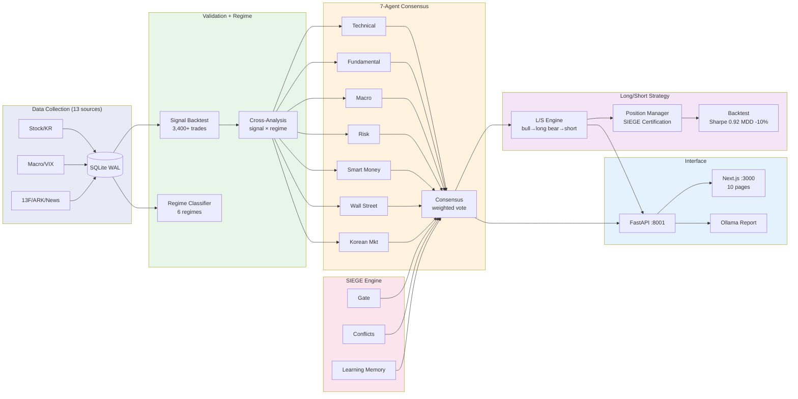

# Nuri-Quant

<div align="center">

[](https://www.python.org/)
[]()
[](LICENSE)
[](https://www.sqlite.org/)

**[Docs](CLAUDE.md)** | **[API Swagger](http://localhost:8001/docs)** | **[Dashboard](http://localhost:3000)** | **[Issues](https://github.com/researcherhojin/nuri-quant/issues)**

</div>

Open-source quant investment platform. Collects data from 13 free sources, validates signals with backtesting, classifies market regimes, and recommends trades via 7-agent consensus — with a Next.js dashboard and LLM-powered reports.

## Tech Stack

**Data**: OpenBB, yfinance, pykrx, edgartools, TA-Lib
**Quant**: pandas, Riskfolio-Lib, VectorBT, QuantStats, Plotly
**Interface**: FastAPI, Next.js 16, shadcn/ui, Tailwind 4, Ollama
**Infra**: SQLite (WAL), APScheduler, Discord, GitHub Actions CI

## Getting Started

```bash
# Prerequisites: Python 3.12, uv, brew install ta-lib
git clone https://github.com/researcherhojin/nuri-quant.git && cd nuri-quant
make setup                                    # venv + deps + DB init + portfolio import

# Collect 5 years of data
python -m nuri.collectors.stock --period 5y   # US stocks (OpenBB)
python -m nuri.collectors.stock_kr --days 1825 # Korean stocks (pykrx)
make collect                                  # macro/technical/fear&greed/ARK

# Validate + analyze + recommend
make validate                                 # signal backtest + scorecard
make regime                                   # market regime + strategy map
make recommend                                # candidates + tracking
make verify                                   # full report → data/reports/YYYY-MM-DD/
```

### Commands

```bash
# Trading
make consensus      # 7-agent analysis on portfolio
make scan           # market-wide scanner (89 US tickers)
make swing          # scan + agent consensus → entry
make strategy       # L/S strategy + regime monitor
make backtest-ls    # 5.4yr backtest + Monte Carlo
make optimize       # grid search parameter tuning
make mean-reversion # mean-reversion scan + backtest
make pairs          # pairs trading scan + backtest

# Data
make wallstreet     # analyst ratings + earnings + insider
make filings        # SEC 10-K key metrics

# Infrastructure
make lint           # ruff check
make test           # 142 unit tests
make gate           # pipeline readiness check
make start          # API(:8001) + Dashboard(:3000)
```

## Architecture

```
nuri/
├── core/              # DB (sole sqlite3 entry), rules
├── collectors/        # 16 data collectors (BaseCollector pattern)
├── analysis/          # Pure analysis: portfolio, risk, sector, charts, sentiment
├── quant/             # Quantitative pipeline
│   ├── regime/        # 6-regime classifier, macro score, strategy map
│   ├── validation/    # Signal/superinvestor/analyst backtest, scorecard
│   ├── backtest/      # VectorBT engine, grid search optimizer
│   └── factors/       # Multi-factor scoring (momentum, value, quality)
├── trading/           # Trading execution
│   ├── agents/        # 7 agents + weighted consensus
│   ├── engine/        # SIEGE: gate, conflicts, learning memory
│   ├── strategy/      # L/S, mean-reversion, pairs trading
│   ├── recommend/     # Candidates, rebalance, tracker
│   ├── swing/         # Market-wide scanner
│   └── execution/     # Broker interface (Alpaca paper + DryRun)
├── api/               # FastAPI REST + SSE stream
├── alerts/            # Discord daily report
└── llm/               # Ollama LLM report
```



## Key Features

- **7-Agent Consensus** — Technical, Fundamental, Macro, Risk, Smart Money, Wall Street, Korean Market agents. Weighted voting with risk agent veto power
- **Long/Short Strategy** — Regime-based direction switching with SIEGE Certification Gate. Backtest: +62% return, Sharpe 0.92, MDD -10%
- **SIEGE Engine** — Gated Execution (10 conditions), Conflict Detection (BUY+SELL → HOLD), Learning Memory (drift auto-penalty)
- **Parameter Optimization** — Grid search for RSI/MACD/BB thresholds and holding periods
- **Multi-Strategy** — L/S regime switching, Mean-Reversion (BB+RSI), Pairs Trading (correlation Z-score)
- **Dashboard** — Next.js 16 with SSE real-time updates, Recharts price charts, portfolio management, mobile responsive

## Investment Rules

Defined in `config/rules.yaml`, enforced across all modules:

| Rule | Limit |
|------|-------|
| Single position | ≤ 15% |
| Sector exposure | ≤ 35% |
| Per-stock stop loss | -20% |
| Portfolio stop | -10% drawdown |
| Leverage ETF ban | TSLL, TQQQ, SQQQ, UPRO, SPXU |

## Roadmap

- [ ] **차트 고도화** — Recharts에 기술적 지표 오버레이 (RSI, MACD, BB) + 시그널 마커
- [ ] **한국 시장 수집기 확장** — pykrx 기반 외국인/기관 수급, 공매도 잔고
- [ ] **실거래 연동 완성** — Alpaca live trading + 한투 OpenAPI
- [ ] **알림 고도화** — Telegram 봇, 레짐 전환 push 알림

## License

[Apache License 2.0](LICENSE)
