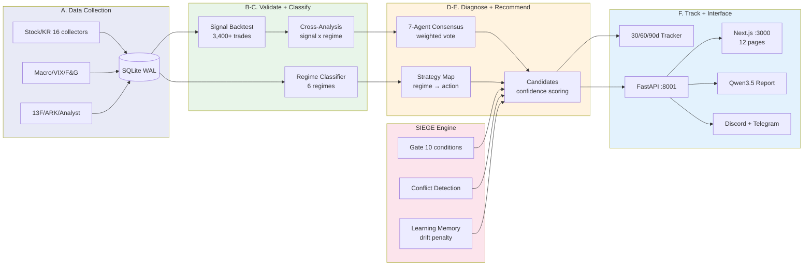

# Nuri-Quant

<div align="center">

[](https://www.python.org/)
[]()
[](LICENSE)
[](https://www.sqlite.org/)
[]()

**[Docs](CLAUDE.md)** | **[API Swagger](http://localhost:8001/docs)** | **[Dashboard](http://localhost:3000)** | **[Issues](https://github.com/researcherhojin/nuri-quant/issues)**

</div>

100% 무료 오픈소스 퀀트 투자 플랫폼. 16개 수집기 + 6개 외부 사이트에서 데이터 수집, 시그널 백테스트 검증, 6-레짐 시장 분류, 7-에이전트 합의 추천 — Next.js 대시보드(12 pages) + Qwen3.5 LLM 리포트 포함.

## 6-Step Pipeline

```
Collect → Validate → Classify → Diagnose → Recommend → Track
  13개      3,400+     6-레짐     매크로      7-에이전트    30/60/90일
  소스      트레이드    분류기     스코어      합의 투표     성과 추적
```

## Tech Stack

| Layer | Tools |
|-------|-------|
| **Data** | OpenBB, yfinance, pykrx, edgartools, FRED, TA-Lib |
| **Quant** | pandas, Riskfolio-Lib, VectorBT, QuantStats, scikit-learn |
| **Viz** | Plotly, Matplotlib, Recharts (dashboard) |
| **Interface** | FastAPI (:8001), Next.js 16 (:3000), shadcn/ui, Tailwind 4 |
| **LLM** | Ollama (Qwen3.5) — SIEGE 인증 리포트, thinking model |
| **Infra** | SQLite (WAL), APScheduler (17 cron), Discord, Telegram, GitHub Actions CI |
| **Security** | JWT + bcrypt, slowapi rate limiting, CSP/HSTS, audit logging |

## Quick Start

```bash
# Prerequisites: Python 3.12, uv, brew install ta-lib
git clone https://github.com/researcherhojin/nuri-quant.git && cd nuri-quant
make setup              # venv + deps + DB init + portfolio import
cp .env.example .env    # API keys 설정 (대부분 optional)
```

### 데이터 수집

```bash
# 최초 5년치 수집
python -m nuri.collectors.stock --period 5y      # US 주가 (OpenBB)
python -m nuri.collectors.stock_kr --days 1825   # KR 주가 (pykrx)

# 일일 수집 (이후 매일)
make collect            # 6개 수집기: stock, stock_kr, macro, technical, fear_greed, ark
make wallstreet         # 애널리스트 등급, 실적 서프라이즈, 내부자 거래
make filings            # SEC 10-K 핵심 지표
```

### 분석 파이프라인

```bash
make analyze            # 포트폴리오 + 섹터 + 리스크 분석
make validate           # 시그널 백테스트 + 슈퍼투자자/애널리스트 검증 + 스코어카드
make consensus          # 7-에이전트 합의 (보유 전 종목)
make strategy           # L/S 레짐 전략 + 전환 + 행동 지침
```

### 트레이딩

```bash
# 에이전트 합의
make consensus                                          # 보유 종목 전체
python -m nuri.trading.agents.consensus --ticker TSLA   # 단일 종목

# 시장 스캔
make scan               # 89종목 시그널 스캔
make swing              # 스캔 + 에이전트 합의 → 진입 저장

# 전략
make backtest-ls        # L/S 5.4년 백테스트 + Monte Carlo
make optimize           # 파라미터 그리드 서치
make mean-reversion     # 평균회귀 스캔 + 백테스트
make pairs              # 페어 트레이딩 스캔 + 백테스트
```

### 종합 스캔 + 증거 시각화

```bash
make full-scan          # 7-phase 전체 파이프라인 (수집→분석→검증→레짐→추천→타겟→증거)
make quick-scan         # 빠른 4-step (수집→분석→합의→타겟, ~2분)
make targets            # 전 종목 매수가/손절가/익절가 계산
make rebalance          # 규칙 위반 감지 + 매도 수량 제시
make evidence           # 5개 Plotly 증거 차트 생성
make external           # 외부 데이터 요약 (TipRanks, Dataroma, ARK 등 6개 사이트)
make report-llm         # Qwen3.5 LLM 리포트 생성 + 자동 저장
```

Output: `data/reports/{date}/` 에:
- `evidence/` — 5개 Plotly HTML 차트 (레짐, 히트맵, 시그널, F&G, 매도 근거)
- `portfolio_action_plan.md` — 종합 실행 플랜
- `llm_report.md` — Qwen3.5 LLM 증거 기반 리포트

### 인프라

```bash
make lint               # ruff check (E/F/W/I, line-length 120)
make test               # pytest 188 tests
make start              # API(:8001) + Dashboard(:3000) 동시 실행
make deploy             # rsync to Mac Mini (production)
make backup             # DB 30일 롤링 백업
```

## Architecture

```
nuri/
├── core/              # DB (유일한 sqlite3 진입점), rules (config/rules.yaml 로더)
├── collectors/        # 16개 데이터 수집기 (BaseCollector 상속)
├── analysis/          # portfolio, risk, sector, charts, rebalance_advisor, evidence_charts
├── quant/
│   ├── regime/        # 6-레짐 분류기, 매크로 스코어, 전략 맵
│   ├── validation/    # 시그널/슈퍼투자자/애널리스트 백테스트, 스코어카드
│   ├── backtest/      # VectorBT 엔진, 그리드 서치 옵티마이저
│   └── factors/       # 멀티팩터 스코어 (모멘텀, 가치, 퀄리티, 센티멘트)
├── trading/
│   ├── agents/        # 7개 에이전트 + 가중 합의 엔진
│   ├── engine/        # SIEGE: 게이트, 충돌 감지, 학습 메모리
│   ├── strategy/      # L/S, 평균회귀, 페어 트레이딩
│   ├── recommend/     # 후보 추천, 리밸런싱, 가격 타겟, 성과 추적
│   ├── swing/         # 시장 전체 스캐너
│   └── execution/     # 브로커 인터페이스 (Alpaca paper + DryRun)
├── api/               # FastAPI REST + SSE 스트림
├── alerts/            # Discord + Telegram 알림, daily_report
└── llm/               # Ollama Qwen3.5 LLM 리포트 (SIEGE 인증, auto-save)
```

### Data Flow



## 7-Agent Consensus

7개 전문 에이전트가 독립적으로 분석 후 가중 투표로 최종 결정.

| Agent | Weight | Data Source | Role |
|-------|--------|-------------|------|
| Technical | 18% | RSI, MACD, SMA crossovers | 기술적 시그널 |
| Fundamental | 14% | PE, ROE, growth, debt | 펀더멘탈 가치 |
| Macro | 14% | Regime + macro score + momentum | 거시경제 환경 |
| **Risk** | **22%** | Stop-loss, volatility, concentration | **거부권 보유** |
| Smart Money | 9% | 13F flow + analyst consensus | 기관 자금 흐름 |
| Wall Street | 13% | Analyst ratings + EPS surprise + insider | 애널리스트 의견 |
| Korean Market | 10% | KRW/USD FX, foreign flows, KOSPI | 한국 시장 특화 |

- Risk Agent: confidence >= 80이면 **SELL 거부권** 발동 (전원 BUY여도 SELL)
- Korean Market Agent: US 종목에 대해 중립 HOLD 반환
- 가중치는 `recommendations` 테이블 기반 동적 조정

## SIEGE Engine

Gated Execution + Conflict Detection + Learning Memory.

```
confidence = regime_win_rate x 60% + regime_pf x 40%
           x drift_multiplier (0.3 ~ 1.1)        ← Learning Memory
           x conflict_penalty (0.5x if high)      ← Conflict Detection
           x regime_fit_penalty (0.4x if avoid)    ← Strategy Map
           x position_penalty (0.3x if minimal)    ← Regime position sizing
```

## Investment Rules

`config/rules.yaml`에 정의, 전 모듈에서 강제 적용.

### 포지션 관리

| Rule | Limit |
|------|-------|
| 단일 종목 최대 비중 | 15% |
| 섹터 최대 노출 | 35% |
| 최소 현금 비중 | 20% |
| 레버리지 ETF | TSLL, TQQQ, SQQQ, UPRO, SPXU **금지** |

### 손절 규칙 (O'Neil 기반)

| 종류 | 손절선 |
|------|--------|
| 성장주 | -7% |
| 가치주 | -10% |
| 포트폴리오 전체 | -10% MDD |

### 익절 규칙 (O'Neil + Minervini 기반)

| 종류 | 1차 익절 | 2차 익절 | 잔여분 |
|------|---------|---------|--------|
| 성장주 | +20% (50% 매도) | +40% (25% 매도) | 트레일링 -15% |
| 가치주 | +15% (50% 매도) | +30% (25% 매도) | 트레일링 -15% |
| 스윙 | +5% (50% 매도) | +10% (전량 매도) | — |

### 매수 진입 조건

| 조건 | 값 |
|------|-----|
| VIX > 30 | 신규 매수 **금지** |
| VIX 25~30 | 절반 포지션만 |
| F&G < 20 (극도 공포) | 현금 60% 유지 |
| 분할 매수 | 최대 3회, 간격 5일 |
| O'Neil 8주 규칙 | 3주 내 +20% 돌파 시 최소 8주 보유 |

### 매수 체크리스트

매수 전 반드시 확인:

- [ ] TipRanks Moderate Buy 이상
- [ ] 슈퍼투자자 3명+ 보유 (dataroma.com)
- [ ] PE < 100 (투기 경고)
- [ ] 매출 > $0 (프리레비뉴 기업 금지)
- [ ] 멀티팩터 상위 50% 이내

### 매도 우선순위

포트폴리오 정리 시 순서:

1. 레버리지/인버스 ETF
2. 손절선 초과 종목
3. 슈퍼투자자 0명 + 적자 기업
4. 비중 한도 초과 종목
5. 섹터 한도 초과

### 추천 포맷 — 가격 타겟 필수

모든 매수/매도 추천에 구체적 가격 제시:

```
종목: NVDA (성장주)
현재가: $168.00
├── 매수가 (진입): $165.00 (지지선 근처 지정가)
├── 손절가: $153.45 (-7%)
├── 1차 익절: $198.00 (+20%) → 50% 매도
├── 2차 익절: $231.00 (+40%) → 25% 매도
├── 트레일링 스톱: 고점 대비 -15% (나머지 25%)
└── TipRanks 목표가: $273.61 (+63%)
```

## 6-Regime Classifier

| Regime | SPY vs SMA | VIX | Strategy |
|--------|-----------|-----|----------|
| bull_low_vol | Above SMA200 | < threshold | 공격적 — 풀 포지션 |
| bull_high_vol | Above SMA200 | > threshold | 선택적 — 상위 시그널만 |
| sideways_low_vol | SMA50 ± band | < threshold | 중립 — 평균회귀 |
| **sideways_high_vol** | SMA50 ± band | > threshold | **방어적 — 최소 포지션** |
| bear_low_vol | Below SMA200 | < threshold | 숏 편향 — 헤지 |
| bear_high_vol | Below SMA200 | > threshold | 현금 — 관망 |

동적 임계값: 252일 히스토리 기반 VIX/Sideways 밴드 자동 조정.

### Long/Short Regime Strategy

레짐에 따라 롱/숏/현금 비중 자동 조절:

| Regime | Long | Short | Cash | 전략 |
|--------|------|-------|------|------|
| bull_low_vol | 80% | 0% | 20% | 풀 롱, 성장주 집중 |
| bull_high_vol | 60% | 0% | 40% | 선택적 롱, 상위 시그널만 |
| sideways_low_vol | 40% | 0% | 60% | 평균회귀, 스윙 |
| **sideways_high_vol** | **20%** | **0%** | **80%** | **방어적, 최소 포지션** |
| bear_low_vol | 10% | 30% | 60% | 숏 편향 (SH/SDS) |
| bear_high_vol | 0% | 50% | 50% | 풀 숏 + 현금 |

레짐 전환 시 행동:
- `bull → sideways`: 롱 50% 축소, 숏 없음
- `sideways → bear`: 롱 30%로 축소, 숏 20% 진입 (SH)
- `bear → sideways`: 숏 전량 청산, 롱 40% 복귀
- `sideways → bull`: 롱 80%로 확대

### Current Strategy Snapshot (auto-updated by `make strategy`)

> **Last updated: 2026-03-28**
>
> | Indicator | Value |
> |-----------|-------|
> | Regime | SIDEWAYS + HIGH VOL |
> | VIX | 30.4 |
> | Fear & Greed | 10.5 (Extreme Fear) |
> | Macro Score | 48/100 (Cautious) |
> | Position | DEFENSIVE |
> | Long Target | 20% |
> | Short Target | 0% |
> | Cash Target | 80% |
> | Signals USE | sma_golden, rsi_oversold |
> | Sectors | XLV, XLP, XLRE, XLU (방어 섹터) |
>
> **Actions**: 신규 매수 금지 (VIX > 30). 손절선 초과 종목 우선 정리. 현금 비중 극대화.

## External Data Sources

투자 결정 전 확인하는 외부 사이트:

| Site | Purpose | 확인 항목 |
|------|---------|----------|
| [dataroma.com](https://www.dataroma.com) | 슈퍼투자자 13F | 보유자 수, 매수/매도 트렌드 |
| [tradingeconomics.com](https://tradingeconomics.com) | 매크로 데이터 | GDP, CPI, 금리, 고용 |
| [macrotrends.net](https://www.macrotrends.net) | 펀더멘탈 | PE, 매출, 역사적 밸류에이션 |
| [tipranks.com](https://www.tipranks.com) | 애널리스트 컨센서스 | 목표가, Buy/Hold/Sell 비율 |
| [etf.com](https://www.etf.com) | ETF 펀드 플로우 | 자금 유입/유출, 섹터 로테이션 |
| [ark-funds.com](https://ark-funds.com) | ARK Invest | Cathie Wood 매수/매도 |

## Environment Variables

`.env` 파일에 설정 (대부분 optional, fallback 존재):

| Variable | Purpose | Required |
|----------|---------|----------|
| `FRED_API_KEY` | FRED 매크로 데이터 | No (yfinance fallback) |
| `DISCORD_WEBHOOK_URL` | 일일 리포트 발송 | No (stdout fallback) |
| `DISCORD_BOT_TOKEN` | 봇 모드 알림 | No |
| `FINNHUB_API_KEY` | US 기관 자금 흐름 | No |
| `OLLAMA_HOST` / `OLLAMA_MODEL` | LLM 리포트 | No (localhost:11434, qwen3.5) |
| `TELEGRAM_BOT_TOKEN` / `TELEGRAM_CHAT_ID` | Telegram 알림 | No |
| `API_AUTH_ENABLED` / `API_KEY` | API 인증 | No (false = 개발 모드) |
| `CORS_ORIGINS` | CORS 허용 도메인 | No (localhost:3000) |
| `DASHBOARD_PASSWORD` | 대시보드 인증 | No (미설정 시 public) |
| `ALPACA_API_KEY` / `ALPACA_SECRET_KEY` | 페이퍼 트레이딩 | No (DryRun fallback) |

## Infrastructure

- **2-Machine Setup**: MacBook (dev) ↔ M2 Pro Mac Mini (24/7 production)
- **DB**: SQLite WAL mode, `data/portfolio.db`, 27+ tables (audit_log, external_analysis 포함)
- **Scheduler**: 17 cron jobs (KST), lazy imports
- **CI**: GitHub Actions — ruff lint + pytest + Next.js tsc (uv + venv 캐시 최적화)
- **Security**: JWT + API key 인증, bcrypt 해싱, slowapi rate limiting, CSP/HSTS 보안 헤더
- **Deploy**: `make deploy` (rsync), `make backup` (30-day rolling)
- **Dashboard**: Next.js 16 — 12 routes 포함 `/evidence` (Plotly 차트 뷰어)
- **Alerts**: Discord + Telegram — 규칙 위반, 레짐 전환, 매매 시그널
- **MCP**: `.mcp.json` — Claude Code에서 직접 DB 쿼리 가능

## Completed — Security & Production Readiness

보안 감사 (OWASP + STRIDE) 기반 — **17/17 항목 완료**.

<details>
<summary>CRITICAL 5/5 + HIGH 6/6 + MEDIUM 6/6 (클릭하여 펼치기)</summary>

**CRITICAL**: JWT/API key 인증, bcrypt 해싱, slowapi Rate Limiting, CORS 강화, Pydantic 입력 검증

**HIGH**: 감사 로깅 (audit_log), Monte Carlo block bootstrap, Partial fill 추적, DB 마이그레이션 원자성, 수집 실패 처리 (>10% 거부), CSP/HSTS 보안 헤더

**MEDIUM**: 데이터 신선도 검증 (72h), 적응형 히스테리시스 (VIX≥25), FX 캘리브레이션 (90일 mean±1σ), SSE 캐시 (60초), 증거 차트 5개, Telegram 봇 알림

</details>

## Roadmap — Next Phase

### 자동화 (진행 중)

- [ ] 외부 데이터 수집기 완전 자동화 — TipRanks/Dataroma 스크래핑
- [ ] `make full-scan` → Discord/Telegram 자동 발송
- [ ] 대시보드 증거 차트 실시간 갱신

### 고도화

- [ ] 백테스트에 신규 익절/손절 규칙 적용 → 성과 검증
- [ ] 대시보드에 가격 타겟 + 리밸런스 어드바이저 페이지
- [ ] Alpaca 실전 연동 (paper → live 전환 가이드)
- [ ] 멀티 포트폴리오 지원 (계좌별 독립 분석)

## License

[Apache License 2.0](LICENSE)
