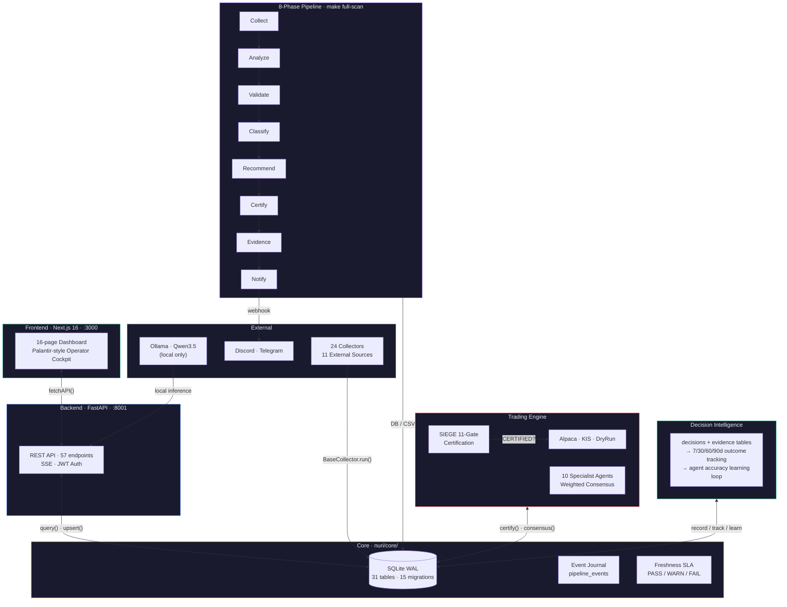

# Nuri-Quant

<div align="center">

[](https://github.com/researcherhojin/nuri-quant/actions/workflows/main-ci-cd.yml)
[](https://codecov.io/gh/researcherhojin/nuri-quant)
[](LICENSE)

**[Issues](https://github.com/researcherhojin/nuri-quant/issues)** · **[Strategy](docs/STRATEGY.md)**

</div>

Open-source quantitative investment platform that **proves why you should buy or sell** — not gut feeling. 24 data collectors, 10 specialist agents, and an 11-condition mechanical gate certify every recommendation before it reaches you.

## Pipeline

`make full-scan` runs 8 phases end-to-end. Phases communicate via DB/CSV — no direct imports between phases.

```mermaid
graph LR
    A["📡 <b>A · Collect</b><br/>12 collectors<br/>stock · macro · technicals"]
    B["📊 <b>B · Analyze</b><br/>portfolio · sector · risk"]
    C["🧪 <b>C · Validate</b><br/>signal backtest + scorecard<br/>+ learning memory snapshot"]
    D["🏷️ <b>D · Classify</b><br/>regime × strategy map<br/>+ multi-factor composite"]
    E["🤖 <b>E · Recommend</b><br/>candidates + 10-agent consensus<br/>+ swing scanner"]
    F["🛡️ <b>F · Certify</b><br/>price targets · rebalance<br/>SIEGE 11-gate certification"]
    G["📈 <b>G · Evidence</b><br/>5 Plotly charts"]
    H["🔔 <b>H · Notify</b><br/>Discord · Telegram"]

    A -->|"prices · macro · signals (DB)"| B
    B -->|"portfolio analysis (DB)"| C
    C -->|"signal_results.csv"| D
    D -->|"regime + factors (DB)"| E
    E -->|"recommendations (DB)"| F
    F -->|"CERTIFIED / REJECTED"| G
    G -->|"evidence HTML"| H

    style A fill:#e8eaf6,stroke:#5c6bc0,color:#1a237e
    style B fill:#e8f5e9,stroke:#66bb6a,color:#1b5e20
    style C fill:#fff3e0,stroke:#ffa726,color:#e65100
    style D fill:#e3f2fd,stroke:#42a5f5,color:#0d47a1
    style E fill:#fce4ec,stroke:#ef5350,color:#b71c1c
    style F fill:#f3e5f5,stroke:#ab47bc,color:#4a148c
    style G fill:#e0f2f1,stroke:#26a69a,color:#004d40
    style H fill:#fff9c4,stroke:#fdd835,color:#f57f17
```



## Key Features

- **Evidence-based decisions** — 8,000+ historical trade backtests across 20 signals validate every recommendation
- **10-regime market classification** — 6 base (bull/bear/sideways × high/low vol) + 4 special (recovery, euphoria, stagflation, sector rotation)
- **10 specialist agents** — Weighted consensus voting with SSE reasoning trace. Risk agent holds veto power (SELL + confidence ≥ 80 overrides all)
- **SIEGE certification** — [11-condition mechanical gate](https://github.com/nutshells3/Swarm-Intelligence-Engine-with-Gated-Execution). Single failure → REJECTED
- **Investment rules UI** — Take-profit highlights (emerald/amber), VIX half-position warning, sell priority badges. O'Neil (CAN SLIM) + Minervini (SEPA), 3:1 reward-to-risk
- **Pipeline observability** — [Palantir Foundry](https://www.palantir.com/docs/foundry/data-lineage/overview)-style Data Health + [Dagster](https://docs.dagster.io/guides/observe/asset-freshness-policies) Freshness SLA
- **Superinvestor tracking** — SEC 13F filings (Buffett, Dalio, NPS Korea, Key Square, Strive)
- **Portfolio onboarding** — Dashboard UI for CRUD, CSV import/export, sample portfolio, YAML reverse sync
- **LLM reports** — Qwen3.5 evidence-based analysis with SIEGE certification, fully local (Ollama)

## Architecture



## Tech Stack

| Layer | Stack |
|-------|-------|
| **Frontend** | Next.js 16 · React 19 · Tailwind 4 · shadcn/ui · Recharts · ReactFlow |
| **Backend** | Python 3.12 · FastAPI · SQLite (WAL) · Pydantic · JWT · SSE |
| **Quant** | pandas · NumPy · TA-Lib · VectorBT · Riskfolio-Lib · scikit-learn |
| **Data** | OpenBB · pykrx · edgartools · FRED · yfinance · Beautiful Soup · FINVIZ |
| **LLM** | Ollama (local) · Qwen3.5 35B MoE · OpenAI gpt-5.4-nano (Tier 0 only) |
| **CI/CD** | GitHub Actions · pytest-xdist · Vitest · Playwright · Ruff · Codecov · Trivy |

## Getting Started

### Prerequisites (macOS Apple Silicon)

```bash
# 1. Homebrew (if not installed)
/bin/bash -c "$(curl -fsSL https://raw.githubusercontent.com/Homebrew/install/HEAD/install.sh)"

# 2. System dependencies
brew install uv ta-lib

# 3. Node.js 22 (fnm recommended)
brew install fnm
fnm install 22 && fnm use 22
echo 'eval "$(fnm env --use-on-cd)"' >> ~/.zshrc
```

### Setup

```bash
# Clone
git clone https://github.com/researcherhojin/nuri-quant.git
cd nuri-quant

# Backend
make setup                 # uv venv + deps + DB init + portfolio import

# Frontend
cd frontend && npm ci && cd ..

# Config
cp .env.example .env                                    # edit API keys (all optional)
cp config/portfolio.example.yaml config/portfolio.yaml  # edit your holdings

# Verify
make test                  # 2,524 backend tests
cd frontend && npx vitest run && cd ..  # 593 frontend tests
```

### Run

```bash
make start                 # API (:8001) + Dashboard (:3000)
make full-scan             # 8-phase pipeline: collect → certify → notify
make quick-scan            # Fast 4-step: collect → analyze → consensus → targets (~2 min)
```

After `make start`: Dashboard at <http://localhost:3000>, API docs at <http://localhost:8001/docs>.

### Useful Commands

```bash
make collect               # 12 collectors (all external data)
make consensus             # 10-agent consensus + price targets
make certify               # SIEGE 11-condition certification
make test                  # pytest (2,524 tests, parallel via xdist)
make lint                  # ruff check
cd frontend && npm run test  # vitest (593 tests)

# Single test
.venv/bin/python -m pytest tests/test_db.py::TestUpsertPrices::test_insert_and_query -v
```

## Multi-machine Workflow

Two patterns for running Nuri-Quant on more than one Mac. Pick whichever fits your hardware setup — they compose freely.

### Migrating state between machines

`scripts/sync_dev.sh` rsyncs everything git can't carry: gitignored project state (`.env`, `config/portfolio.yaml`, `data/portfolio.db`) plus Claude Code state (`~/.claude/projects/...` conversation history + memory + global skills/plugins/settings). Caches and runtime state are excluded.

```bash
# One-time setup on each machine
sudo systemsetup -setremotelogin on             # both Macs
ssh-copy-id <other-mac>.local                   # passwordless SSH (uses $USER)

# Tell the script who the "other" machine is. Put this in ~/.zshrc, NOT .env.
# Reason: sync_dev.sh syncs .env between machines, so a DEV2_HOST in .env
# would propagate and make the other machine point at itself.
echo 'export DEV2_HOST=<other-mac>.local' >> ~/.zshrc
source ~/.zshrc

# Recurring sync (run on whichever machine has the freshest state)
scripts/sync_dev.sh push                        # this laptop → other
scripts/sync_dev.sh pull                        # other → this laptop
scripts/sync_dev.sh push --with-reports         # include data/reports/ (~136MB)
scripts/sync_dev.sh push --no-claude            # project files only, skip ~/.claude
```

Each machine's `~/.zshrc` holds the *other* machine's hostname, so the value is asymmetric by design. The script does a SQLite WAL checkpoint before transfer, prompts before destructive overwrites, and uses `rsync --partial` for resumable delta transfers. Operate one machine at a time to avoid DB conflicts.

### Auto-pull receiver (portable dev → always-on prod)

When one Mac is portable dev (you take it out) and the other stays home as the 24/7 receiver, install the launchd auto-pull agent on the receiver once. After this, every `git push` from the portable machine is reflected on the receiver within 5 minutes — no manual sync needed.

```bash
# On the receiver (always-on Mac), one-time setup
cp scripts/com.nuri-quant.autopull.plist ~/Library/LaunchAgents/
launchctl load ~/Library/LaunchAgents/com.nuri-quant.autopull.plist

# Verify (RunAtLoad=true triggers immediately)
launchctl list | grep nuri-quant.autopull
tail -f ~/Library/Logs/nuri-quant-autopull.log
```

The agent runs `scripts/auto_deploy.sh` every 5 minutes:

1. **Fetch** `origin/main`. If no new commits, exit.
2. **Fast-forward merge** only — refuses non-ff and refuses to touch a dirty worktree.
3. **Diff analysis** — warns if `pyproject.toml`/`uv.lock` (run `uv sync`), `frontend/package*.json` (run `npm ci`), or `nuri/core/db.py` (run migrate) changed.
4. **Deploy hook** — placeholder for restarting 24/7 services.

Network failures are silently retried on the next tick.

## Architecture

```
nuri/
├── core/          # DB gateway (sole sqlite3 importer), rules, events, freshness, timezone
├── collectors/    # 24 modules — BaseCollector pattern (collect → save → run)
├── analysis/      # Portfolio, risk, sector, charts, rebalance advisor, evidence
├── quant/
│   ├── regime/    # 10-regime classifier + strategy map
│   ├── validation/# Signal/superinvestor/analyst backtests + scorecard
│   ├── backtest/  # VectorBT engine + grid search optimizer
│   └── factors/   # Multi-factor scoring (momentum, value, quality)
├── trading/
│   ├── agents/    # 10 specialist agents + weighted consensus
│   ├── engine/    # SIEGE: gate, conflicts, learning memory
│   ├── strategy/  # Long/Short, mean-reversion, pairs trading
│   ├── recommend/ # Candidates, price targets, rebalance, tracker
│   ├── swing/     # Market-wide scanner + entry/exit rules
│   └── execution/ # Broker interface (Alpaca paper + DryRun)
├── api/           # FastAPI REST (54 endpoints) + SSE streaming
├── alerts/        # Discord + Telegram notifications
└── llm/           # LLM report (Ollama) + OpenAI wrapper + event classifier
```

**Design decisions:**
- **DB as sole integration point** — `nuri/core/db.py` is the only `sqlite3` importer. All modules use `query()`, `query_df()`, `upsert_*()`. Tests inject `tmp_path` for isolation.
- **Phase isolation** — 8 pipeline phases never import each other. Data flows through DB tables and CSV files only.
- **Config-driven rules** — Investment rules in `config/rules.yaml`, agent thresholds in `config/agents.yaml`. Code executes rules, never defines them.
- **Lean-cost stack** — SQLite (not Postgres), Ollama for portfolio data (local only), OpenBB + yfinance (not Bloomberg). OpenAI nano for public headline classification only (~$3.51/yr). See `docs/STRATEGY.md` §2.5.

## Investment Rules

Defined in `config/rules.yaml`. Based on [O'Neil (CAN SLIM)](https://www.investors.com/) + [Minervini (SEPA)](https://www.minervini.com/) + [Disposition Effect research (Shefrin 1985)](https://onlinelibrary.wiley.com/doi/10.1111/j.1540-6261.1985.tb05002.x).

| | Growth | Value | Swing |
|---|--------|-------|-------|
| **Stop-Loss** | -7% | -10% | -5% |
| **Take-Profit 1** | +20% → sell 50% | +15% → sell 50% | +5% → sell 50% |
| **Take-Profit 2** | +40% → sell 25% | +30% → sell 25% | +10% → sell all |
| **Remainder** | Trailing -15% | Trailing -15% | — |

**Core Rules:**
- VIX > 30 → block all new buys (win rate collapses)
- Buy checklist: TipRanks ≥ Moderate Buy, superinvestors ≥ 3, PE < 100, revenue > $0, multi-factor top 50%
- Sell priority: Leveraged ETF → stop-loss breach → no superinvestors → position limit → sector limit

## References

| Source | Application |
|--------|-------------|
| [SIEGE Engine](https://github.com/nutshells3/Swarm-Intelligence-Engine-with-Gated-Execution) | 11-condition gate, certification, event journal |
| [Palantir Foundry](https://www.palantir.com/docs/foundry/data-lineage/overview) | Data Health, pipeline monitoring |
| [Dagster](https://docs.dagster.io/guides/observe/asset-freshness-policies) | Asset freshness PASS/WARN/FAIL |
| [TradingAgents](https://github.com/TauricResearch/TradingAgents) | Multi-agent consensus pattern |
| [O'Neil — CAN SLIM](https://www.investors.com/) | Stop-loss -7%, take-profit +20%/+40% |
| [Minervini — SEPA](https://www.minervini.com/) | Trailing stop, 3:1 reward-to-risk |

## License

[GNU Affero General Public License v3.0](LICENSE)
