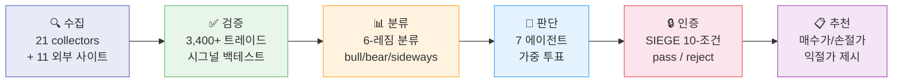

# Nuri-Quant (누리퀀트)

<div align="center">

[](https://www.python.org/)
[]()
[](https://codecov.io/gh/researcherhojin/nuri-quant)
[](LICENSE)
[]()

**[API Docs](http://localhost:8001/docs)** · **[Dashboard](http://localhost:3000)** · **[Issues](https://github.com/researcherhojin/nuri-quant/issues)**

</div>

주식을 사거나 팔 때, 근거 없이 감으로 하고 있지 않나요?

Nuri-Quant은 **"왜 이 종목을 사야/팔아야 하는지"를 데이터로 증명**하는 오픈소스 퀀트 투자 플랫폼입니다. 21개 수집기로 데이터를 모으고, 3,400건 이상의 과거 트레이드로 시그널을 검증하고, 7개 전문 에이전트가 독립적으로 분석한 뒤 투표하고, 10개 규칙을 기계적으로 검증해서 — 최종 추천이 나옵니다.

## 파이프라인



| 단계 | 설명 |
|------|------|
| **수집** | 미국/한국 주가, 매크로 지표, Fear&Greed, 13F, 애널리스트 목표가 + 11개 외부 사이트 (TipRanks, Dataroma, CBOE, CoinGecko, Reddit/WSB 등) |
| **검증** | 3,400건+ 과거 트레이드로 시그널 백테스트. 최근 성과 급락 시그널은 Learning Memory가 자동 신뢰도 하향 |
| **분류** | SPY 가격, SMA50/200, VIX 기반 6개 레짐 분류. 날짜별 VIX 히스테리시스 + KST 타임존 통일 |
| **판단** | 7개 에이전트 독립 분석 + 가중 투표. Risk 에이전트 거부권: confidence 80 이상 시 전원 BUY여도 SELL 강제 |
| **인증** | [SIEGE Engine](https://github.com/nutshells3/Swarm-Intelligence-Engine-with-Gated-Execution) — 10개 규칙 기계적 검증. 하나라도 error면 REJECTED |
| **추천** | 매수가, 손절가(-7%), 1차 익절(+20%, 50% 매도), 2차 익절(+40%, 25% 매도), 트레일링 스톱(-15%) |

## Quick Start

```bash
# Prerequisites: Python 3.12, uv, brew install ta-lib
git clone https://github.com/researcherhojin/nuri-quant.git && cd nuri-quant
make setup         # venv + deps + DB init + portfolio import
cp .env.example .env
cp config/portfolio.example.yaml config/portfolio.yaml  # 본인 포트폴리오 편집
make full-scan     # 전체 파이프라인 실행 (수집→검증→분류→판단→인증→추천→시각화→알림)
```

<details>
<summary><b>전체 명령어</b></summary>

| Command | 설명 |
|---------|------|
| `make full-scan` | 전체 파이프라인 8단계 실행 |
| `make quick-scan` | 수집→분석→합의→타겟 (~2분) |
| `make consensus` | 7에이전트 합의 + 가격 타겟 |
| `make certify` | SIEGE 10-condition 인증 |
| `make targets` | 전 종목 매수가/손절가/익절가 |
| `make rebalance` | 규칙 위반 감지 + 매도 수량 |
| `make evidence` | 5개 Plotly 증거 차트 |
| `make report-llm` | Qwen3.5 LLM 증거 기반 리포트 |
| `make start` | API(:8001) + Dashboard(:3000) 동시 실행 |
| `make test` | pytest 628 tests (39 files) |

</details>

## 투자 규칙

`config/rules.yaml`에 정의. [O'Neil (CAN SLIM)](https://www.investors.com/) + [Minervini (SEPA)](https://www.minervini.com/) + [처분효과 연구](https://onlinelibrary.wiley.com/doi/10.1111/j.1540-6261.1985.tb05002.x) 기반.

| | 성장주 | 가치주 | 스윙 |
|---|--------|-------|------|
| **손절** | -7% | -10% | -5% |
| **1차 익절** | +20% → 50% 매도 | +15% → 50% 매도 | +5% → 50% 매도 |
| **2차 익절** | +40% → 25% 매도 | +30% → 25% 매도 | +10% → 전량 |
| **나머지** | 트레일링 -15% | 트레일링 -15% | — |

**핵심 규칙:**
- VIX > 30 → 신규 매수 금지 (승률 급락 구간)
- 매수 체크리스트: TipRanks ≥ Moderate Buy, 슈퍼투자자 3명+, PE < 100, 매출 > $0, 멀티팩터 상위 50%
- 매도 우선순위: 레버리지 ETF → 손절선 초과 → 슈퍼투자자 0명 → 비중 초과 → 섹터 초과

## 파이프라인 관측성

[Palantir Foundry](https://www.palantir.com/docs/foundry/data-lineage/overview) + [Dagster Freshness Policy](https://docs.dagster.io/guides/observe/asset-freshness-policies) + [SIEGE Event Journal](https://github.com/nutshells3/Swarm-Intelligence-Engine-with-Gated-Execution) 패턴 적용.

| 기능 | 설명 |
|------|------|
| **Event Journal** | 모든 파이프라인 상태 전환을 `pipeline_events` 테이블에 append-only 기록. causation_id로 인과 추적 |
| **Data Freshness** | 데이터 소스별 PASS/WARN/FAIL 상태. 주가 18h/30h, VIX 24h/72h, 합의 24h/48h SLA |
| **Pipeline Control** | 6-step DAG 의존성 검증 + `run_step()` wrapper. `/api/pipeline/{step}/run`으로 개별 스텝 실행 |
| **Operator Cockpit** | 대시보드 상단 FreshnessBar + Pipeline 페이지에 [실행] 버튼 + 이벤트 타임라인 |
| **Projection 기반 대시보드** | `analyze_portfolio()` 인라인 호출 제거 (93초 → <1초). recommendations 테이블에서 조회 |

### 데이터 정합성

| 항목 | 내용 |
|------|------|
| **타임존** | `nuri.core.timezone` — 내부 KST 통일, `datetime.now()` 사용 금지 |
| **VIX 히스테리시스** | 과거 레짐 분류 시 해당 날짜의 실제 VIX 조회 (현재 VIX 근사 제거) |
| **환율** | 하드코딩 1450원 제거 → 7일 초과 경고, 미수집 시 에러 |
| **데이터 신선도 강제** | SPY 120시간 초과 → `classify_regime()` 차단 (주말/공휴일 감안) |

### 피드백 루프

| 항목 | 내용 |
|------|------|
| **hit 판정** | BUY: ret30 >= 5% (기존 > 0%), SELL: ret30 < -2%. `hit_quality` = 달성률 |
| **실행 추적** | `trades` 테이블 + API (`POST/GET/PUT /api/trades`) — 추천 vs 실제 실행 비교 |
| **에이전트 감사** | `agent_verdicts` JSON — 7개 에이전트 개별 판단 기록 |
| **Confidence 감사** | `scoring_detail` JSON — drift/conflict/regime_fit 계수 역추적 |

## Tech Stack

### 1. 수집 (Collect)

[]()
[]()
[]()
[]()
[]()
[]()
[]()

> 21 collectors + 11 외부 사이트 (TipRanks · Dataroma · CBOE · CoinGecko · Reddit/WSB · ARK · ETF.com · Macrotrends · TradingEcon · Short Interest · FINVIZ)

### 2. 분석 (Quant)

[]()
[]()
[]()
[]()
[]()

### 3. 백엔드 (API)

[]()
[]()
[]()

> 45+ endpoints · 29 tables · SSE stream · JWT + bcrypt + slowapi · Pipeline Event Journal · Data Freshness SLA

### 4. 프론트엔드 (Dashboard)

[]()
[]()
[]()
[]()

> 14 pages · Dark mode · Palantir-style Operator Cockpit · FreshnessBar (PASS/WARN/FAIL) · Pipeline Control

### 5. LLM

[]()
[]()

### 6. CI/CD

[]()
[]()
[]()
[]()

## 레퍼런스

### 투자 이론

| 출처 | 적용 |
|------|------|
| [O'Neil — CAN SLIM](https://www.investors.com/) | 손절 -7%, 익절 +20%/+40% |
| [Minervini — SEPA](https://www.minervini.com/) | 트레일링 스톱, 3:1 손익비 |
| [Shefrin 1985 — 처분효과](https://onlinelibrary.wiley.com/doi/10.1111/j.1540-6261.1985.tb05002.x) | 수익 종목 조기 매도 편향 경고 |

### 아키텍처 & 오픈소스

| 출처 | 적용 |
|------|------|
| [SIEGE Engine](https://github.com/nutshells3/Swarm-Intelligence-Engine-with-Gated-Execution) | 10-condition gate, certification, event journal |
| [Palantir Foundry](https://www.palantir.com/docs/foundry/data-lineage/overview) | Data Health, Data Expectations, pipeline monitoring |
| [Dagster](https://docs.dagster.io/guides/observe/asset-freshness-policies) | Asset freshness PASS/WARN/FAIL, observability |
| [TradingAgents](https://github.com/TauricResearch/TradingAgents) | 멀티에이전트 합의 패턴 |
| [Riskfolio-Lib](https://riskfolio-lib.readthedocs.io/) | MVO/Risk Parity 최적화 |
| [VectorBT](https://vectorbt.dev/) | 벡터 기반 백테스트 |
| [Ghostfolio](https://github.com/ghostfolio/ghostfolio) | 대시보드 UX |
| [React Flow](https://reactflow.dev/) | 파이프라인 DAG 시각화 |

## License

[GNU Affero General Public License v3.0](LICENSE)
