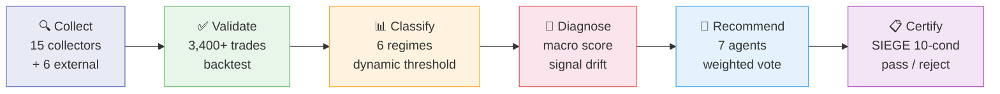
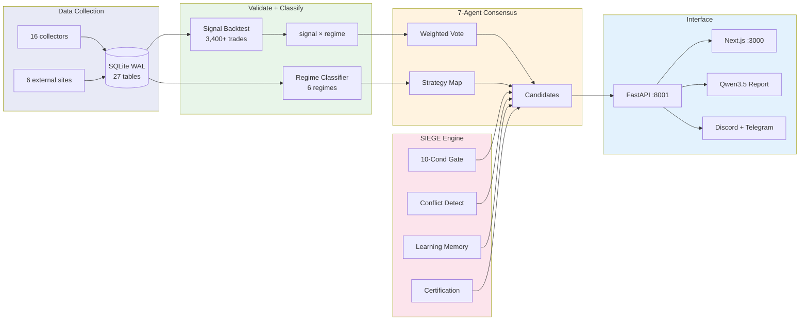

# Nuri-Quant (누리퀀트)

<div align="center">

[](https://www.python.org/)
[]()
[](LICENSE)
[]()
[]()

**[API Swagger](http://localhost:8001/docs)** · **[Dashboard](http://localhost:3000)** · **[Docs](CLAUDE.md)** · **[Issues](https://github.com/researcherhojin/nuri-quant/issues)**

100% 무료 오픈소스 퀀트 투자 플랫폼.<br/>
15개 수집기 + 6개 외부 사이트 → 시그널 백테스트 → 6-레짐 분류 → 7-에이전트 합의 → SIEGE 인증

</div>

## Pipeline



## Tech Stack

<div align="center">

[](https://fastapi.tiangolo.com/)
[](https://nextjs.org/)
[](https://ollama.com/)
[](https://plotly.com/)
[](https://pandas.pydata.org/)
[](https://tailwindcss.com/)
[](https://jwt.io/)
[](https://discord.com/)
[](https://telegram.org/)

</div>

| Layer | Tools | Count |
|-------|-------|-------|
| **Data** | OpenBB · yfinance · pykrx · edgartools · FRED · TA-Lib | 15 collectors |
| **External** | TipRanks · Dataroma · Macrotrends · ARK · ETF.com · TradingEconomics | 6 sites |
| **Quant** | pandas · Riskfolio-Lib · VectorBT · QuantStats · scikit-learn · cvxpy | — |
| **Backend** | FastAPI · uvicorn · SSE stream · Pydantic | 14 API routes |
| **Frontend** | Next.js 16 · React 19 · shadcn/ui · Tailwind 4 · Recharts | 12 pages |
| **LLM** | Ollama · Qwen3.5 (35B-A3B MoE) · thinking model · auto-save | — |
| **DB** | SQLite WAL · 27 tables · audit_log · external_analysis | 4.1 MB |
| **Security** | JWT · bcrypt · slowapi · CSP/HSTS · audit log · Pydantic | 5 layers |
| **CI/CD** | GitHub Actions · ruff + pytest + tsc · uv cache · Trivy scan | 3 jobs |

## Getting Started

```bash
# Prerequisites: Python 3.12, uv, brew install ta-lib
git clone https://github.com/researcherhojin/nuri-quant.git && cd nuri-quant
make setup         # venv + deps + DB init + portfolio import
cp .env.example .env
```

### Commands

> `make full-scan` — 수집부터 증거 시각화 + SIEGE 인증 + 알림까지 한번에.

<details>
<summary><b>전체 명령어</b></summary>

| Command | Description |
|---------|-------------|
| `make full-scan` | 8-phase 전체 파이프라인 |
| `make quick-scan` | 빠른 4-step (~2분) |
| `make consensus` | 7-에이전트 합의 + 가격 타겟 |
| `make targets` | 전 종목 매수가/손절가/익절가 |
| `make rebalance` | 규칙 위반 감지 + 매도 수량 |
| `make certify` | SIEGE 10-condition 인증 |
| `make evidence` | 5개 Plotly 증거 차트 |
| `make report-llm` | Qwen3.5 LLM 리포트 |
| `make external` | 외부 데이터 요약 |
| `make test` | pytest 188 tests |
| `make lint` | ruff check |
| `make start` | API + Dashboard 동시 실행 |

</details>

## Architecture



## SIEGE Engine

[Swarm Intelligence Engine with Gated Execution](https://github.com/nutshells3/Swarm-Intelligence-Engine-with-Gated-Execution) 아키텍처를 투자 도메인에 적용.

| Component | Original SIEGE | Nuri-Quant Implementation |
|-----------|---------------|--------------------------|
| **Planning Gate** | 10-condition machine check | 10개 규칙 기계 검증 (`make certify`) |
| **Multi-Agent** | LLM agent dispatch | 7 domain agents + weighted vote |
| **Conflict Detection** | Code merge conflicts | BUY/SELL direction conflicts |
| **Learning Memory** | Execution failure retry | Signal drift → confidence penalty |
| **Certification** | OAE formal assurance | rules.yaml 기반 pass/reject |

### 10-Condition Certification

```
make certify

═══════════════════════════════════════════════════════
  SIEGE Certificate — CERTIFIED (90%)
═══════════════════════════════════════════════════════
  ✅ 종목 비중 <= 15%
  ✅ 섹터 비중 <= 35%
  ✅ 손절선 준수
  ✅ 데이터 신선도 (72h)
  ✅ 레버리지 ETF 비보유
  ⚠️ VIX > 30 매수 차단
  ✅ 외부 데이터 충분
  ✅ 방향 충돌 해소
  ⚠️ 시그널 drift 안전
  ✅ rules.yaml 완전 로드
═══════════════════════════════════════════════════════
```

## 7-Agent Consensus

| Agent | Weight | Role |
|-------|--------|------|
| Technical | 18% | RSI, MACD, SMA crossovers |
| Fundamental | 14% | PE, ROE, growth, debt |
| Macro | 14% | Regime + macro score |
| **Risk** | **22%** | **Veto power** (conf ≥ 80 → SELL) |
| Smart Money | 9% | 13F + analyst consensus |
| Wall Street | 13% | Ratings + EPS surprise + insider |
| Korean Market | 10% | KRW/USD FX, KOSPI |

## Investment Rules

`config/rules.yaml` — O'Neil (CAN SLIM) + Minervini (SEPA) 기반.

| Category | Growth | Value | Swing |
|----------|--------|-------|-------|
| **Stop Loss** | -7% | -10% | -5% |
| **Target 1** | +20% (50% sell) | +15% (50% sell) | +5% (50% sell) |
| **Target 2** | +40% (25% sell) | +30% (25% sell) | +10% (all) |
| **Trailing** | -15% from high | -15% from high | -20% |

| Gate | Condition |
|------|-----------|
| VIX > 30 | **Block** new buys |
| VIX 25-30 | Half position only |
| F&G < 20 | Cash 60% |
| Position | Max 15% per stock |
| Sector | Max 35% per sector |

<details>
<summary><b>매수 체크리스트 + 매도 우선순위</b></summary>

**Buy checklist**: TipRanks ≥ Moderate Buy · superinvestors ≥ 3 · PE < 100 · revenue > $0 · factor top 50%

**Sell priority**: 1. Leverage ETF → 2. Stop-loss exceeded → 3. No superinvestor + loss → 4. Overweight → 5. Sector overweight

</details>

## Completed Roadmap

보안 감사 (OWASP + STRIDE) 기반 — **17/17 항목 완료**.

<details>
<summary>CRITICAL 5/5 · HIGH 6/6 · MEDIUM 6/6</summary>

**CRITICAL**: JWT auth · bcrypt hashing · rate limiting · CORS · input validation

**HIGH**: Audit log · Monte Carlo block bootstrap · partial fill · DB migration · collection failure guard · CSP/HSTS

**MEDIUM**: Data freshness · adaptive hysteresis · FX calibration · SSE cache · evidence charts · Telegram

</details>

## Next Phase

- [ ] 외부 데이터 수집기 완전 자동화 — TipRanks/Dataroma scraping
- [ ] 백테스트에 신규 익절/손절 규칙 적용 → 성과 검증
- [ ] 대시보드 가격 타겟 + 리밸런스 어드바이저 페이지
- [ ] Alpaca 실전 연동 (paper → live)
- [ ] 멀티 포트폴리오 지원

## License

[Apache License 2.0](LICENSE)
