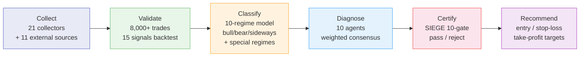

# Nuri-Quant

<div align="center">

[](https://github.com/researcherhojin/nuri-quant/actions/workflows/ci.yml)
[](https://codecov.io/gh/researcherhojin/nuri-quant)
[](LICENSE)

**[API Docs](http://localhost:8001/docs)** · **[Dashboard](http://localhost:3000)** · **[Issues](https://github.com/researcherhojin/nuri-quant/issues)**

</div>

Open-source quantitative investment platform that **proves why you should buy or sell** — not gut feeling. 21 data collectors ingest market data, 8,000+ historical trades validate 15 signals across 10 market regimes, 10 specialist agents vote independently, and a 10-condition gate mechanically certifies every recommendation before it reaches you.

## Pipeline



| Stage | Description |
|-------|-------------|
| **Collect** | US/KR equities, macro indicators (FRED), Fear & Greed, 13F filings, analyst estimates + 11 external sites (TipRanks, Dataroma, CBOE, CoinGecko, Reddit/WSB, ARK, etc.) |
| **Validate** | Backtest 8,000+ historical trades across 15 signals (price, macro, data-driven). Learning Memory auto-downgrades signals with degrading win rates |
| **Classify** | 10-regime classification: 6 base (bull/bear/sideways × high/low vol) + 4 special (recovery, euphoria, stagflation, sector rotation). Adaptive hysteresis with per-day historical VIX lookup |
| **Diagnose** | 10 specialist agents with weighted voting. Risk agent holds veto power: forces SELL override when confidence ≥ 80 |
| **Certify** | [SIEGE Engine](https://github.com/nutshells3/Swarm-Intelligence-Engine-with-Gated-Execution) — 10-condition mechanical gate. Single error → REJECTED |
| **Recommend** | Entry price, stop-loss (-7%), take-profit 1 (+20%, sell 50%), take-profit 2 (+40%, sell 25%), trailing stop (-15%) |

## Quick Start

```bash
# Prerequisites: Python 3.12, uv, brew install ta-lib
git clone https://github.com/researcherhojin/nuri-quant.git && cd nuri-quant
make setup         # venv + deps + DB init + portfolio import
cp .env.example .env
cp config/portfolio.example.yaml config/portfolio.yaml  # edit your holdings
make full-scan     # run full pipeline: collect → validate → classify → diagnose → certify → recommend → visualize → notify
```

<details>
<summary><b>All Commands</b></summary>

| Command | Description |
|---------|-------------|
| `make full-scan` | Full 8-stage pipeline execution |
| `make quick-scan` | Collect → analyze → consensus → targets (~2 min) |
| `make consensus` | 10-agent consensus + price targets |
| `make certify` | SIEGE 10-condition certification |
| `make targets` | Entry / stop-loss / take-profit for all holdings |
| `make rebalance` | Rule violation detection + sell quantities |
| `make evidence` | 5 Plotly evidence charts |
| `make report-llm` | Qwen3.5 LLM evidence-based report |
| `make start` | API (:8001) + Dashboard (:3000) |
| `make test` | pytest 818 tests (43 files) |

</details>

## Investment Rules

Defined in `config/rules.yaml`. Based on [O'Neil (CAN SLIM)](https://www.investors.com/) + [Minervini (SEPA)](https://www.minervini.com/) + [Disposition Effect research (Shefrin 1985)](https://onlinelibrary.wiley.com/doi/10.1111/j.1540-6261.1985.tb05002.x).

| | Growth | Value | Swing |
|---|--------|-------|-------|
| **Stop-Loss** | -7% | -10% | -5% |
| **Take-Profit 1** | +20% → sell 50% | +15% → sell 50% | +5% → sell 50% |
| **Take-Profit 2** | +40% → sell 25% | +30% → sell 25% | +10% → sell all |
| **Remainder** | Trailing -15% | Trailing -15% | — |

**Core Rules:**
- VIX > 30 → block all new buys (win rate collapses)
- Buy checklist: TipRanks ≥ Moderate Buy, superinvestors ≥ 3, PE < 100, revenue > $0, multi-factor top 50%
- Sell priority: Leveraged ETF → stop-loss breach → no superinvestors → position limit → sector limit

## Pipeline Observability

Architecture inspired by [Palantir Foundry](https://www.palantir.com/docs/foundry/data-lineage/overview) Data Health + [Dagster](https://docs.dagster.io/guides/observe/asset-freshness-policies) Freshness Policy + [SIEGE](https://github.com/nutshells3/Swarm-Intelligence-Engine-with-Gated-Execution) Event Journal.

| Feature | Description |
|---------|-------------|
| **Event Journal** | Append-only `pipeline_events` table. All state transitions recorded with `causation_id` for causal tracing |
| **Data Freshness SLA** | Per-source PASS/WARN/FAIL. Prices 48h/120h, VIX 24h/72h, Consensus 24h/48h thresholds |
| **Pipeline Control** | 6-step DAG with dependency validation. `run_step()` wrapper + `/api/pipeline/{step}/run` endpoint |
| **Operator Cockpit** | Palantir-style dashboard: FreshnessBar badges + Pipeline page with run buttons + event timeline |
| **Projection-based Dashboard** | Removed inline `analyze_portfolio()` (93s → <1s). Reads pre-computed results from `recommendations` table |

### Data Integrity

| Item | Detail |
|------|--------|
| **Timezone** | `nuri.core.timezone` — KST internally, `datetime.now()` prohibited |
| **VIX Hysteresis** | Historical VIX lookup per-day for regime classification (removed current-VIX approximation) |
| **Exchange Rate** | Hardcoded 1450 KRW/USD removed → staleness warning at 7d, error if unavailable |
| **Freshness Enforcement** | SPY > 120h stale → `classify_regime()` blocked (weekend/holiday aware) |
| **Automated Rules** | Take-profit signals, trailing stop (HWM-based), portfolio MDD -10% gate — `price_targets.py` |

### Feedback Loop

| Item | Detail |
|------|--------|
| **Hit Calculation** | BUY: ret30 ≥ 5% (was > 0%), SELL: ret30 < -2%. `hit_quality` = achievement ratio |
| **Execution Tracking** | `trades` table + API (`POST/GET/PUT /api/trades`) — recommendation vs actual execution |
| **Agent Audit** | `agent_verdicts` JSON — 10 individual agent judgments recorded per recommendation |
| **Confidence Audit** | `scoring_detail` JSON — drift/conflict/regime_fit coefficients for full audit trail |

## Tech Stack

### 1. Data Collection

[]()
[]()
[]()
[]()
[]()
[]()
[]()

> 21 collectors + 11 external sources (TipRanks · Dataroma · CBOE · CoinGecko · Reddit/WSB · ARK · ETF.com · Macrotrends · TradingEconomics · ShortInterest · FINVIZ)

### 2. Quantitative Analysis

[]()
[]()
[]()
[]()
[]()

### 3. Backend

[]()
[]()
[]()

> 53 endpoints · 29 tables (v11 migrations) · SSE streaming · JWT + bcrypt + slowapi rate limiting · Pipeline Event Journal · Data Freshness SLA

### 4. Frontend

[]()
[]()
[]()
[]()

> 14 pages · Dark mode · Palantir-style Operator Cockpit · FreshnessBar (PASS/WARN/FAIL) · Pipeline Control

### 5. LLM

[]()
[]()

### 6. CI/CD

[]()
[]()
[]()
[]()

## References

### Investment Theory

| Source | Application |
|--------|-------------|
| [O'Neil — CAN SLIM](https://www.investors.com/) | Stop-loss -7%, take-profit +20%/+40% |
| [Minervini — SEPA](https://www.minervini.com/) | Trailing stop, 3:1 reward-to-risk ratio |
| [Shefrin 1985 — Disposition Effect](https://onlinelibrary.wiley.com/doi/10.1111/j.1540-6261.1985.tb05002.x) | Premature profit-taking bias alert |

### Architecture & Open Source

| Source | Application |
|--------|-------------|
| [SIEGE Engine](https://github.com/nutshells3/Swarm-Intelligence-Engine-with-Gated-Execution) | 10-condition gate, certification, event journal |
| [Palantir Foundry](https://www.palantir.com/docs/foundry/data-lineage/overview) | Data Health, Data Expectations, pipeline monitoring |
| [Dagster](https://docs.dagster.io/guides/observe/asset-freshness-policies) | Asset freshness PASS/WARN/FAIL, observability |
| [TradingAgents](https://github.com/TauricResearch/TradingAgents) | Multi-agent consensus pattern |
| [Riskfolio-Lib](https://riskfolio-lib.readthedocs.io/) | MVO / Risk Parity optimization |
| [VectorBT](https://vectorbt.dev/) | Vectorized backtesting engine |
| [Ghostfolio](https://github.com/ghostfolio/ghostfolio) | Dashboard UX inspiration |
| [React Flow](https://reactflow.dev/) | Pipeline DAG visualization |

## License

[GNU Affero General Public License v3.0](LICENSE)
