# Nuri-Quant

<div align="center">

[](https://github.com/researcherhojin/nuri-quant/actions/workflows/main-ci-cd.yml)
[](https://codecov.io/gh/researcherhojin/nuri-quant)
[](LICENSE)

</div>

An open-source quant platform that **proves the evidence behind every investment decision**.

Every BUY/SELL recommendation runs through a **collect → analyze → consensus → certify → track** pipeline. Each decision is recorded with its market context and per-agent reasoning, then automatically scored against actual outcomes after 30/60/90 days. The system gets more accurate as outcomes accumulate — agent weights adjust within a ±30% band based on hit rate.

## Architecture

Every BUY/SELL decision travels a **5-step pipeline**. Phases talk only through SQLite + CSV (loose coupling, [STRATEGY §2.3](docs/STRATEGY.md#23-느슨한-결합-loose-coupling-via-data)) — rerun an upstream phase and downstream refreshes automatically.

```mermaid
flowchart LR
    CFG[/"config/*.yaml<br/>rules · agents · signals · universe · siege_gates"/]:::config

    subgraph Pipeline["Decision pipeline · 5 phases · DB-only coupling"]
        direction LR
        A(["① Collect<br/>25 collectors<br/>US · KR · macro · news · 13F · ARK"]):::collect
        B(["② Analyze<br/>20 signals · 10 regimes<br/>(6 base + 4 special) · 4 factors<br/>15 macro event categories"]):::analyze
        C(["③ Consensus<br/>10 agents · weighted vote<br/>risk veto (SELL conf ≥ 80)"]):::consensus
        D(["④ Certify<br/>SIEGE v2 · 11 base / 11-30+ per-class<br/>5 accounts × 5 asset classes<br/>regime-adaptive position cap"]):::certify
        E(["⑤ Track<br/>outcome_30d · _60d · _90d<br/>→ agent accuracy feedback"]):::track

        A -- "prices · fundamentals<br/>macro · news · institutional_flows" --> B
        B -- "signal_results · factors<br/>regime_transitions · macro_events" --> C
        C -- "recommendations<br/>agent_verdicts · scoring_detail" --> D
        D -- "certifications · conditions<br/>evidence + portfolio_hash" --> E
        E -. "agent weight drift (±30%)" .-> C
    end

    DB[("SQLite WAL · 34 tables<br/>pipeline_events · certifications<br/>freshness SLA · audit trail")]:::db

    CFG -. "policies<br/>(YAML loaders in nuri/core)" .-> Pipeline
    Pipeline -. persist .-> DB

    classDef config fill:#1e293b,stroke:#64748b,color:#e2e8f0
    classDef collect fill:#064e3b,stroke:#10b981,color:#ecfdf5
    classDef analyze fill:#1e3a8a,stroke:#3b82f6,color:#dbeafe
    classDef consensus fill:#581c87,stroke:#a855f7,color:#f3e8ff
    classDef certify fill:#7c2d12,stroke:#f97316,color:#ffedd5
    classDef track fill:#831843,stroke:#ec4899,color:#fce7f3
    classDef db fill:#0f172a,stroke:#334155,color:#cbd5e1
```



Driven by `config/*.yaml` (rules · agents · signals · universe · SIEGE gates). Persisted in SQLite WAL — `nuri/core/db.py` is the only `sqlite3` importer. Per-phase detail, DB schema, and SIEGE v2 spec: [docs/ARCHITECTURE.md](docs/ARCHITECTURE.md) + [docs/SIEGE_V2.md](docs/SIEGE_V2.md).

### Key architectural decisions

- **Sole SQLite gateway** — `nuri/core/db.py` is the only `sqlite3` importer (hook-enforced). 34 tables, WAL mode. All modules use `query()`, `query_df()`, `upsert_*()`, `get_db()`. Tests inject `tmp_path` for full isolation.
- **Config-driven, code-static** — all thresholds, rules, signal metadata, and SIEGE gate policies live in `config/*.yaml`. Changing a stop-loss or adding a new market means editing YAML, not Python. See `rules.yaml`, `agents.yaml`, `signals.yaml`, `universe.yaml`.
- **DB-only integration between phases** — phases communicate through DB tables and CSV files, never direct imports. Re-running an upstream phase automatically refreshes downstream consumers.
- **SIEGE v2: 3-dimensional certification** — gates apply per Account (strategy profile) × Asset Class (exposure: us_equity, kr_equity, commodity, bond) × Execution Market (KRX, NYSE). See [`docs/SIEGE_V2.md`](docs/SIEGE_V2.md). Inspired by [nutshells3/SIEGE](https://github.com/nutshells3/Swarm-Intelligence-Engine-with-Gated-Execution).
- **Regime-adaptive position cap** (E3-3c, 2026-04-19) — `siege_gates.regime_overrides` applies per-regime multipliers to `per_position_max`: aggressive 1.20× (`bull_low_vol`, `recovery`) / conservative 0.80× (`bear_high_vol`, `bull_high_vol`, `stagflation`, `euphoria`) / neutral 1.0×. Stage 2 paired counterfactual (N=254 entries, SMA 50/200 cross × 5Y) showed 60d 95% bootstrap CI [+0.0153%, +0.1588%] of mean paired delta — modest but statistically real (~+0.5%/year annualized). Hard veto (VIX>30) preserved orthogonally. Sector cap regime override deferred to portfolio simulator (E3-4).
- **15 macro event categories** — RSS headlines classified by OpenAI gpt-5.4-nano (regex fallback). Includes `export_surge`, `demand_growth`, `currency_shift` for Korean market. Events feed into regime classification and Korean Market Agent.

### Code layout

| Path | Pipeline phase | Role |
|------|----------------|------|
| `nuri/collectors/` | Collect | 25 collectors (BaseCollector pattern). US: yfinance/OpenBB. KR: pykrx + KOSPI/KOSDAQ index. Macro: FRED/yfinance. News: GoogleNews RSS |
| `nuri/quant/regime/` | Analyze | Regime classifier (6 base + 4 special), macro score (9 indicators), event score (15 categories) |
| `nuri/quant/validation/` | Analyze | Signal backtest (20 signals from `config/signals.yaml`), superinvestor/analyst backtest, scorecard |
| `nuri/quant/factors/` | Analyze | Multi-factor scoring (momentum, value, quality, composite) |
| `nuri/trading/agents/` | Consensus | 10 specialist agents + weighted consensus. Risk agent veto. Korean Market Agent reads macro_events |
| `nuri/trading/engine/` | Certify | SIEGE v2 — 3D certification (Account × Asset Class × Market) with per-asset-class expansion, conflict detection, learning memory |
| `nuri/trading/recommend/` | Certify+Track | Candidates, price targets, rebalance advisor, outcome tracker (30/60/90d) |
| `nuri/llm/` | Classify | Event classifier (OpenAI/regex), LLM report (OpenAI primary, llama.cpp/Ollama fallback), OpenAI wrapper |
| `nuri/api/` | Serve | FastAPI REST + SSE on **:8001** (incl. `/actions`, `/opportunities`, `/market-context`, `/coverage`). Swagger at `/docs` |
| `frontend/` | Serve | Next.js 16 + React 19 + Tailwind 4 + shadcn/ui on **:3000** (17 routes, Action-First dashboard, dark theme) |
| `nuri/core/` | Foundation | db.py (sole SQLite), events.py (journal), freshness.py (SLA), timezone.py (KST), rules.py, signal_config.py |
| `config/*.yaml` | Foundation | rules, agents, signals, universe, stock_types, portfolio (gitignored) |

## Dashboard

The dashboard at `:3000/` answers **"what should I do today?"** — an Action-First design that prioritizes actionable intelligence over raw data. Pension/IRP holdings are filtered out (monthly rebalancing, not daily).

1. **Hero** — 4 stats: 총 자산 · 오늘 P&L · 누적 수익률 · 승률
2. **System Health** — 4 cards: SIEGE score · Regime · Macro score · Data freshness (links to detail pages)
3. **Macro Events** — Recent high-impact news with 한국어 category labels (지정학/실적/유가 등), deduplicated
4. **Action Items** — 🔴 즉시 실행 (SIEGE violations, stop-loss) · 🟡 오늘 확인 (take-profit, short squeeze) · ✅ 유지 (compact chips)
5. **Market context strip** — VIX · 심리 · 경제 · 실제/권장 비중
6. **Composition** — Recharts donut + tabs (자산/섹터/계좌) + rich legend
7. **Holdings table** — sorted by `positionPct` desc, top 8 + expand toggle
8. **Opportunity Explorer** — top 3 non-portfolio tickers with pros/cons/verdict + "10-Agent 분석" button + /scan link

Korean tickers show names (삼성전자) instead of numbers (005930.KS). For row-level decisions see `/portfolio` and `/advisor`.

## Tech Stack

| Layer | Stack |
|-------|-------|
| **Backend** | Python 3.12 · FastAPI · SQLite (WAL) · uv |
| **Frontend** | Next.js 16 · React 19 · Tailwind 4 · shadcn/ui |
| **Quant** | pandas · TA-Lib · VectorBT · OpenBB · Riskfolio-Lib · yfinance |
| **CI/CD** | GitHub Actions · pytest (xdist + shard) · Vitest · Playwright · Ruff · Codecov · Trivy |

### LLM (optional, off by default)

All LLM integrations are **wired but inactive** unless you set the corresponding environment variable. The system runs without any LLM and falls back to regex/rule-based logic. See [`docs/STRATEGY.md`](docs/STRATEGY.md#443-외부-llm-egress-policy-152) §4.4.3 for the egress policy.

| Provider | Purpose | Activation | Data class |
|----------|---------|------------|------------|
| **OpenAI gpt-5.4-nano** | RSS headline classification | `OPENAI_API_KEY` set | Tier 0 (public news). ~$3.51/yr at 100 headlines/day |
| **OpenAI gpt-5.4-nano** | Daily LLM report (`make report-llm`) — primary since 2026-04-14 | `OPENAI_API_KEY` + `OPENAI_ZDR_APPROVED=1` | Tier 2 (portfolio) — ZDR required. ~$0.10/yr at 1 call/day |
| **llama.cpp** (local) | Daily LLM report fallback | `LLAMA_MODEL_PATH` set | Tier 2 — local only |
| **Ollama** (local) | Daily LLM report fallback | `OLLAMA_HOST` set + Ollama running | Tier 2 — local only |

The egress policy is enforced by `nuri/llm/openai_client.py`: a single wrapper logs every external call to the `external_llm_calls` table (timestamp/model/tokens, **no content**), and `NURI_DISABLE_EXTERNAL_LLM=1` raises immediately.

## Getting Started

```bash
# Prerequisites: Python 3.12, uv, ta-lib, Node 22
brew install uv ta-lib fnm && fnm install 22

# Setup
git clone https://github.com/researcherhojin/nuri-quant.git && cd nuri-quant
make setup                                              # backend (uv venv + deps + DB init)
cd frontend && npm ci && cd ..                          # frontend
cp .env.example .env                                    # API keys (all optional)
cp config/portfolio.example.yaml config/portfolio.yaml  # your holdings (gitignored)

# Run
make start          # API (:8001) + Dashboard (:3000)
make full-scan      # 8-phase pipeline end-to-end
make consensus      # 10-agent analysis + decision recording
make certify        # SIEGE v2 certification (asset-class per-expansion)
make scan           # Daily scan (us_core, 85 tickers)
make scan-extended  # Weekly scan (us_core + S&P 500, 543 tickers)
```

### Test commands

```bash
make test       # full suite (3,345 backend + 984 frontend + 38 e2e)
make test-fast  # backend only, slow tests excluded (~24s)
make test-slow  # backend slow tests only (LLM gather_context, scheduler)
```

### Production: 2-Machine Setup

Nuri-Quant runs across two Apple Silicon Macs.

| | M5 Max MacBook Pro (dev) | M2 Pro Mac mini (24/7 receiver) |
|---|---|---|
| Role | Development, analysis, manual runs | Production scheduler, data collection, alerts |
| Code sync | `git push` → | launchd `autopull` every 5 min (git fetch + ff-merge) |
| Config sync | `make deploy-mini` → | `.env`, `portfolio.yaml`, `NEXT_SESSION.md` via SCP (DB excluded) |
| Scheduler | N/A | 24 jobs: collectors, consensus, backtest, weekly 1y universe backfill |

```bash
# After shipping a PR from MBP — 1 command syncs everything to Mac mini:
make deploy-mini
# → git pull + config sync + scheduler reload (if changed) + verify (~30s)

# Prerequisites:
#   export DEV2_HOST=user@macmini.local   # in ~/.zshrc (NOT .env)
#   SSH key registered (MBP → Mac mini)
```

## Investment Rules

Defined in `config/rules.yaml` and loaded via `nuri/core/rules.py`. Sources: O'Neil (CAN SLIM), Minervini (SEPA), Shefrin & Statman (1985, 처분효과 / disposition effect).

### Account strategy profiles

Each account in `config/portfolio.yaml` selects one strategy via the `strategy` field. Stricter strategies cut losses earlier and limit concentration; looser strategies allow winners to grow.

| Strategy | Stop-Loss | Max Single Position | Notes |
|----------|-----------|---------------------|-------|
| `core` | -7% | 15% | Default. Strict O'Neil-style discipline |
| `active` | -10% | 25% | + `trailing_stop_arm: 15` — trailing stop auto-arms at +15% to protect winners |
| `swing` | -15% | 30% | Short-term rotations only |
| `long_term` | -20% | 25% | Buy-and-hold ETFs |
| `pension` | -30% | 40% | Long-horizon retirement allocations |

### Take-profit by stock type

Each ticker is tagged growth/value via `config/stock_types.yaml`. Take-profit and trailing-stop levels apply per type.

| Type | 1st Target | 2nd Target | Trailing |
|------|-----------|-----------|----------|
| Growth | +20% (sell 50%) | +40% (sell 25%) | -15% from HWM |
| Value | +15% (sell 50%) | +30% (sell 25%) | -15% from HWM |

### Hard gates (always-on, no override)

- **VIX > 30** → new buys blocked
- **execution_priority** → stop-loss → take-profit → trailing → new-buy (loss largest first)
- **Buy checklist** → TipRanks ≥ Moderate Buy · superinvestors ≥ 3 · PE < 100 · revenue > $0 · multi-factor top 50%
- **SIEGE v2 gate** → 1 error-grade failure = REJECTED, no manual override (conditions count varies per asset-class expansion)

## References

| Source | Usage |
|--------|-------|
| [SIEGE Engine](https://github.com/nutshells3/Swarm-Intelligence-Engine-with-Gated-Execution) | Policy-driven gate certification (v2: asset-class expansion), safety lattice, iterative learning |
| [OAE](https://github.com/nutshells3/orchestration-assurance-engine) | Claim trace, evidence lineage, audit pipeline |
| [safeslice](https://github.com/nutshells3/safeslice) | Statistical reliability bounds, witness cliff detection (Phase 4 target) |
| [fwp](https://github.com/nutshells3/fwp) | Protocol seam pattern, governed job lifecycle |
| [Palantir Foundry](https://www.palantir.com/docs/foundry/data-lineage/overview) | Decision Intelligence pattern |
| [Dagster](https://docs.dagster.io/guides/observe/asset-freshness-policies) | Freshness SLA (PASS/WARN/FAIL) |
| [TradingAgents](https://github.com/TauricResearch/TradingAgents) | Multi-agent consensus pattern |
| [VectorBT](https://vectorbt.dev/) | Vectorized backtest |
| [Riskfolio-Lib](https://riskfolio-lib.readthedocs.io/) | Portfolio optimization |
| [OpenBB](https://docs.openbb.co/) | Unified financial data abstraction |

## Further Documentation

- [`docs/STRATEGY.md`](docs/STRATEGY.md) — project philosophy, architectural decisions, investment rules, roadmap
- [`docs/KIS_INTEGRATION.md`](docs/KIS_INTEGRATION.md) — KIS (Korea Investment & Securities) Open API integration
- [`CLAUDE.md`](CLAUDE.md) — Claude Code agent guide (commands, architecture, gotchas)
- [`CONTRIBUTING.md`](CONTRIBUTING.md) — development workflow, PR discipline
- [`SECURITY.md`](SECURITY.md) — security policy, LLM egress rules, credential handling

## License

[AGPL-3.0](LICENSE)
