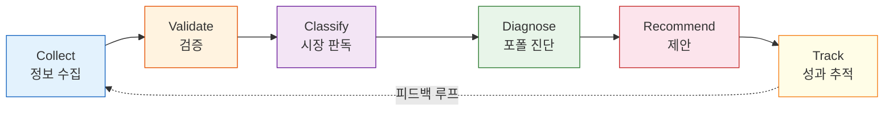
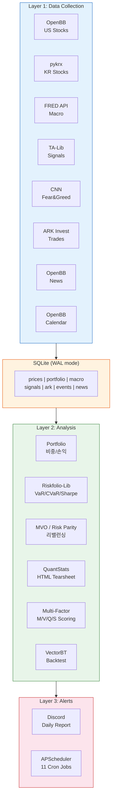

# Nuri-Quant

<div align="center">

[](https://www.python.org/)
[](LICENSE)
[](https://openbb.co/)
[](https://riskfolio-lib.readthedocs.io/)
[](https://vectorbt.dev/)
[](https://github.com/ranaroussi/quantstats)

**투자 정보를 수집하고, 검증하고, 실행하는 오픈소스 퀀트 투자 파이프라인**

누리(世) — 세상의 모든 투자 정보를 모아 수익으로 바꾸는 시스템

</div>

## What is Nuri-Quant?

단순한 주가 수집기가 아닙니다. 다양한 투자 정보를 모으고, 그 정보가 **실제로 수익을 만드는지 검증**하고, 검증된 전략을 **현재 시장 상황에 맞게 추천**하는 전 과정을 자동화합니다.

## Core Process



| Step | Description | Status |
|------|-------------|--------|
| **Collect** | Aggregate investment data from 7 source categories | ✅ 8 collectors |
| **Validate** | Backtest: "Did following this info actually make money?" | 🔨 Phase C |
| **Classify** | Market regime detection (bull/bear × high/low volatility) | 📋 Phase D |
| **Diagnose** | Portfolio risk, weight, correlation analysis | ✅ 6 modules |
| **Recommend** | Market-aware rebalancing with validated signals | ✅ MVO/RP |
| **Track** | Compare recommendations vs actual performance → feedback | 📋 Phase E |

## Tech Stack

**Data Collection**<br/>


**Analysis & Optimization**<br/>


**Automation & Infra**<br/>


## Architecture



## Information Sources

| Category | Source | Data |
|----------|--------|------|
| **Superinvestors** | Dataroma, ARK Invest, 13F | Buffett/Soros portfolios, ARK daily trades |
| **Macro** | FRED, TradingEconomics | Rates, CPI, oil, FX, VIX, yield curve |
| **Valuation** | Macrotrends, OpenBB | Long-term PER/PBR/ROE, financials |
| **Analyst** | TipRanks | Price targets, ratings, success rates |
| **ETF Flows** | ETF.com | Sector ETF inflows/outflows |
| **Sentiment** | CNN Fear&Greed, Reddit, News | Fear/Greed index, social sentiment |
| **Supply/Demand** | pykrx, FINRA | Institutional flows, short interest |

## Getting Started

**Prerequisites**: Python 3.12, [uv](https://docs.astral.sh/uv/), `brew install ta-lib`

```bash
git clone https://github.com/researcherhojin/nuri-quant.git
cd nuri-quant

# Setup (venv + dependencies + DB + portfolio import)
make setup

# Configure API keys
cp .env.example .env
# Edit: FRED_API_KEY, DISCORD_WEBHOOK_URL

# Collect data
make collect

# Analyze portfolio
python -m nuri.analysis.portfolio
python -m nuri.analysis.risk
python -m nuri.analysis.performance --html

# Run backtest
python -m nuri.quant.backtest.engine

# Start 24/7 scheduler
python -m nuri.scheduler
```

## Roadmap

### Phase A: Foundation ✅
- [x] 8 data collectors (OpenBB + pykrx + FRED + TA-Lib + CNN + ARK)
- [x] 6 analysis modules (portfolio, risk, performance, sector, correlation, rebalance)
- [x] Riskfolio-Lib optimization (MVO, Risk Parity, constraints)
- [x] VectorBT backtest engine + multi-factor scoring
- [x] QuantStats HTML tearsheets
- [x] Discord alerts + APScheduler (11 cron jobs)

### Phase B: Information Sources
- [ ] Dataroma superinvestor tracking
- [ ] TipRanks analyst consensus
- [ ] Macrotrends long-term financials
- [ ] ETF.com sector fund flows
- [ ] Institutional/foreign investor flows (pykrx)
- [ ] Short interest + put/call ratio (OpenBB)

### Phase C: Validation Engine
- [ ] Per-source signal backtesting framework
- [ ] Strategy scorecard (win rate, avg return, max loss per source)
- [ ] Hypothesis testing ("Does following ARK actually work?")

### Phase D: Market Regime
- [ ] Regime classifier (bull/bear/sideways × high/low volatility)
- [ ] Macro environment scoring (market thermometer)
- [ ] Regime-to-strategy mapping

### Phase E: Contextual Recommendations
- [ ] Regime-aware rebalancing (defensive ↔ aggressive auto-switch)
- [ ] Validated-signal-based buy/sell candidates
- [ ] Recommendation history + performance tracking

### Phase F: Interface
- [ ] REST API (FastAPI)
- [ ] Web dashboard
- [ ] LLM-powered natural language reports

## Investment Rules

These rules are **enforced in code**, not just guidelines:

| Rule | Constraint | Enforcement |
|------|-----------|-------------|
| Single position limit | ≤ 15% | `rebalance.py`, `portfolio.py` |
| Sector exposure limit | ≤ 35% | `sector.py` |
| Leverage ETF ban | TSLL, TQQQ, etc. | `rebalance.py` (weight → 0) |
| Per-stock stop loss | -20% | `risk.py` |
| Portfolio stop | -10% drawdown | `risk.py` |
| All signals | Decision aid only | Human makes final call |

## License

[MIT](LICENSE)

---

> *"The goal is not to predict the future, but to be prepared for it."* — Pericles
