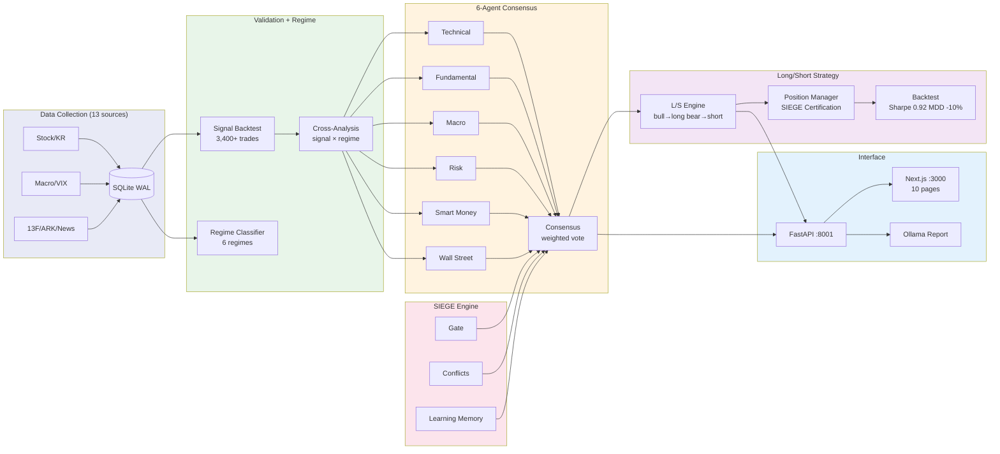

# Nuri-Quant

<div align="center">

[](https://www.python.org/)
[]()
[](LICENSE)
[](https://www.sqlite.org/)

**[Docs](CLAUDE.md)** | **[API Swagger](http://localhost:8001/docs)** | **[Dashboard](http://localhost:3000)** | **[Issues](https://github.com/researcherhojin/nuri-quant/issues)**

</div>

Open-source quant investment platform. Collects data from 13 free sources, validates signals with backtesting, classifies market regimes, and recommends trades via 6-agent consensus — with a Next.js dashboard and LLM-powered reports.

## Tech Stack

**Data Collection**<br/>
[]()
[]()
[]()
[]()
[]()

**Analysis + Quant**<br/>
[]()
[]()
[]()
[]()
[]()

**Interface**<br/>
[]()
[]()
[]()
[]()
[]()

**Infra**<br/>
[]()
[]()
[]()

## Getting Started

```bash
# Prerequisites: Python 3.12, uv, brew install ta-lib
git clone https://github.com/researcherhojin/nuri-quant.git && cd nuri-quant
make setup                                    # venv + deps + DB init + portfolio import

# Collect 5 years of data
python -m nuri.collectors.stock --period 5y   # US stocks (OpenBB)
python -m nuri.collectors.stock_kr --days 1825 # Korean stocks (pykrx)
make collect                                  # macro/technical/fear&greed/ARK

# Validate + analyze + recommend
make validate                                 # C-1~C-4 signal backtest + scorecard
make regime                                   # D-1~D-3 market regime + strategy
make recommend                                # E-1~E-3 candidates + tracking
make verify                                   # full report → data/reports/YYYY-MM-DD/
```

### Useful Commands

```bash
# Verification (run before commit)
make verify-all     # 6-check system verification (tests + API + build + DB + logic + backtest)
make demo           # full 14-step pipeline demo
make test           # 105 unit tests

# Trading
make scan           # market-wide scanner (88 US tickers)
make swing          # scan + 6-agent consensus → entry
make strategy       # L/S strategy + regime transition monitor
make backtest-ls    # 5.4yr backtest + Monte Carlo (p<0.01)
make consensus      # 6-agent analysis on portfolio
make wallstreet     # analyst ratings + earnings + insider
make filings        # SEC 10-K key metrics (edgartools)

# Infrastructure
make gate           # pipeline readiness check (10 conditions)
make start          # API(:8001) + Dashboard(:3000) simultaneous
make positions      # position P&L monitor
```

## Architecture



## Key Features

- **6-Agent Consensus** — Technical, Fundamental, Macro, Risk, Smart Money, Wall Street agents independently analyze each ticker. Weighted voting with risk veto power on stop-loss breaches
- **Wall Street Agent** — Analyst upgrade/downgrade tracking (560+ ratings), earnings surprise history, insider transactions. Data-driven, not opinion-based
- **Long/Short Strategy** — Regime-based direction switching: bull→long ETF, bear→inverse ETF(SH), sideways→cash. SIEGE Certification Gate validates every position entry
- **Strategy Backtest** — 5.4-year simulation with real SH prices, 10-day min hold, slippage. +62% return, Sharpe 0.92, MDD -10% (SPY: -24%). Monte Carlo p<0.01
- **Gated Execution** — 10 data-readiness conditions block pipeline phases. Position Certification requires regime alignment + agent consensus + concentration limits
- **Conflict Detection** — BUY+SELL on same ticker → HOLD forced. High-severity conflicts halve confidence and block rebalancing
- **Learning Memory** — Append-only drift detection. bb_bounce -57%, macd_golden -72% auto-penalized in confidence scoring
- **Ticker Deep Dive** — `/ticker/[symbol]` page: 6-agent verdicts, analyst ratings timeline, earnings surprise, insider activity, fundamentals, smart money
- **LLM Report Validation** — Ollama reports fact-checked against input data. Ticker hallucination detection, numeric claim verification, mandatory disclaimers

## Investment Rules

Defined in `config/rules.yaml`, enforced across all modules:

| Rule | Limit |
|------|-------|
| Single position | ≤ 15% |
| Sector exposure | ≤ 35% |
| Per-stock stop loss | -20% |
| Portfolio stop | -10% drawdown |
| Leverage ETF ban | TSLL, TQQQ, SQQQ, UPRO, SPXU |

## Roadmap

### Bugs / Immediate Fixes

- [ ] **API URL 불일치** — `frontend/src/lib/api.ts`와 `report/page.tsx`의 기본 URL이 `:8000`. 백엔드는 `:8001`. `NEXT_PUBLIC_API_URL` 환경변수 설정 또는 기본값 수정 필요
- [ ] **frontend Git 분리** — `frontend/.git` 존재. monorepo 통합 시 삭제 필요 (또는 git submodule 설정)
- [ ] **Overview/Strategy 페이지 Badge** — `/`, `/strategy` 페이지가 아직 raw `Badge` 사용. `StatusBadge` 디자인 시스템으로 통일 필요

### Frontend (Phase G)

- [ ] **에러 바운더리** — API 실패 시 빈 화면 대신 사용자 친화적 에러 표시 (Error Boundary + fallback UI)
- [ ] **차트 통합** — Python Plotly 차트를 Recharts/Lightweight-charts로 교체하여 Next.js 내 인터랙티브 차트 구현 (가격 + 기술적 지표 + 시그널 오버레이)
- [ ] **인증** — `DASHBOARD_PASSWORD` 환경변수 기반 로그인 (Next.js middleware)
- [ ] **실시간 데이터** — SSE 또는 WebSocket으로 자동 새로고침 (현재는 60초 캐시 + 수동 새로고침)
- [ ] **포트폴리오 관리 UI** — 보유 종목 추가/삭제/수정 (현재 `config/portfolio.yaml` 수동 편집)
- [ ] **모바일 반응형** — 테이블 가로 스크롤 + 카드 레이아웃 최적화

### Backend

- [ ] **Linter/Formatter** — `ruff` 도입 (현재 미설정)
- [ ] **CI/CD** — GitHub Actions: test → lint → build → deploy (현재 수동 `make deploy`)
- [ ] **DB 마이그레이션** — Alembic 또는 버전 관리 마이그레이션 (현재 `scripts/migrate_db.py` 단일 파일)
- [ ] **API 테스트** — FastAPI 엔드포인트 통합 테스트 (현재 단위 테스트만 존재)

### Quant / Strategy

- [ ] **백테스트 파라미터 최적화** — Grid search / Bayesian optimization으로 시그널 임계값 자동 튜닝
- [ ] **한국 시장 에이전트** — `.KS` 종목 전용 로직 (환율, 공매도 제한, KOSPI/KOSDAQ 구분)
- [ ] **다중 전략** — L/S 외 mean-reversion, pairs trading 등 전략 모듈 추가
- [ ] **실거래 연동** — 증권사 API 연동 (한투 OpenAPI, Alpaca 등)으로 주문 자동 실행

## License

[MIT](LICENSE)
