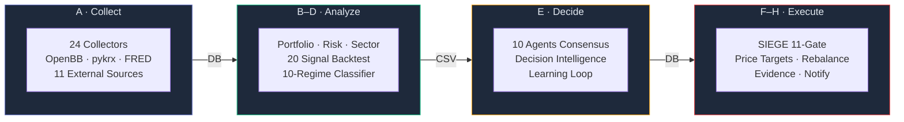

# Nuri-Quant

<div align="center">

[](https://github.com/researcherhojin/nuri-quant/actions/workflows/main-ci-cd.yml)
[](https://codecov.io/gh/researcherhojin/nuri-quant)
[](LICENSE)

**[Issues](https://github.com/researcherhojin/nuri-quant/issues)** · **[Strategy](docs/STRATEGY.md)**

</div>

Open-source quantitative investment platform that **proves why you should buy or sell** — not gut feeling. 24 data collectors, 10 specialist agents, and an 11-condition mechanical gate certify every recommendation before it reaches you.

## Architecture



```
nuri/
├── core/          # DB (sole sqlite3), rules, events, freshness, timezone
├── collectors/    # 24 modules — BaseCollector pattern
├── analysis/      # Portfolio, risk, sector, charts, evidence
├── quant/         # Regime classifier, signal backtest, VectorBT, multi-factor
├── trading/
│   ├── agents/    # 10 specialist agents + weighted consensus
│   ├── engine/    # SIEGE 11-gate, Decision Intelligence, learning memory
│   ├── strategy/  # Long/Short, mean-reversion, pairs trading
│   ├── recommend/ # Candidates, price targets, rebalance, tracker
│   └── execution/ # Alpaca · KIS · DryRun
├── api/           # FastAPI (57 endpoints) + SSE
├── alerts/        # Discord · Telegram
└── llm/           # Ollama (local) + OpenAI wrapper
```

**Design:** DB as sole integration point · Phase isolation (no cross-phase imports) · Config-driven rules (`config/*.yaml`) · Decision Intelligence (outcome tracking + learning loop) · Lean-cost stack (SQLite, Ollama local, ~$3.51/yr OpenAI)

## Key Features

- **Evidence-based decisions** — 8,000+ historical trade backtests across 20 signals validate every recommendation
- **Decision Intelligence** — Every BUY/SELL decision recorded with market context + agent evidence. 7/30/60/90-day outcome tracking feeds back into agent weight adjustment
- **10-regime market classification** — 6 base (bull/bear/sideways × high/low vol) + 4 special (recovery, euphoria, stagflation, sector rotation)
- **10 specialist agents** — Weighted consensus voting with SSE reasoning trace. Risk agent holds veto power (SELL + confidence ≥ 80 overrides all)
- **SIEGE certification** — [11-condition mechanical gate](https://github.com/nutshells3/Swarm-Intelligence-Engine-with-Gated-Execution). Single failure → REJECTED
- **Pipeline observability** — [Palantir Foundry](https://www.palantir.com/docs/foundry/data-lineage/overview)-style Data Health + [Dagster](https://docs.dagster.io/guides/observe/asset-freshness-policies) Freshness SLA

## Tech Stack

**Backend**<br/>


**Frontend**<br/>


**Data & Quant**<br/>


**LLM**<br/>


**CI/CD**<br/>


## Getting Started

### Prerequisites (macOS Apple Silicon)

```bash
# 1. Homebrew (if not installed)
/bin/bash -c "$(curl -fsSL https://raw.githubusercontent.com/Homebrew/install/HEAD/install.sh)"

# 2. System dependencies
brew install uv ta-lib

# 3. Node.js 22 (fnm recommended)
brew install fnm
fnm install 22 && fnm use 22
echo 'eval "$(fnm env --use-on-cd)"' >> ~/.zshrc
```

### Setup

```bash
git clone https://github.com/researcherhojin/nuri-quant.git
cd nuri-quant

make setup                 # uv venv + deps + DB init + portfolio import
cd frontend && npm ci && cd ..

cp .env.example .env                                    # edit API keys (all optional)
cp config/portfolio.example.yaml config/portfolio.yaml  # edit your holdings

make test                  # backend tests (parallel via xdist)
cd frontend && npx vitest run && cd ..  # frontend tests
```

### Run

```bash
make start                 # API (:8001) + Dashboard (:3000)
make full-scan             # 8-phase pipeline: collect → certify → notify
make quick-scan            # Fast 4-step: collect → analyze → consensus → targets (~2 min)
make consensus             # 10-agent consensus + decision recording
make certify               # SIEGE 11-gate certification
```

After `make start`: Dashboard at <http://localhost:3000>, API docs at <http://localhost:8001/docs>.

## Investment Rules

Defined in `config/rules.yaml`. Based on [O'Neil (CAN SLIM)](https://www.investors.com/) + [Minervini (SEPA)](https://www.minervini.com/) + [Disposition Effect research (Shefrin 1985)](https://onlinelibrary.wiley.com/doi/10.1111/j.1540-6261.1985.tb05002.x).

| | Growth | Value | Swing |
|---|--------|-------|-------|
| **Stop-Loss** | -7% | -10% | -5% |
| **Take-Profit 1** | +20% → sell 50% | +15% → sell 50% | +5% → sell 50% |
| **Take-Profit 2** | +40% → sell 25% | +30% → sell 25% | +10% → sell all |
| **Remainder** | Trailing -15% | Trailing -15% | — |

**Core Rules:**
- VIX > 30 → block all new buys (win rate collapses)
- Buy checklist: TipRanks ≥ Moderate Buy, superinvestors ≥ 3, PE < 100, revenue > $0, multi-factor top 50%
- Sell priority: Leveraged ETF → stop-loss breach → no superinvestors → position limit → sector limit

## Multi-machine Workflow

Two patterns for running Nuri-Quant on more than one Mac. Pick whichever fits your hardware setup — they compose freely.

### Migrating state between machines

`scripts/sync_dev.sh` rsyncs everything git can't carry: gitignored project state (`.env`, `config/portfolio.yaml`, `data/portfolio.db`) plus Claude Code state (`~/.claude/projects/...` conversation history + memory + global skills/plugins/settings). Caches and runtime state are excluded.

```bash
# One-time setup on each machine
sudo systemsetup -setremotelogin on             # both Macs
ssh-copy-id <other-mac>.local                   # passwordless SSH (uses $USER)

# Tell the script who the "other" machine is. Put this in ~/.zshrc, NOT .env.
echo 'export DEV2_HOST=<other-mac>.local' >> ~/.zshrc
source ~/.zshrc

# Recurring sync (run on whichever machine has the freshest state)
scripts/sync_dev.sh push                        # this laptop → other
scripts/sync_dev.sh pull                        # other → this laptop
scripts/sync_dev.sh push --with-reports         # include data/reports/ (~136MB)
scripts/sync_dev.sh push --no-claude            # project files only, skip ~/.claude
```

### Auto-pull receiver (portable dev → always-on prod)

```bash
# On the receiver (always-on Mac), one-time setup
cp scripts/com.nuri-quant.autopull.plist ~/Library/LaunchAgents/
launchctl load ~/Library/LaunchAgents/com.nuri-quant.autopull.plist

# Verify
launchctl list | grep nuri-quant.autopull
tail -f ~/Library/Logs/nuri-quant-autopull.log
```

The agent runs `scripts/auto_deploy.sh` every 5 minutes: fetch → ff-only merge → dependency/schema drift warning → deploy hook.

## References

| Source | Application |
|--------|-------------|
| [SIEGE Engine](https://github.com/nutshells3/Swarm-Intelligence-Engine-with-Gated-Execution) | 11-condition gate, certification, event journal |
| [Palantir Foundry](https://www.palantir.com/docs/foundry/data-lineage/overview) | Data Health, pipeline monitoring, Decision Intelligence |
| [Dagster](https://docs.dagster.io/guides/observe/asset-freshness-policies) | Asset freshness PASS/WARN/FAIL |
| [TradingAgents](https://github.com/TauricResearch/TradingAgents) | Multi-agent consensus pattern |
| [O'Neil — CAN SLIM](https://www.investors.com/) | Stop-loss -7%, take-profit +20%/+40% |
| [Minervini — SEPA](https://www.minervini.com/) | Trailing stop, 3:1 reward-to-risk |

## License

[GNU Affero General Public License v3.0](LICENSE)
