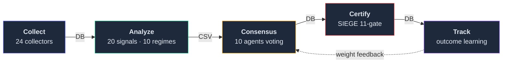

# Nuri-Quant

<div align="center">

[](https://github.com/researcherhojin/nuri-quant/actions/workflows/main-ci-cd.yml)
[](https://codecov.io/gh/researcherhojin/nuri-quant)
[](LICENSE)

</div>

데이터로 투자 판단의 **근거를 증명**하는 오픈소스 퀀트 플랫폼.

수집 → 분석 → 합의 → 검증 파이프라인이 매 추천마다 실행되며, 모든 BUY/SELL 의사결정은 시장 컨텍스트와 에이전트 근거와 함께 기록되고, 30/60/90일 후 실제 성과가 자동 추적됩니다.

## Architecture



| Layer | Role |
|-------|------|
| `nuri/collectors/` | 24 data collectors (OpenBB, pykrx, FRED, edgartools, FINVIZ, etc.) |
| `nuri/quant/` | Signal backtest, regime classifier, multi-factor scoring, VectorBT |
| `nuri/trading/agents/` | 10 specialist agents + weighted consensus (risk agent veto power) |
| `nuri/trading/engine/` | SIEGE 11-gate certification + Decision Intelligence + learning memory |
| `nuri/api/` | FastAPI REST (57 endpoints) + SSE streaming |
| `frontend/` | Next.js 16 dashboard (16 pages, dark theme, Tailwind 4 + shadcn/ui) |
| `nuri/core/db.py` | Sole SQLite gateway (31 tables, WAL mode). All modules go through here |

## Tech Stack

**Backend**


**Frontend**


**Quant**


**LLM**
-000000?logo=ollama&logoColor=white)


> Ollama: 포트폴리오/의사결정 데이터 분석 (로컬 전용, 외부 전송 금지). OpenAI: 공개 RSS 헤드라인 분류만 (Tier 0, ~$3.51/yr). [상세 정책](docs/STRATEGY.md)

**CI/CD**


## Getting Started

```bash
# Prerequisites: Python 3.12, uv, ta-lib, Node 22
brew install uv ta-lib fnm && fnm install 22

# Setup
git clone https://github.com/researcherhojin/nuri-quant.git && cd nuri-quant
make setup                                              # backend (uv venv + deps + DB init)
cd frontend && npm ci && cd ..                          # frontend
cp .env.example .env                                    # API keys (all optional)
cp config/portfolio.example.yaml config/portfolio.yaml  # your holdings

# Run
make start       # API (:8001) + Dashboard (:3000)
make full-scan   # 8-phase pipeline end-to-end
make consensus   # 10-agent analysis + decision recording
make certify     # SIEGE 11-gate certification
```

## Investment Rules

`config/rules.yaml` — [O'Neil](https://www.investors.com/) + [Minervini](https://www.minervini.com/) + [처분효과 연구 (Shefrin 1985)](https://onlinelibrary.wiley.com/doi/10.1111/j.1540-6261.1985.tb05002.x)

| | Growth | Value | Swing |
|---|--------|-------|-------|
| **Stop-Loss** | -7% | -10% | -5% |
| **Take-Profit** | +20%/+40% | +15%/+30% | +5%/+10% |
| **Trailing** | -15% | -15% | — |

VIX > 30 → 신규 매수 차단 · 슈퍼투자자 ≥ 3명 · PE < 100 · 멀티팩터 상위 50%

## References

| Source | Usage |
|--------|-------|
| [SIEGE Engine](https://github.com/nutshells3/Swarm-Intelligence-Engine-with-Gated-Execution) | 11-gate certification |
| [Palantir Foundry](https://www.palantir.com/docs/foundry/data-lineage/overview) | Decision Intelligence |
| [Dagster](https://docs.dagster.io/guides/observe/asset-freshness-policies) | Freshness SLA |
| [TradingAgents](https://github.com/TauricResearch/TradingAgents) | Multi-agent consensus |

## License

[AGPL-3.0](LICENSE)
