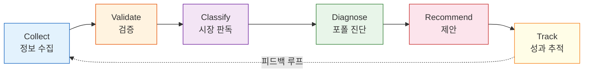

# Nuri-Quant

<div align="center">

[](https://www.python.org/)
[](LICENSE)
[](https://openbb.co/)
[](https://riskfolio-lib.readthedocs.io/)
[](https://vectorbt.dev/)

**투자 정보를 수집하고, 검증하고, 실행하는 오픈소스 퀀트 투자 파이프라인**

누리(世) — 세상의 모든 투자 정보를 모아 수익으로 바꾸는 시스템

</div>

## What is Nuri-Quant?

단순한 주가 수집기가 아닙니다. 다양한 투자 정보를 모으고, 그 정보가 **실제로 수익을 만드는지 검증**하고, 검증된 전략을 **현재 시장 상황에 맞게 추천**하는 전 과정을 자동화합니다.

## Core Pipeline



| Step | Description | Status |
|------|-------------|--------|
| **Collect** | 12개 수집기로 가격/펀더멘탈/슈퍼투자자/애널리스트/매크로/뉴스 수집 | ✅ Phase A+B |
| **Validate** | 시그널별 백테스트: "이 정보를 따르면 실제로 돈을 버는가?" | 🔨 Phase C |
| **Classify** | 시장 레짐 감지 (강세/약세/횡보 x 고변동/저변동) | 📋 Phase D |
| **Diagnose** | 포트폴리오 리스크, 비중, 상관관계, 기술적 차트 분석 | ✅ 8 modules |
| **Recommend** | MVO/Risk Parity 기반 리밸런싱 제안 | ✅ |
| **Track** | 제안 vs 실제 성과 비교 → 피드백 루프 | 📋 Phase E |

## Investment Decision Process

"이 종목을 살까?" 판단에 필요한 9단계 중 8단계를 커버합니다:

```
1. 시장 환경은?     ✅ 매크로(금리/CPI/VIX) + Fear&Greed
2. 싸긴 한 건가?    ✅ PER/PBR/PSR + 역사적 비교     (B-1)
3. 실적은 괜찮나?   ✅ ROE/매출성장/이익률/부채비율    (B-1)
4. 차트는?          ✅ 캔들+BB+SMA+RSI+MACD+시그널   (B-3)
5. 전문가들은?      ✅ 애널리스트 목표가/컨센서스      (B-4)
6. 큰손들은?        ✅ 버핏/달리오 13F + ARK          (B-2)
7. 돈이 몰리나?     📋 ETF 자금흐름                   (Phase C)
8. 분위기는?        ✅ 뉴스 센티먼트                   (B-6)
9. 리스크는?        ✅ VaR/상관관계/포지션 사이즈
```

> **차트의 매수/매도 시그널(▲/▼)은 "이 시점에서 기술적 조건이 발생했다"는 참고 신호입니다.**
> 기계적으로 따르는 것이 아니라, 위 9단계를 종합하여 판단하는 의사결정 보조 도구입니다.
> 시그널의 실제 수익률은 Phase C(Validation Engine)에서 검증 예정입니다.

## Architecture

```mermaid
graph TB
    subgraph Collectors["Layer 1: Data Collection (12 collectors)"]
        Stock["OpenBB<br/>US Stocks (5Y)"]
        StockKR["pykrx<br/>KR Stocks (5Y)"]
        Macro["FRED API<br/>Macro"]
        Tech["TA-Lib<br/>Signals"]
        FG["CNN<br/>Fear&Greed"]
        ARK["ARK Invest<br/>Trades"]
        News["OpenBB<br/>News (1h)"]
        Events["OpenBB<br/>Calendar"]
        Fund["OpenBB<br/>Fundamentals"]
        SI["SEC EDGAR<br/>13F Superinvestors"]
        Est["OpenBB<br/>Analyst Consensus"]
    end

    subgraph DB["SQLite (WAL mode, 14 tables)"]
        Tables["prices | portfolio | macro | signals | ark<br/>events | news | fundamentals | superinvestors<br/>estimates | institutional_flows | llm_bench<br/>factors | backtests"]
    end

    subgraph Analysis["Layer 2: Analysis (8 modules)"]
        Portfolio["Portfolio<br/>비중/손익"]
        Risk["Riskfolio-Lib<br/>VaR/CVaR/Sharpe"]
        Rebalance["MVO / Risk Parity<br/>리밸런싱"]
        Perf["QuantStats<br/>HTML Tearsheet"]
        Factor["Multi-Factor<br/>M/V/Q/S Scoring"]
        BT["VectorBT<br/>Backtest"]
        Charts["Plotly Charts<br/>기술적 분석 + 시그널"]
        Sentiment["Sentiment<br/>뉴스 감성 분석"]
    end

    subgraph Alerts["Layer 3: Alerts & Scheduling"]
        Discord["Discord<br/>Daily Report"]
        Sched["APScheduler<br/>14 Cron Jobs"]
    end

    Collectors --> DB
    DB --> Analysis
    Analysis --> Alerts

    style Collectors fill:#E3F2FD,stroke:#1565C0
    style DB fill:#FFF3E0,stroke:#E65100
    style Analysis fill:#E8F5E9,stroke:#2E7D32
    style Alerts fill:#FCE4EC,stroke:#C62828
```



## Data Sources

모든 소스 100% 무료. API 키가 필요한 경우 무료 티어.

| Category | Source | Data | Frequency |
|----------|--------|------|-----------|
| US Stocks | OpenBB (yfinance) | OHLCV 5년 | 미장 중 5분 |
| KR Stocks | pykrx | OHLCV 5년 (KOSPI/KOSDAQ) | 한국장 중 5분 |
| Technical | TA-Lib | RSI, MACD, BB, SMA 20/50/200 | 일 1회 |
| Macro | FRED API | 금리, CPI, 유가, 환율, VIX | 매시 |
| Fear & Greed | CNN | 시장 심리 지수 (0-100) | 일 1회 |
| Fundamentals | OpenBB `fundamental.metrics` | PE, PB, ROE, 마진, 성장률, 부채비율 | 주 1회 |
| Superinvestors | SEC EDGAR 13F (edgartools) | 버핏/게이츠/달리오/애크먼/테퍼 포트폴리오 | 주 1회 |
| Analyst | OpenBB `estimates.consensus` | 목표가, 투자의견, 애널리스트 수 | 주 1회 |
| News | OpenBB News | 종목별 뉴스 + 키워드 센티먼트 | 매시 |
| Events | OpenBB Calendar | 실적발표, 배당, FOMC | 일 1회 |
| ARK Trades | ARK Invest CSV | 일일 매수/매도 내역 | 일 1회 |
| Institutional | pykrx + finnhub | 기관/외인 순매수 | 일 1회 (⚠️ API 불안정) |

## Getting Started

**Prerequisites**: Python 3.12, [uv](https://docs.astral.sh/uv/), `brew install ta-lib`

```bash
git clone https://github.com/researcherhojin/nuri-quant.git
cd nuri-quant

# 1. Setup
make setup
cp .env.example .env   # FRED_API_KEY 설정

# 2. 데이터 수집 (최초 1회, 5년치)
python -m nuri.collectors.stock --period 5y
python -m nuri.collectors.stock_kr --days 1825
python -m nuri.collectors.fundamental
python -m nuri.collectors.superinvestors
python -m nuri.collectors.estimates
make collect

# 3. 분석 + 차트 생성
python -m nuri.analysis.sentiment
python -m nuri.analysis.charts --all

# 4. 전체 검증 (결과 → data/reports/YYYY-MM-DD/)
make verify

# 5. 24/7 자동화 (Mac Mini)
python -m nuri.scheduler
```

### 검증 결과 디렉토리

```
data/reports/2026-03-26/
├── portfolio.csv           # 종목별 비중, 손익
├── risk.json               # Sharpe, VaR, MDD, 손절선 경고
├── sector.csv              # 섹터별 비중
├── correlation.csv/.png    # 상관행렬 + 히트맵
├── rebalance_mvo.csv       # MVO 리밸런싱 제안
├── rebalance_rp.csv        # Risk Parity 리밸런싱 제안
├── factors.csv             # 멀티팩터 스코어
├── tearsheet.html          # QuantStats HTML 티어시트
├── summary.txt             # 전체 요약
└── charts/
    ├── TSLA.html           # 인터랙티브 차트 (캔들+BB+SMA+RSI+MACD+시그널)
    ├── NVDA.html
    └── ... (23종목)
```

## Tech Stack

| Tool | Role | License |
|------|------|---------|
| [OpenBB Platform v4](https://openbb.co/) | US 시장 데이터 + 펀더멘탈 + 애널리스트 (multi-provider) | AGPL v3 |
| [pykrx](https://github.com/sharebook-kr/pykrx) | 한국 시장 데이터 (KOSPI/KOSDAQ EOD) | MIT |
| [edgartools](https://github.com/dgunning/edgartools) | SEC EDGAR 13F 슈퍼투자자 포트폴리오 | MIT |
| [Riskfolio-Lib 7.2](https://riskfolio-lib.readthedocs.io/) | 포트폴리오 최적화 (MVO, HRP, CVaR) | BSD 3 |
| [VectorBT 0.28](https://vectorbt.dev/) | 벡터화 백테스트 (Numba JIT) | MIT |
| [QuantStats](https://github.com/ranaroussi/quantstats) | 성과 HTML 티어시트 (30+ 지표) | MIT |
| [TA-Lib](https://ta-lib.org/) | 기술적 지표 (RSI, MACD, BB, SMA, EMA) | BSD |
| [Plotly](https://plotly.com/python/) | 인터랙티브 차트 시각화 | MIT |
| [APScheduler 3.11](https://apscheduler.readthedocs.io/) | Python-native cron 스케줄러 (14 jobs) | MIT |
| [FRED API](https://fred.stlouisfed.org/docs/api/) | 매크로 지표 (금리, CPI, 유가, 환율) | Public |

## Roadmap

### Phase A: Foundation ✅
- [x] 8 data collectors (OpenBB + pykrx + FRED + TA-Lib + CNN + ARK)
- [x] 6 analysis modules (portfolio, risk, performance, sector, correlation, rebalance)
- [x] Riskfolio-Lib optimization (MVO, Risk Parity, constraints)
- [x] VectorBT backtest engine + multi-factor scoring
- [x] QuantStats HTML tearsheets
- [x] Discord alerts + APScheduler

### Phase B: Information Sources + Visualization ✅
> 상세: [`docs/PLAN_PHASE_B.md`](docs/PLAN_PHASE_B.md)

- [x] **B-1.** 펀더멘탈 수집기 — PE/PB/ROE/마진/성장률 (OpenBB `fundamental.metrics`)
- [x] **B-2.** 슈퍼투자자 13F — 버핏/게이츠/달리오/애크먼/테퍼 (edgartools, SEC EDGAR)
- [x] **B-3.** 기술적 분석 차트 — 캔들+BB+SMA+RSI+MACD, 매수/매도 시그널, 정보 패널 (Plotly)
- [x] **B-4.** 애널리스트 컨센서스 — 목표가/투자의견 (OpenBB `estimates.consensus`)
- [x] **B-5.** 기관/외인 수급 — 프레임워크 (pykrx + finnhub)
- [x] **B-6.** 뉴스 센티먼트 — 키워드 사전 기반 감성 분석
- [x] **B-7.** 뉴스 수집 강화 — 매시 수집 + 키워드 알림
- [x] 가격 데이터 5년치 확보 (25,000+건)

### Phase C: Validation Engine
- [ ] 시그널별 백테스트 ("차트의 ▲BUY를 따르면 실제로 수익이 나는가?")
- [ ] 소스별 스코어카드 (승률, 평균 수익률, 최대 손실)
- [ ] 가설 검정 ("Does following ARK/Buffett actually work?")
- [ ] ETF 자금흐름 수집 + 섹터 로테이션

### Phase D: Market Regime
- [ ] 레짐 분류기 (강세/약세/횡보 x 고변동/저변동)
- [ ] 매크로 환경 점수 (시장 온도계)
- [ ] 레짐별 최적 전략 매핑

### Phase E: Contextual Recommendations
- [ ] 레짐 인식 리밸런싱 (방어적 ↔ 공격적 자동 전환)
- [ ] 검증된 시그널 기반 매수/매도 후보
- [ ] 추천 이력 + 성과 추적

### Phase F: Interface
- [ ] REST API (FastAPI)
- [ ] Web dashboard
- [ ] LLM 기반 자연어 리포트

## Investment Rules

코드에 **강제 적용**되는 규칙. 가이드라인이 아닌 하드 제약조건:

| Rule | Constraint | Enforcement |
|------|-----------|-------------|
| 단일 종목 비중 한도 | ≤ 15% | `rebalance.py`, `portfolio.py` |
| 섹터 노출 한도 | ≤ 35% | `sector.py` |
| 레버리지 ETF 매수 금지 | TSLL, TQQQ, SQQQ, UPRO, SPXU | `rebalance.py` (weight → 0) |
| 종목별 손절선 | -20% | `risk.py` |
| 포트폴리오 스톱 | -10% drawdown | `risk.py` |
| 모든 시그널 | **의사결정 보조**만 | 최종 판단은 사람 |

## License

[MIT](LICENSE)

---

> *"The goal is not to predict the future, but to be prepared for it."* — Pericles
