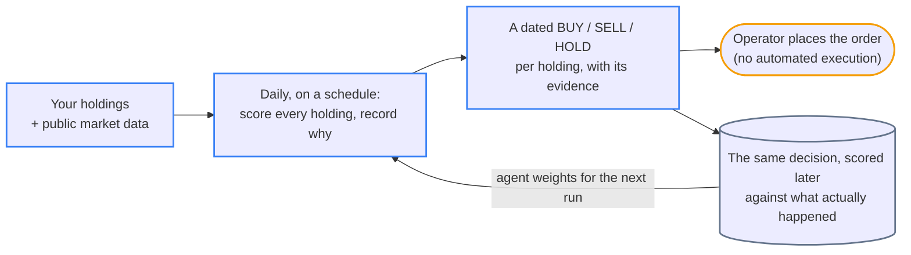

# Nuri-Quant

<div align="center">

[](https://github.com/researcherhojin/nuri-quant/actions/workflows/main-ci-cd.yml)
[](https://codecov.io/gh/researcherhojin/nuri-quant)
[](LICENSE)

**A quantitative decision-support platform that records and scores the evidence behind each investment recommendation.**

</div>

Nuri-Quant reviews a portfolio of US and Korean equities every day. It issues a dated BUY / SELL / HOLD for each holding together with the evidence behind it, then grades each recommendation against what the market actually did.

- **Recommendation only.** The system never places orders; the operator executes every trade by hand.
- **No performance claim.** No investment edge is claimed unless a pre-registered evaluation passes ([`docs/STRATEGY.md`](docs/STRATEGY.md) §3.11).
- **Not investment advice.** The output is a research record for one operator's own decisions.

## Table of Contents

- [Security](#security)
- [Background](#background)
- [Install](#install)
- [Usage](#usage)
- [Tech Stack](#tech-stack)
- [Project Stats](#project-stats)
- [Documentation](#documentation)
- [Maintainers](#maintainers)
- [Acknowledgements](#acknowledgements)
- [Contributing](#contributing)
- [License](#license)

## Security

The repository is public; the deployed system runs on a real portfolio.

- A pre-push hook and a required CI check block personal financial data (broker names, account details, ticker and P&L pairs) from entering the repository.
- Every external LLM call goes through a single module that logs it; the recommendation pipeline itself uses no LLM.
- The production API binds to `127.0.0.1`.

See [`SECURITY.md`](SECURITY.md) for the security policy and how to report a vulnerability.

## Background

### What it does

| Task | Output |
|------|--------|
| Review every holding, every day | A dated BUY / SELL / HOLD per holding with the agent verdicts, market context and price levels behind it, kept in a decision ledger (`/decisions`) |
| Grade past recommendations | Realized returns of each decision at 7, 14 and 30 days, against a benchmark where one applies; separately, each agent's 30-day hit rate sets its weight in the next consensus |
| Screen the universe | BUY candidates outside the portfolio, scored and gated by [`config/buy_signals.yaml`](config/buy_signals.yaml), with the scanner's observations kept separate from the verdict |
| Watch the inputs | A freshness SLA per data source, judged against each source's own schedule; when an input of the dashboard verdict fails it, the verdict is replaced by a stale-data notice |
| Show it on one page | The Overview dashboard (`/`): market indices, regime, macro score, holding reviews, portfolio composition, data freshness and pipeline status, each with its source |
| Send briefs | A US pre-market brief and US and Korean post-market briefs to Discord |
| Answer an AI client | A read-only MCP server with candidates, macro facts, freshness and live quotes, and no holdings |

The universe is US equities and the KOSPI 200. Korean prices come from pykrx and fundamentals from yfinance, the KOSPI 200 list from pykrx with a FinanceDataReader fallback, and real-time quotes optionally from the KIS Open API ([`docs/KIS_INTEGRATION.md`](docs/KIS_INTEGRATION.md)).

### How it works


```mermaid
flowchart LR
    IN["Your holdings<br/>+ public market data"]
    RUN["Daily, on a schedule:<br/>score every holding, record why"]
    DEC["A dated BUY / SELL / HOLD<br/>per holding, with its evidence"]
    YOU(["Operator places the order<br/>(no automated execution)"])
    LED[("The same decision, scored later<br/>against what actually happened")]

    IN --> RUN --> DEC --> YOU
    DEC --> LED
    LED -- "agent weights for the next run" --> RUN

    classDef step  stroke:#3b82f6,stroke-width:2px
    classDef store stroke:#64748b,stroke-width:2px
    classDef human stroke:#f59e0b,stroke-width:2px
    class IN,RUN,DEC step
    class LED store
    class YOU human
```

### Pipeline

| Stage | Package | Role |
|-------|---------|------|
| **Collect** | `nuri/collectors` | Collects prices, fundamentals, macroeconomic data and news |
| **Analyze** | `nuri/analysis` | Analyzes portfolio risk and sector exposure; computes daily factor scores |
| **Consensus** | `nuri/trading/agents` | Combines the weighted verdicts of 10 rule-based specialist agents per holding, subject to a risk veto |
| **Decide** | `nuri/trading/engine` | Records each consensus decision with its market context and applies the hard-veto gates |
| **Track** | `nuri/trading/recommend` | Measures recommendation outcomes at horizons from 7 to 90 days |

The stages are not chained by an orchestrator. `nuri/scheduler.py` registers 59 independent APScheduler jobs, and each job reads its inputs from database tables written by other jobs.

- Scheduling: 59 cron jobs · in-process
- Storage: SQLite WAL · 63 tables
- Market analytics: 22 trading signals · 10 regimes · a 4-factor composite score

See [`docs/ARCHITECTURE.md`](docs/ARCHITECTURE.md) for the runtime topology, the daily schedule and the scoring model.

## Install

Requirements: Python 3.12 or later, [uv](https://docs.astral.sh/uv/), TA-Lib and Node.js 22. On macOS: `brew install uv ta-lib fnm && fnm install 22`.

```bash
git clone https://github.com/researcherhojin/nuri-quant.git && cd nuri-quant
cp config/portfolio.example.yaml config/portfolio.yaml  # holdings (gitignored); make setup imports it
make setup                                              # backend dependencies, database, git hooks
cd frontend && npm ci && cd ..                          # frontend dependencies
cp .env.example .env                                    # API keys (all optional)
```

Every API key is optional; a collector without credentials is skipped. [`docs/FRESH_CLONE_SETUP.md`](docs/FRESH_CLONE_SETUP.md) walks through the full setup.

## Usage

```bash
make start          # API on :8001 (OpenAPI at /docs), dashboard on :3000
make full-scan      # run all pipeline stages in sequence
make consensus      # run the agent consensus and record decisions
make test-fast      # backend tests, excluding slow tests
make verify-all     # pre-push checks: tests, lint, frontend
make help           # list all targets
```

Investment rules and thresholds live in [`config/`](config/) (mainly `rules.yaml`); their rationale is in [`docs/STRATEGY.md`](docs/STRATEGY.md). Optional LLM features and their data-egress rules are described in §4.4.3 of the same document.

## Tech Stack

<!-- 버전은 메이저(0.x 는 메이저.마이너)만 적는다 — 실제 설치 버전과의 대조는 tests/verify/test_readme_badges.py (#1704) -->

**Frontend**<br/>


**Backend**<br/>


**Data & Quant**<br/>


**Testing & Lint**<br/>


**Infra**<br/>


## Project Stats

These values are verified against the code by `make verify-doc-counts`, which runs in the pre-push hook and in CI (CI skips the counts that need the Python environment).

| Metric | Value |
|--------|-------|
| Backend tests | 8,503 collected across 403 files |
| Frontend test files | 112 vitest files |
| Data collectors | 31 collectors (BaseCollector pattern) |
| Scheduler jobs | 59 cron entries |
| API endpoints | 73 declared in `nuri/api/routes/` |
| Database | SQLite WAL · 63 tables, 72 forward-only migrations |

## Documentation

| Document | Contents |
|----------|----------|
| [`docs/STRATEGY.md`](docs/STRATEGY.md) | Principles, decisions and investment rules (authoritative) |
| [`docs/ARCHITECTURE.md`](docs/ARCHITECTURE.md) | Runtime topology, database, configuration, CI/CD |
| [`docs/OVERVIEW.md`](docs/OVERVIEW.md) | The Overview dashboard: panels, data refresh, responsive layout and verification |
| [`docs/RESEARCH_BRIEFING.md`](docs/RESEARCH_BRIEFING.md) | Ticker research, public briefing prompts, validation and known limitations |
| [`docs/FRESH_CLONE_SETUP.md`](docs/FRESH_CLONE_SETUP.md) | End-to-end setup from a fresh clone |
| [`docs/DEVELOPER_GUIDE.md`](docs/DEVELOPER_GUIDE.md) | Pre-push checks and helper scripts for recurring development pitfalls |
| [`docs/KIS_INTEGRATION.md`](docs/KIS_INTEGRATION.md) | Korea Investment & Securities Open API: real-time quotes, investor flows, analyst opinions |
| [`CONTRIBUTING.md`](CONTRIBUTING.md) | Workflow, required checks, pull request rules |
| [`SECURITY.md`](SECURITY.md) | Security policy and LLM egress rules |

## Maintainers

[@researcherhojin](https://github.com/researcherhojin)

## Acknowledgements

- The specialist-agent consensus follows [TradingAgents](https://github.com/TauricResearch/TradingAgents), with rule-based agents in place of LLM agents.
- Data freshness policies follow [Dagster](https://docs.dagster.io/guides/observe/asset-freshness-policies).
- Portfolio optimization uses [Riskfolio-Lib](https://riskfolio-lib.readthedocs.io/).
- The investment rules are based on O'Neil (CAN SLIM) and Minervini (SEPA).
- An earlier portfolio-certification gate adapted from SIEGE Engine was retired in #1619 ([`docs/STRATEGY.md`](docs/STRATEGY.md) §6).

## Contributing

Open an issue to agree on scope before submitting a pull request. See [`CONTRIBUTING.md`](CONTRIBUTING.md) for the workflow and required checks.

## License

[AGPL-3.0-or-later](LICENSE)
