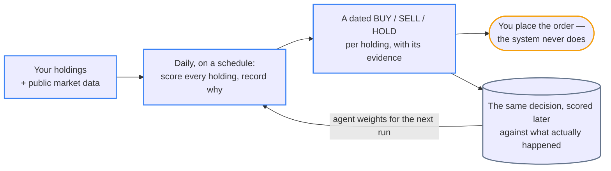

# Nuri-Quant

<div align="center">

[](https://github.com/researcherhojin/nuri-quant/actions/workflows/main-ci-cd.yml)
[](https://codecov.io/gh/researcherhojin/nuri-quant)
[](LICENSE)

**An auditable quant research platform that records and scores the evidence behind each investment decision.**

</div>

Nuri-Quant collects market data, evaluates a portfolio with a panel of rule-based agents, and issues dated BUY / SELL / HOLD recommendations together with the evidence that produced them. Each recommendation is later scored against the realized outcome at 30, 60 and 90 days, and those results feed back into the agent weights. The platform recommends only; all orders are placed manually by the operator.

## Table of Contents

- [Security](#security)
- [Background](#background)
- [Install](#install)
- [Usage](#usage)
- [Investment Rules](#investment-rules)
- [LLM Integration](#llm-integration)
- [Deployment](#deployment)
- [Tech Stack](#tech-stack)
- [Project Stats](#project-stats)
- [Documentation](#documentation)
- [Maintainers](#maintainers)
- [Acknowledgements](#acknowledgements)
- [Contributing](#contributing)
- [License](#license)

## Security

The repository is public, while the running system operates on a real portfolio. Two controls keep the two apart.

| Control | Enforcement |
|---------|-------------|
| Personal financial data is never committed | `scripts/verify/check_privacy_leak.py` runs as a pre-push hook and as the required `Privacy Leak Scan` CI job. It blocks broker names, large monetary literals near sensitive keys, ticker and signed-percentage combinations, and personal identifiers such as hostnames and home paths (matched by shape, never by value). `config/portfolio.yaml` is gitignored. |
| Portfolio data does not reach external models without approval | `nuri/llm/openai_client.py` is the only module permitted to call an external LLM. See [LLM Integration](#llm-integration). This rule is enforced in code review, not by an automated check. |

In production the API binds to `127.0.0.1`; the password-protected Next.js proxy is the only reachable surface. Vulnerability reporting and the full list of controls are in [`SECURITY.md`](SECURITY.md).

## Background

### Scope

Nuri-Quant is designed to make each recommendation traceable, not to claim that the recommendations are profitable. Two constraints define its scope.

- **Recommendation only.** The pipeline ends at a recommendation and an alert. A paper-trading broker adapter exists in `nuri/trading/execution/broker.py` for backtesting and manual testing, but no scheduled job or decision path calls it. Enabling automated execution requires an amendment to [`docs/STRATEGY.md`](docs/STRATEGY.md) (§7.1).
- **No claimed edge.** `GET /api/alpha` reports `edge_status: "NOT_MEASURABLE"` until a pre-registered evaluation passes. The criteria were fixed on 2026-07-08: at least 200 US BUY decisions, benchmarked against SPY, with a ticker-block permutation p-value below 0.05, evaluated on 2027-06-30 (§3.11). Until then, capital that follows system recommendations is limited to a capped experiment sleeve, and dashboard tracking figures describe tracking completeness rather than performance.

The project does not publish a backtested strategy or a Sharpe ratio. It provides the measurement infrastructure required before such a claim could be made.

### How it works

The daily decision loop evaluates the holdings already in the portfolio and records the reasoning for each one. A separate scan surfaces candidates outside the portfolio (`/api/opportunities` and the BUY candidates in the morning brief). Neither path places orders.


```mermaid
flowchart LR
    IN["Your holdings<br/>+ public market data"]
    RUN["Daily, on a schedule:<br/>score every holding, record why"]
    DEC["A dated BUY / SELL / HOLD<br/>per holding, with its evidence"]
    YOU(["You place the order —<br/>the system never does"])
    LED[("The same decision, scored later<br/>against what actually happened")]

    IN --> RUN --> DEC --> YOU
    DEC --> LED
    LED -- "agent weights for the next run" --> RUN

    classDef step  stroke:#3b82f6,stroke-width:2px
    classDef store stroke:#64748b,stroke-width:2px
    classDef human stroke:#f59e0b,stroke-width:2px
    class IN,RUN,DEC step
    class LED store
    class YOU human
```

Agent weights are adjusted from each agent's 30-day hit rate and are bounded to ±30% of their configured base values.

### Architecture

The system is organized into five stages: **collect → analyze → consensus → certify → track**.

| Stage | Package | Role |
|-------|---------|------|
| **Collect** | `nuri/collectors` | Prices, fundamentals, macro data and news from external sources |
| **Analyze** | `nuri/analysis` | Portfolio, risk and sector analysis. The daily `factors` job computes factor scores with the shared `nuri/quant` library |
| **Consensus** | `nuri/trading/agents` | 10 specialist agents score each holding; a weighted vote with a risk veto produces the recommendation |
| **Certify** | `nuri/trading/engine` | Policy gates that certify or reject the portfolio state |
| **Track** | `nuri/trading/recommend` | Scores recommendations at 30, 60 and 90 days and updates agent weights |

The stages are not chained by an orchestrator. `nuri/scheduler.py` registers 59 independent APScheduler jobs, and each job reads its inputs from tables written by earlier jobs.

- Scheduling: 59 cron jobs · in-process, none of which calls another
- Storage: SQLite WAL · 61 tables
- Analytics: 22 signals · 10 regimes · a 4-factor composite
- Decision axes: thesis changes (`alpha_action`) are kept separate from position sizing (`portfolio_action`), so an oversized position leads to rebalancing advice, never to an urgent sell

The scheduler layout, the daily schedule, the decision axes and the scoring model are described in [`docs/ARCHITECTURE.md`](docs/ARCHITECTURE.md). Certification is specified in [`docs/CERTIFICATION_SPEC.md`](docs/CERTIFICATION_SPEC.md).

## Install

### Requirements

- Python 3.12 and [uv](https://docs.astral.sh/uv/)
- TA-Lib
- Node.js 22

On macOS:

```bash
brew install uv ta-lib fnm && fnm install 22
```

### Setup

```bash
git clone https://github.com/researcherhojin/nuri-quant.git && cd nuri-quant
cp config/portfolio.example.yaml config/portfolio.yaml  # holdings (gitignored); make setup imports it
make setup                                              # backend dependencies, database, git hooks
cd frontend && npm ci && cd ..                          # frontend dependencies
cp .env.example .env                                    # API keys (all optional)

make start                                              # API on :8001, dashboard on :3000
```

The dashboard is served at `http://localhost:3000` and the OpenAPI documentation at `http://localhost:8001/docs`.

All API keys are optional. Collectors without credentials skip themselves and log the skip, and the pipeline completes without them.

## Usage

### Commands

```bash
make full-scan      # run every stage in order (9 steps, A–H)
make consensus      # 10-agent analysis and decision recording
make certify        # certification gates (account × asset class)
make scan           # daily swing scan (us_core, 85 tickers)
make scan-extended  # weekly swing scan (us_core + S&P 500 extension, 543 tickers)

make test-fast      # backend tests, excluding slow tests
make test           # full backend suite, including 27 slow tests
make ci-cov         # combine CI shard coverage artifacts

make verify-quick   # pre-commit checks
make verify-all     # pre-push checks: tests, lint, frontend
make help           # list all targets
```

### Dashboard

The dashboard home page (`:3000/`) is organized around the actions due today. Pension and IRP holdings are excluded because they are rebalanced monthly.

| Section | Contents |
|---------|----------|
| **Hero** | Total assets, today's P&L, cumulative return and win rate, labeled as a portfolio snapshot (unrealized, pension excluded) to distinguish them from the decision ledger |
| **System Health** | Certification score, market regime, macro score, data freshness |
| **Action Items** | Grouped by urgency: immediate (stop-loss, certification veto), review today (take-profit, squeeze), rebalance, hold. Each card links to its evidence record (`/decisions/{id}`) when one exists for the same date |
| **Macro Events** | Deduplicated high-impact headlines by category |
| **Composition** | Allocation by asset, sector and account |
| **Holdings** | Positions sorted by weight; top 8 with expansion |
| **Opportunity Explorer** | Top 3 non-portfolio tickers with pros, cons and a verdict |

The daily summary verdict depends on data freshness. If any input listed under `verdict_gate` in [`config/freshness.yaml`](config/freshness.yaml) is stale, the dashboard lists the stale inputs instead of issuing a verdict.

The interface is in Korean, and Korean tickers are shown by name (for example, 삼성전자 rather than 005930.KS). The frontend has 18 routes.

## Investment Rules

Investment rules are defined in [`config/rules.yaml`](config/rules.yaml) and loaded through `nuri/core/rules.py`; thresholds are not hardcoded. The rules draw on O'Neil (CAN SLIM), Minervini (SEPA), and Shefrin and Statman (1985) on the disposition effect.

| Strategy | Stop-loss | Profile |
|----------|-----------|---------|
| `core` | -7% | Default, O'Neil discipline |
| `active` | -10% | Early loss-cutting |
| `swing` | -15% | Short-term positions (up to 7 trading days) |
| `long_term` | -20% | Buy-and-hold ETFs |
| `pension` | -30% | Long-horizon retirement allocations |

Take-profit ladders apply on top of these: growth positions take profit at +20% and +40% and then trail at -15%; value positions at +15% and +30%, also trailing at -15%. Two gates apply to every strategy: a VIX above 30 blocks new purchases (25–30 halves the position size), and certification rejects any error-grade failure without manual override. Thresholds and rationale are documented in [`docs/STRATEGY.md`](docs/STRATEGY.md) §3.4–§3.5 and §6.

New rules are introduced in stages: **surface** evidence, then a **soft penalty** (a deterministic downgrade), then a **hard veto** (blocking an action on downside risk), and finally a **symmetric amplifier**. Each promotion requires a STRATEGY amendment with backtest evidence, and a rule may be demoted when later evidence does not support it.

## LLM Integration

The system runs without any LLM; when none is configured it falls back to rule-based and regex logic. Each integration is activated by its environment variable. The egress policy is defined in [`docs/STRATEGY.md`](docs/STRATEGY.md) §4.4.3.

| Provider | Purpose | Activation | Data tier |
|----------|---------|------------|-----------|
| **OpenAI gpt-5.4-nano** | RSS headline classification | `OPENAI_API_KEY` | Tier 0 (public). About $3.51/year at 100 headlines/day |
| **OpenAI gpt-5.4-nano** | Daily LLM report | `OPENAI_API_KEY` + `OPENAI_ZDR_APPROVED=1` | Tier 2 (portfolio). About $0.10/year at 1 report/day |
| **llama.cpp** (local) | Daily report fallback | `LLAMA_MODEL_PATH` | Tier 2, local only |
| **Ollama** (local) | Daily report fallback | `OLLAMA_HOST` | Tier 2, local only |

`nuri/llm/openai_client.py` is the only module permitted to import `openai`. It logs every external call to the `external_llm_calls` table (timestamp, model and token counts; never content), requires `OPENAI_ZDR_APPROVED=1` for prompts containing portfolio data, and raises before any request is sent when `NURI_DISABLE_EXTERNAL_LLM=1` is set.

`llama-cpp-python` is an optional `local-llm` extra because its default PyPI package builds llama.cpp from source. `make setup` and the production deployment include it; CI does not.

## Deployment

The reference deployment uses two machines: a development host and an always-on server that runs the scheduler. `make deploy-mini` synchronizes them. The server is the only writer; the development host uses a read-only copy of its database, so decision records have a single ledger of record.

The server pushes a heartbeat ref (`refs/nuri/heartbeat-mini`, an empty-tree commit) every 10 minutes. A scheduled GitHub Actions workflow alerts the operations channel if the ref has not been updated for 45 minutes, so an outage is detected from outside the machine.

## Tech Stack

**Backend**


**Frontend**


**Quant**


**CI/CD**


## Project Stats

Rows marked ✅ are checked on every pull request by `make verify-doc-counts`, which fails CI if the value differs from the code. Other rows are point-in-time measurements (2026-08-29; coverage 2026-09-29).

| Metric | Value | Verified |
|--------|-------|:--------:|
| **Backend tests** | 8,521 collected across 391 files | ✅ |
| **Backend coverage** | 99% statements: 150 of 25,528 uncovered; 123 of 7,888 branches partial (`make ci-cov`, same basis as Codecov) | |
| **Frontend tests** | 1,746 across 146 vitest files, 99.87% statement coverage | ✅ |
| **E2E tests** | 89 across 10 Playwright specs | |
| **Pipeline stages** | 5 (certify runs without a dedicated job) | |
| **Data collectors** | 27 collectors (BaseCollector pattern); 22 run on schedule, the rest on demand | ✅ |
| **Specialist agents** | 10, with consensus weights summing to 1.0 | |
| **Actor fleet** | 16 registered: 9 active, 7 dormant, plus 3 infrastructure helpers | |
| **Scheduler jobs** | 59 cron entries: 29 collect, 1 analyze, 1 consensus, 5 track, 23 operate | ✅ |
| **Strategy regimes** | 10 (6 base + 4 special) | ✅ |
| **Trading signals** | 22: 20 per-ticker (actionable) + 2 market-wide (shadow) | |
| **API endpoints** | 73 declared in `nuri/api/routes/`, plus 3 in `main.py` | ✅ |
| **Frontend routes** | 18 | |
| **Database** | SQLite WAL · 61 tables, 65 forward-only migrations | ✅ |
| **DB modules** | 15 under `nuri/core/db/`; `connection.py` is the only `sqlite3` importer, enforced in CI | |

## Documentation

| Document | Contents |
|----------|----------|
| [`docs/STRATEGY.md`](docs/STRATEGY.md) | Principles, architectural decisions and investment rules. Authoritative when documents disagree. |
| [`docs/ARCHITECTURE.md`](docs/ARCHITECTURE.md) | Code and database layout, schema, environment variables, CI/CD |
| [`docs/CERTIFICATION_SPEC.md`](docs/CERTIFICATION_SPEC.md) | Certification specification. Of its three dimensions, account and asset class are implemented; execution market hours is specified only. |
| [`docs/KIS_INTEGRATION.md`](docs/KIS_INTEGRATION.md) | Korea Investment & Securities Open API integration |
| [`docs/UX_REDESIGN_PLAN.md`](docs/UX_REDESIGN_PLAN.md) | Dashboard redesign plan: phases, responsive specification, gates |
| [`docs/DEVELOPER_GUIDE.md`](docs/DEVELOPER_GUIDE.md) | Development scripts and pre-push checklist |
| [`docs/FRESH_CLONE_SETUP.md`](docs/FRESH_CLONE_SETUP.md) | End-to-end verification from a fresh clone |
| [`CONTRIBUTING.md`](CONTRIBUTING.md) | Development workflow and pull request rules |
| [`SECURITY.md`](SECURITY.md) | Security policy and LLM egress rules |
| [`CLAUDE.md`](CLAUDE.md) / [`AGENTS.md`](AGENTS.md) | Guidelines for coding agents (Claude Code, Codex CLI, Cursor, Copilot) |

## Maintainers

[@researcherhojin](https://github.com/researcherhojin). Nuri-Quant is maintained as a personal investment platform. The contribution rules are strict mainly because coding agents work in this repository and rely on automated guardrails.

## Acknowledgements

| Source | Used for |
|--------|----------|
| [SIEGE Engine](https://github.com/nutshells3/Swarm-Intelligence-Engine-with-Gated-Execution) | Policy-driven gate certification, safety lattice |
| [OAE](https://github.com/nutshells3/orchestration-assurance-engine) | Claim tracing, evidence lineage, audit pipeline |
| [safeslice](https://github.com/nutshells3/safeslice) | Statistical reliability bounds |
| [fwp](https://github.com/nutshells3/fwp) | Protocol seam pattern, governed job lifecycle |
| [Palantir Foundry](https://www.palantir.com/docs/foundry/data-lineage/overview) | Decision intelligence pattern |
| [Dagster](https://docs.dagster.io/guides/observe/asset-freshness-policies) | Freshness SLAs (PASS / WARN / FAIL) |
| [TradingAgents](https://github.com/TauricResearch/TradingAgents) | Multi-agent consensus pattern |
| [López de Prado](https://www.wiley.com/en-us/Advances+in+Financial+Machine+Learning-p-9781119482086) · [Riskfolio-Lib](https://riskfolio-lib.readthedocs.io/) | Walk-forward validation, portfolio optimization |

Academic references: O'Neil (_CAN SLIM_), Minervini (_SEPA_), Shefrin and Statman (1985), Markowitz, Damodaran, Bernstein.

## Contributing

Please open an issue to agree on scope before submitting a pull request, and read [`docs/STRATEGY.md`](docs/STRATEGY.md) before proposing a non-trivial change.

The following checks must pass before a pull request can be merged:

- `Backend Tests`, `Backend Lint`
- `Frontend Tests`, `Frontend Lint`, `Frontend Build`
- `Security Scan` (Trivy, CRITICAL), `Privacy Leak Scan`, `Shell Lint`
- `Universe Coverage Validation`, `Doc Count Drift Check`, `Local-LLM Build Gate`
- `uv.lock Major Boundary`, `package-lock.json Major Boundary`
- `Quick Checks` (5 MB file limit and spellcheck)

A commit-count check (at most 3 commits), Codecov and CodeQL also run but are advisory. Branch protection settings are authoritative if this list falls out of date. See [`CONTRIBUTING.md`](CONTRIBUTING.md) for the full workflow.

Changes to investment rules, and promotions between rule stages, also require a `docs/STRATEGY.md` amendment supported by backtest evidence.

## License

[AGPL-3.0](LICENSE)
