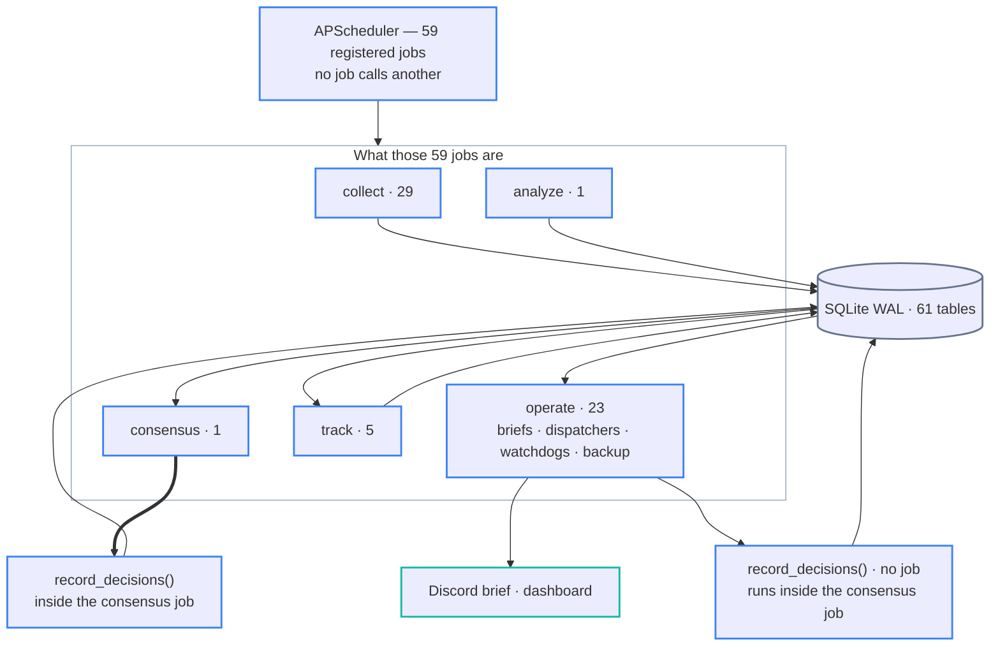
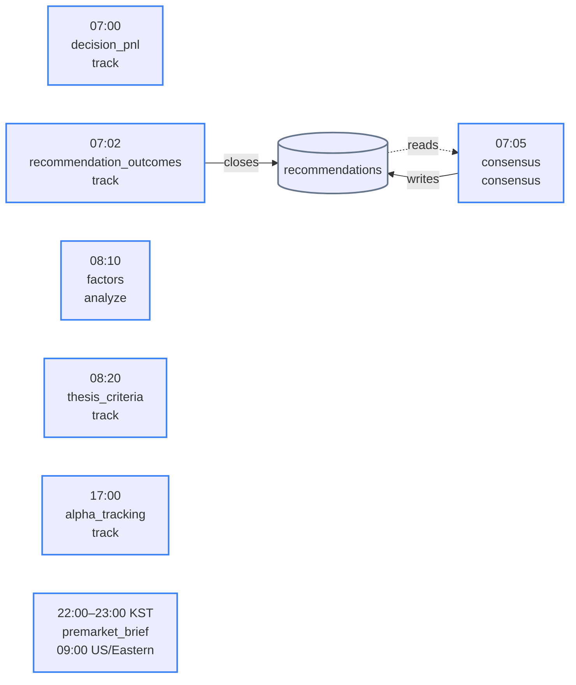
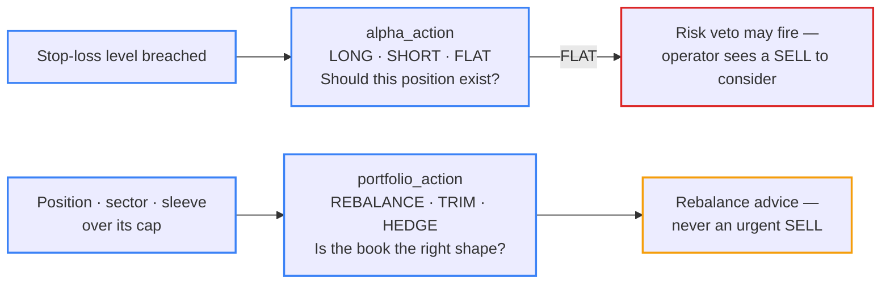

# Architecture Reference

Detailed reference for Nuri-Quant internals. This file is not auto-loaded; read it when working on cross-cutting concerns.

## Pipeline Phases (5-step)

The README shows the high-level flow. The table below gives one row per phase and points to the detail section below or to a peer document.

| # | Phase | Inputs | Outputs | Key modules | Detail |
|---|-------|--------|---------|-------------|--------|
| 1 | **Collect** | External APIs (yfinance · pykrx · KIS · Toss · FRED · Wikipedia · GoogleNews RSS · FINVIZ · ARK · Reddit) | `prices` · `fundamentals` · `macro` · `superinvestors` · `estimates` · `analyst_ratings` · `insider_trades` · `news` · `events` tables | `nuri/collectors/` (27 collectors, BaseCollector pattern) | [KIS_INTEGRATION.md](KIS_INTEGRATION.md) · `nuri/collectors/CLAUDE.md` |
| 2 | **Analyze** | Phase 1 tables | `signal_results.csv` + `signal_scorecard.csv` + `regime_transitions` + `factors` tables | `nuri/quant/regime/` · `nuri/quant/validation/` · `nuri/quant/factors/` · `nuri/llm/event_classifier.py` | "Signal System" and "Regime Classifier" below |
| 3 | **Consensus** | Phase 2 outputs + `portfolio` + `macro_events` | `recommendations` table rows with per-agent verdicts + weighted final action | `nuri/trading/agents/` (10 specialists + consensus engine, risk veto) | `nuri/trading/agents/CLAUDE.md` |
| 4 | **Decide** | The consensus result handed over in memory (`record_decisions()`), plus `prices` · `macro` · current regime for the decision context. The portfolio-wide certifier that used to read `config/rules.yaml siege_gates` was retired (#1619). | `decisions` + `decision_evidence` rows per consensus decision | `nuri/trading/engine/decisions.py` | "Decision Engine" below |
| 5 | **Track** | Phase 3 `recommendations.action` + actual prices after N days | `outcome_30d` / `outcome_60d` / `outcome_90d` (read back by Learning Memory for Phase 3 weights) + weekly per-agent accuracy snapshots in `strategy_memory` | `nuri/trading/recommend/tracker.py` + `nuri/trading/agents/consensus/learning_memory.py` | "C→D→E Data Flow" below |

The Serve layer (FastAPI `:8001`, Next.js `:3000`, Discord and Telegram) is a projection of the DB, not a pipeline phase. It is read-only apart from explicit write routes (portfolio edits, pipeline runs, memory snapshots); the certification routes that used to write a `certifications` row on every call were removed with the certifier (#1619). See the "API" and "Dashboard API" sections below.

## Runtime Topology

The phase table above is the data model. At runtime there is no orchestrator: `nuri/scheduler.py` registers independent APScheduler jobs, and each job reads its inputs from tables written by earlier jobs.



The thick arrow marks the one in-memory hand-off: the consensus job passes its result to `record_decisions()` as a Python object rather than through a table.

`decide` (named `certify` until #1619) has no job of its own: `record_decisions()` runs inside the consensus job. The portfolio-wide certifier that used to live in this stage is gone — the brief, the dashboard health and violations endpoints and `/api/certify` were detached and the engine module deleted; dashboard violations come from `rebalance_advisor.detect_violations()` (prudential constraints only, execution fields stripped). The `certifications` table stays as a historical ledger.

| Stage | Scheduled as | Reads | Writes |
|-------|--------------|-------|--------|
| **Collect** | 29 jobs, from every 5 minutes during market hours to weekly | External APIs | `prices`, `fundamentals`, `macro`, `news` |
| **Analyze** | 1 job: `factors` at `10 8 * * *` | `prices`, `fundamentals`, `macro` | `factors` |
| **Consensus** | 1 job: `consensus` at `5 7 * * *` | `recommendations.outcome_30d` (for weights), collector tables | `recommendations` with `agent_verdicts` |
| **Decide** | No dedicated job; `record_decisions()` runs inside the consensus job (see above) | Consensus result, handed over in memory | `decisions`, `decision_evidence` |
| **Track** | 5 jobs: `decision_pnl`, `recommendation_outcomes`, `thesis_criteria`, `alpha_tracking`, `agent_accuracy` | `recommendations`, `prices`, `decisions`, `theses`, `signals`, `factors`, `fundamentals` | `recommendations.outcome_{30,60,90}d`, `decision_outcomes`, `strategy_memory`, `thesis_criteria_checks`, `decisions` |

The stage directories are `nuri/collectors`, `nuri/analysis`, `nuri/trading/agents`, `nuri/trading/engine` and `nuri/trading/recommend`. Imports that cross these boundaries are allowed only inside function bodies, never at module level, and each one must be listed in an allowlist with a stated reason. `tests/core/test_cross_stage_imports.py` enforces this in both directions.

### Daily Schedule

The stage names describe data dependencies, not execution order. Because nothing chains the jobs, the schedule runs them in a different order:



Outcome tracking at 07:02 runs before the consensus job at 07:05, so consensus reads the windows closed on the previous day. `premarket_brief` is scheduled in `US/Eastern`, which places it in the late evening in Korea. Because every job reads its inputs from the database, each stage can be re-run independently.

## Decision Axes

Rules that respond to a broken investment thesis are kept separate from rules that respond to position sizing (`nuri/core/axis.py`).

| Axis | Values | Triggered by |
|------|--------|--------------|
| **alpha** | `LONG` / `SHORT` / `FLAT` | A change in the thesis. A stop-loss breach is the only mechanical path to `FLAT`. |
| **portfolio** | `REBALANCE` / `TRIM` / `HEDGE` | Sizing. Concentration, sector-cap and experiment-sleeve breaches are resolved here and never produce an urgent SELL. |



The risk veto reads `alpha_action` only, so an oversized position can lead to rebalancing advice but never to a sell instruction.

## Scoring Model

- **Factor composite** (`nuri/quant/factors/composite.py`): momentum 0.30, value 0.25, quality 0.25, sentiment 0.20. Sentiment is the market-wide Fear & Greed value, so it shifts the score level rather than the ranking. The `factors` job computes and stores it daily at 08:10.
- **BUY-candidate score** (`config/buy_signals.yaml`): combines the factor composite with 5-day momentum, RSI and 30-day breakout. Cross-sectional relative strength and dollar-volume surge are computed and shown as evidence but carry a weight of 0 until validated by a walk-forward test.
- **Signals** (`config/signals.yaml`): 20 per-ticker, actionable signals used by the backtest detectors, plus 2 market-wide shadow signals (yield-curve inversion and HY-OAS widening) marked `actionable: false` and surfaced as warnings only.

## DB as the Sole Integration Point

`nuri/core/db/connection.py` is the only module that imports `sqlite3`. The DB file is `data/portfolio.db` (WAL mode; override with `NURI_DB_PATH`). All upsert functions accept an optional `db_path`, which tests set to a `tmp_path` file for isolation. Schema versioning uses the `schema_version` table and the `_MIGRATIONS` list.

Key DB access patterns:

- `get_db()`: context manager; commits on success, rolls back on exception.
- `query(sql, params)` → `list[dict]` (`readonly=True` blocks writes at the engine level).
- `query_df(sql, params)` → pandas DataFrame.
- `upsert_*()`: one function per table (prices, portfolio, fundamentals, etc.).
- `replace_portfolio_account(account, records)`: DELETE + INSERT in one transaction for the YAML → DB sync.

## Signal System (22 signals: 20 actionable + 2 shadow, YAML-driven registry)

`signal_backtest.py` uses a detector registry: Python detector functions are kept separate from their metadata (thresholds, classification, hold_days). The metadata lives in `config/signals.yaml` and is loaded by `nuri/core/signal_config.py`. The YAML holds 22 entries: the 20 actionable signals below plus 2 market-wide shadow signals (`actionable: false`, detectors in `nuri/quant/validation/market_signals.py`). The actionable signals fall into 4 categories:

- **Price-based** (10): rsi_oversold/overbought, macd_golden/dead, sma_golden/dead, bb_bounce, volume_spike, gap_up, gap_down
- **Macro-based** (3): vix_reversal, pcr_reversal, yield_curve_recovery (require `merge_macro_data()`)
- **Data-dependent** (2): insider_cluster, short_squeeze (require `merge_data_signals()`)
- **Chart pattern** (5): macd_bullish_turn, macd_bearish_turn, bb_squeeze_breakout, near_52w_low_bounce, volume_profile_resistance

`SIGNAL_DEFINITIONS` is built by `_build_signal_definitions()` from the YAML and the detector registry. Threshold changes require a YAML edit only.

**Macro data quirk**: `us_3m_yield` (FRED) is absent in the yfinance fallback, where `^IRX` (13-week T-Bill) is stored as `us_2y_yield`. `merge_macro_data()` therefore queries `us_2y_yield` when `us_3m_yield` is empty.

## C→D→E Data Flow

The validation, regime and recommendation steps are connected by data, not imports:

1. **C-1** (`signal_backtest`) writes `signal_results.csv` and `signal_scorecard.csv` to `data/reports/YYYY-MM-DD/`.
2. **D-3** (`strategy_map.analyze_signal_by_regime()`) reads `signal_results.csv` and labels each trade with the regime at entry.
3. **E-1** (`candidates`) reads the regime-specific stats from D-3 to calibrate confidence scores.
4. **E-3** (`tracker`) saves E-1/E-2 outputs to the `recommendations` table for 30/60/90-day tracking.

Re-running C-1 updates the data that D-3 and E-1 use.

## Regime Classifier (6 base + 4 special)

Base regimes are `{bull,bear,sideways}_{low,high}_vol`, derived from SPY's position relative to SMA50/200 and from VIX, with adaptive hysteresis (5 days normally, 2 days when VIX ≥ 25).

Special regimes, in priority order, override the base `regime` field: euphoria, stagflation, recovery, sector_rotation. See `nuri/quant/regime/classifier.py`. The sector-rotation check compares SPY's 20-day return with each sector ETF's only when both windows end on the same date; an ETF whose collection has stalled is skipped rather than compared against a stale window (#1631).

`RegimeState.trend` and `.volatility` always reflect the base classification. `details["special_regime"]` is `None` or the special regime name, and `details["base_regime"]` always holds the base regime name.

`REGIME_ALLOCATION` covers all 10 regimes. `position.py` looks the regime up in `REGIME_ALLOCATION`; an unregistered regime fails closed (entry is treated as misaligned).

## Decision Engine

`nuri/trading/engine/` provides gated execution, conflict detection and learning memory. Confidence scoring in `candidates.py` combines regime win rate, profit factor, learning-memory drift, conflict penalties and regime fit.

The portfolio-wide certification layer was retired in 2026-10 ([`docs/STRATEGY.md` §6](STRATEGY.md), #1619); what remains in `nuri/trading/engine/` is the decision record (`decisions.py`), the hard-veto and amplifier gates (`gate.py`, `amplifier_gate.py`, STRATEGY §2.6), conflict detection, learning memory and the thesis verdict roll-up. Confidence scoring formula: [`docs/STRATEGY.md` §3.3](STRATEGY.md).

## Pipeline Observability

`nuri/core/events.py` is an append-only event journal. `emit_event()` records state transitions and always writes valid JSON to `payload` (#935). `get_pipeline_status()` returns the 5-stage status, and `get_timeline()` returns the history with `causation_id` for chain tracing.

`nuri/core/freshness.py` implements the data-freshness SLA. `check_freshness(key)` returns PASS, WARN or FAIL. The thresholds (`warn_hours` / `fail_hours` per source) live in `config/freshness.yaml` (#1181). `_load_config()` injects them at import and cross-checks the key set against `FRESHNESS_POLICIES` in both directions; a missing or extra key raises `ValueError`. Queries and labels stay in code. `VERDICT_GATE_KEYS` and `stale_verdict_inputs()` feed the stale gate of the dashboard verdict. Only FAIL blocks; WARN passes because weekend and holiday data age is normal.

`nuri/core/pipeline.py` records stage lifecycle events; it does not orchestrate. `STEP_DEPENDENCIES` declares the 5-stage DAG (`collect → analyze → consensus → decide → track`; `decide` was named `certify` until #1619). `run_step()` checks it and records events but does not enforce it in practice: its only caller is the scheduler, which passes `warn_only=True`, so an unmet dependency is recorded as a dependency warning and the job runs anyway (#894).

Pipeline control API (`nuri/api/routes/pipeline.py`):

- `GET /api/pipeline/status`: 5-stage status and record counts
- `POST /api/pipeline/{step}/run`: runs a step synchronously (does not go through `run_step()`)
- `GET /api/pipeline/timeline`: event log
- `GET /api/freshness`: data freshness report

Trade execution API (`nuri/api/routes/trades.py`):

- `POST /api/trades`: record a trade execution
- `GET /api/trades`: list trades (optional ticker filter)
- `PUT /api/trades/{id}`: update exit info

## Dashboard API (Projection-based, <5s)

`/api/dashboard` reads pre-computed results from the DB instead of running analysis inline. Consensus comes from the `recommendations` table (populated by `make consensus`). The response includes `freshness` and `pipeline_status` so the dashboard can show data age. The one-line `verdict` is stale-gated (#1181): when any `verdict_gate` input (`config/freshness.yaml`) is FAIL-stale, the response carries `verdict_level: "stale"` and `verdict_stale_inputs`, and the verdict text names the stale inputs instead of giving advice.

## API (68 endpoints)

`nuri/api/routes/` — 68 REST endpoints on port 8001, counted from `@router.get/post/put/delete/patch` decorators across 21 route modules. FastAPI's `/docs`, `/redoc`, `/openapi.json` and `/docs/oauth2-redirect` are excluded. Swagger UI is at `http://localhost:8001/docs`. Server-sent events are served at `/api/stream` (30s interval). `/api/coverage` (#297) feeds the Universe and Agent data coverage widget.

### Action-First Dashboard APIs (PR #264-#266)

| Endpoint | Method | Purpose |
|----------|--------|---------|
| `/api/actions` | GET | 우선순위 분류된 오늘의 액션 (🔴urgent/🟡check/🟦portfolio/✅hold). 연금/IRP 제외, 중복 제거. 각 항목에 `decision_id` + `as_of` (same-date `decisions` LEFT JOIN, #1182) — 프론트가 `/decisions/{id}` 증거 체인으로 링크 |
| `/api/opportunities` | GET | 비보유 이슈 종목 탐색 — scan + WSB + events 기반 찬성/반대/판정 |
| `/api/market-context` | GET | 시스템 건강 (regime/macro/freshness) + 매크로 이벤트 (한국어 카테고리) |
| `/api/backtest/equity` | GET | Equity curve + drawdown + metrics (Recharts frontend용 경량 데이터) |

## Scheduler

`nuri/scheduler.py` defines 59 cron jobs in the `SCHEDULES` list, plus a 1-minute `heartbeat` interval job. Times are KST unless a job sets its own timezone (`premarket_brief` runs on `US/Eastern`). Collector imports are deferred inside `_dispatch_collector()` to avoid import-time side effects. A daily `self_restart` job (08:40 KST) recycles the process to reclaim leaked yfinance file descriptors. The `stock_us_freshness` job (06:10 and 06:40 KST, Tuesday to Saturday) keeps the SPY measurement benchmark and the `freshness_tickers` current (§3.11).

## Environment Variables

Configured in `.env` (see `.env.example`) unless noted otherwise:

- `FRED_API_KEY`: FRED macro data (optional; yfinance fallback)
- `DISCORD_WEBHOOK_URL`: daily report (optional; stdout fallback)
- `DISCORD_TOKEN`: bot-mode alerts (optional)
- `FINNHUB_API_KEY`: US institutional flows (optional)
- `OLLAMA_HOST` / `OLLAMA_MODEL`: LLM report via a local Ollama server (optional; `OLLAMA_HOST` unset disables it and must point to localhost; `OLLAMA_MODEL` defaults to `qwen3.5`)
- `NURI_DB_PATH`: SQLite DB location override (optional; default `data/portfolio.db`)
- `DASHBOARD_PASSWORD`: Next.js auth (optional; unset means public)
- `TELEGRAM_BOT_TOKEN` / `TELEGRAM_CHAT_ID`: Telegram alerts (optional)
- `ALPACA_API_KEY` / `ALPACA_SECRET_KEY`: paper trading (optional; DryRun fallback)
- `KIS_PROD_APP_KEY` / `KIS_PROD_APP_SECRET`: KIS Open API live (optional; falls back to `config/kis/kis_devlp.yaml`, gitignored)
- `KIS_PAPER_APP_KEY` / `KIS_PAPER_APP_SECRET`: KIS Open API paper (optional)
- `TOSS_API_KEY` / `TOSS_SECRET_KEY` / `TOSS_ACCOUNT_SEQ`: Toss Open API (optional; IP allowlist, so dev machines receive 403 and skip gracefully)
- `NURI_ROLE`: the value `production` gates two things: §3.11 ledger-backed surfacing (the monthly alpha progress report is staged to `#brief` only when set) and the off-box dead-man heartbeat push (`nuri/alerts/offbox_heartbeat.py`, #1191 option C; a no-op on dev machines). Adjudication runs on the Mac mini DB; the MBP is a read replica, so dev numbers must not reach the brief. Set it in `scripts/launchd/com.nuri-quant.scheduler.plist` under `EnvironmentVariables`, not in `.env`: `make deploy-mini` copies the MBP `.env` over the mini's, so a value kept in `.env` is overwritten by the next deploy (the same applies to `DEV2_HOST`).
- `API_SECRET_KEY`: JWT signing key (required in production, optional in dev). When unset, `nuri/api/auth.py` generates a new `secrets.token_hex(32)` at each start, so all outstanding JWTs become invalid on restart and dashboard users must log in again. Generate one with `python3 -c "import secrets; print(secrets.token_hex(32))"`. Because `make deploy-mini` copies the local `.env` onto the Mac mini, the same value must exist in both `.env` files; otherwise a deploy reverts production to a random per-start key.

## DB Schema (SQLite, WAL mode)

61 tables total (66 migrations as of 2026-10-06). Key tables:

| Table | Purpose |
|-------|---------|
| `prices` | OHLCV 5Y daily bars per ticker. `close` is never NULL: `upsert_prices` drops yfinance's unsettled half rows (#1480) and migration 66 purged the rows written before that (#1630) |
| `portfolio` | Holdings (account, ticker, qty, avg_price) |
| `macro` | FRED indicators + Fear&Greed |
| `signals` | TA-Lib technical indicators |
| `fundamentals` | PE, ROE, margins, growth, beta |
| `superinvestors` | 13F holdings (Buffett, etc.) |
| `estimates` | Analyst consensus + target prices |
| `recommendations` | Daily recs + 30/60/90d outcome tracking (E-3, user-facing emit) |
| `decisions` | #178 Decision Intelligence — rich record (regime/macro/event/agent_verdicts/scoring_detail/dissent/pnl_7/30/60/90d) |
| `agent_decisions` | #33 + #529 Phase 2 actor #8 — production state machine (decision_id, action, conviction, inputs_json with run_id, status pending/emitted/blocked/superseded) |
| `decision_evidence` | #178 lineage — per-decision evidence rows for audit reproducibility |
| `decision_outcomes` | #529 Phase 2 actor #11 — Forward-Outcome-Tracker closed-loop (realized return, alpha, hit threshold at 7/14/30d) |
| `positions` | Long/Short strategy positions |
| `swing_trades` | Market-wide swing trade positions |
| `strategy_memory` | Signal performance snapshots (append-only) |
| `analyst_ratings` | Upgrade/downgrade history |
| `earnings_surprises` | EPS actual vs estimate |
| `insider_trades` | Insider buy/sell transactions |
| `schema_version` | Migration version tracking |
| `pipeline_events` | Append-only event journal |
| `trades` | Trade execution records |

Additional: `agent_audit_ledger`, `agent_messages`, `agent_run_ledger`, `ark`, `ark_source_dates`, `audit_log`, `backtests`, `candidate_ledger`, `candidate_runs`, `causal_audits`, `certifications`, `challenger_attempts`, `collector_runs`, `discord_outbox`, `dr_replicas`, `drift_alerts`, `etf_flows`, `events`, `execution_blocks`, `external_analysis`, `external_llm_calls`, `factors`, `feature_flags`, `foundation_benchmarks`, `held_add_shadow`, `held_add_would_fire`, `hypotheses`, `incidents`, `institutional_flows`, `macro_events`, `maintenance_candidates`, `market_postmortem`, `news`, `regime_posteriors`, `regime_transitions`, `theses`, `thesis_criteria`, `thesis_criteria_checks`, `thesis_evidence`, `walkforward_runs`.

### Three decision-related tables — intentional, not duplicate

The `recommendations`, `decisions` and `agent_decisions` tables look redundant but serve distinct purposes:

| Table | Era | Role | Cardinality | Lifecycle |
|---|---|---|---|---|
| `recommendations` | E-3 (legacy, pre-#178) | User-facing emit + 30/60/90d outcome backfill. Source of truth for "what we told the user." | 1 row per (date, ticker) emit | `outcome_30d/60d/90d` filled by `tracker.py` |
| `decisions` | #178 Decision Intelligence (2026) | Analytical record with rich features (regime, macro_score, event_score, scoring_detail, dissent, agent_verdicts) for backtest/learning. | 1 row per (date, ticker) decision computation | `outcome` enum + `pnl_7/30/60/90d` |
| `agent_decisions` | #33 + #529 Phase 2 actor #8 | Production state machine with run_id traceability (`inputs_json` references regime_run / hypothesis / causal_audit IDs). Status lifecycle prevents race conditions and tracks block reasons. | N rows per (ticker, date) — one per state transition or revision | `status ∈ {pending, emitted, blocked, superseded}` with `decision_outcomes` closing the loop |

Why all three coexist:

- `recommendations` is the user-facing contract; its format must not break.
- `decisions` is the research dataset; its columns map 1:1 to the features the Learning Memory layer studies.
- `agent_decisions` is the auditable production record; `decision_id` joins to `decision_outcomes` for the #529 closed-loop validation.

The overlap between `decisions` and `agent_decisions` is intentional. Removing either would lose research expressiveness or production auditability.

## DB Migrations

Add incremental schema changes to `_MIGRATIONS` in `nuri/core/db_migrations.py` (extracted from `db.py` in PR #553 P2 Stage 1):

```python
_MIGRATIONS: list[tuple[int, str, str]] = [
    (1, "add column foo to prices", "ALTER TABLE prices ADD COLUMN foo TEXT;"),
]
```

`init_db()` applies any unapplied migrations and records them in the `schema_version` table.

## Config Files (`config/`)

- `portfolio.yaml`: accounts and holdings (gitignored; see `portfolio.example.yaml` for the shape)
- `stock_types.yaml`: growth/value override per ticker; controls stop-loss and take-profit thresholds
- `agents.yaml`: agent thresholds and confidence normalization scales (including `smart_money.freshness` per-source max age, #1187); loaded via `nuri/core/agent_config.py`
- `alerts.yaml`: alert thresholds and report timing
- `freshness.yaml`: data-freshness SLA thresholds (`warn_hours` / `fail_hours` per source) and the `verdict_gate` input list; loaded by `_load_config()` in `nuri/core/freshness.py`
- `rules.yaml`: investment rules; loaded via `nuri/core/rules.py`
- `signals.yaml`: signal metadata (thresholds, categories, hold_days)

## Scripts (`scripts/`)

Scripts are grouped in category subdirectories since #557. The full per-script index is `scripts/README.md`.

- `dev/setup.sh`: creates `.venv` via `uv` and installs dependencies
- `db/migrate.py`: DB schema creation and migration runner (`db/backup.sh`: 30-day rolling DB backup)
- `ops/import_portfolio.py`: syncs `config/portfolio.yaml` → DB
- `verify/verify.py`: master verification orchestrator → `data/reports/YYYY-MM-DD/`
- `verify/gate_check.py`: pipeline gate verifier (exits 1 if BLOCKED)
- `verify/check_privacy_leak.py`: privacy scanner (broker names, monetary literals, ticker+PnL, personal-identifier shapes)
- `verify/pre_push_check.sh`: pre-push gate (drift, lint, doc counts, tests, privacy, commit format)
- `deploy/deploy_remote.sh`: rsync from dev to the Mac mini production host
- `deploy/sync_dev.sh`: dev↔dev state sync (gitignored files + ~/.claude Tier 3)
- `deploy/autopull_receiver.sh`: Mac mini receiver (launchd 5-minute auto-pull)
- `launchd/`: 9 plists (including `com.nuri-quant.api` / `com.nuri-quant.dashboard` KeepAlive, #838) and install/uninstall scripts

## Data Directory

```text
data/
├── portfolio.db      # Main SQLite DB (WAL mode)
├── reports/          # Pipeline outputs: data/reports/YYYY-MM-DD/
│   └── YYYY-MM-DD/   # signal_results.csv, signal_scorecard.csv, portfolio_action_plan.md, evidence/
├── backups/          # 30-day rolling DB backups
└── exports/          # Ad-hoc exports
```

## Testing

8,250 backend tests across 388 files + 1,674 frontend vitest (141 files) + 88 Playwright E2E (10 spec files). 백엔드 수·파일 수는 `verify_doc_counts.sh` 가 검사하지만 프론트/E2E 테스트 수는 검사하지 않는다. `vitest list` 가 생성형 테스트를 빼고 세기 때문에(1,604 vs 1,746) 값싼 게이트가 없다. 재측정은 `cd frontend && npx vitest run` · `npx playwright test --list` (2026-09-29 실측).

Tests run with `pytest-xdist`. CI shards use `-n 8 --dist worksteal` because the suite is wait-bound (2x oversubscription on 4-core runners, #1414); local runs keep `-n auto`. Codecov enforces a 1% relative regression gate.

Backend statement coverage was 99% on 2026-08-14 (`make ci-cov` on the `#1052` main run): 17 of 23,311 statements uncovered across 9 files, 81 partial branches. Full coverage (0 uncovered of 22,560) was reached on 2026-05-06 and again on 2026-07-29 (#926) and regressed both times, so 100% is a target to re-reach rather than a standing property. `make ci-cov` (which combines every coverage shard artifact of the latest main CI run; the shard count follows the workflow matrix, #1413) is the reference measurement, because a local run measures a different statement set.

**Slow marker**: 27 LLM/heavy tests are marked `@pytest.mark.slow`. PR CI uses `-m "not slow"`. Use `make test-fast` locally (81.2s, `-n auto --dist worksteal`, M5 Max 2026-08-14).

```python
@pytest.fixture
def db_path(tmp_path):
    path = tmp_path / "test.db"
    init_db(path)
    return path
```

Pass `db_path` to all DB functions. An autouse fixture in `tests/conftest.py` mocks `yfinance.download` (empty DataFrame) and `yfinance.Ticker` (stub), so all tests run without network access.

### Verifying Numeric Claims

```bash
# Tests
.venv/bin/python -m pytest tests/ --collect-only -q | tail -1   # backend
find tests -name "test_*.py" -type f | wc -l                     # backend files
cd frontend && npx vitest run | tail -5                          # frontend
cd frontend && npx playwright test --list | tail -1              # Playwright E2E (loop-generated tests included)
# Architecture
ls nuri/collectors/*.py | grep -vE 'base|__init__' | wc -l       # collectors
ls nuri/trading/agents/*.py | grep -vE 'base|__init__|consensus|config' | wc -l  # agents
.venv/bin/python -c "from nuri.quant.validation.signal_backtest import SIGNAL_DEFINITIONS; print(len(SIGNAL_DEFINITIONS))"
.venv/bin/python -c "from nuri.trading.strategy.longshort import REGIME_ALLOCATION; print(len(REGIME_ALLOCATION))"
grep -rhE "@router\.(get|post|put|delete|patch)" nuri/api/routes/ | wc -l
make verify-doc-counts   # DB tables — live init_db count (DDL lives in nuri/core/db_migrations.py)
find frontend/src/app -name "page.tsx" | wc -l
```

If a count disagrees with this document, fix the document.

## CI/CD Pipeline (`main-ci-cd.yml`)

On push and pull request to `main`:

1. **Lint**: `ruff check nuri/ tests/ scripts/`
2. **Test**: pytest with xdist in a fast-shard matrix, plus 2 slow shards that run on push only (shard counts are defined in `main-ci-cd.yml`). TA-Lib is cached. Dependencies are installed with `uv sync --frozen --extra dev`; the `local-llm` extra is excluded on purpose (#1406, sdist compile). A separate `Local-LLM Build Gate` job (required check) builds and imports the locked `llama-cpp-python` once, only when `pyproject.toml` or `uv.lock` changes. Per-test DB isolation copies go to tmpfs via `NURI_TEST_DB_DIR=/dev/shm/nuri-test-db` (#1414). Push-to-main shards also record per-test durations (`--store-durations --clean-durations`) and upload `durations-fast-N` artifacts; `make sync-test-durations-from-ci` rebuilds `.test_durations` from the latest runs (fail-closed merge + cross-run median, `scripts/ci/merge_test_durations.py`).
3. **Frontend**: `tsc --noEmit` + vitest with coverage; Playwright E2E runs in the `Frontend E2E` job, which is not a required check
4. **Privacy**: `check_privacy_leak.py` on all files
5. **Security**: Trivy CRITICAL vulnerability scan
6. **Quick Checks**: `make spellcheck-ci` and a 5MB file-size limit (#1560)
7. **Lock boundaries**: `uv.lock Major Boundary` / `package-lock.json Major Boundary` reject a major (or direct-dependency 0.x minor) bump without the `lock-bump-reviewed` label (#1364/#1367/#1551)

PR-specific (`pr-discipline.yml`): commit-count gate (at most 3 commits; escape label `scope-expand-approved`).

On PR close (`cache-cleanup.yml`): deletes the GitHub Actions caches stored under that PR's `refs/pull/N/merge` ref so they do not crowd live `main` caches out of the 10GB repository cache limit.

Scheduled (`heartbeat-watch.yml`, #1191 option C): every 20 minutes (cron `7,27,47 * * * *`; off-peak minutes are used because `*/N` schedules can be delayed or dropped under load) the workflow reads the `refs/nuri/heartbeat-mini` ref. This is a custom, non-branch ref, so it does not appear in the branch list. The mini scheduler updates it every 10 minutes by force-pushing an empty-tree commit with `git push --force`. When the heartbeat is older than 45 minutes, the workflow posts to `#ops` via the `DISCORD_WEBHOOK_OPS` secret. The alarm is triggered by the sender's silence, because a host that is down cannot report itself.

## Investment Rules

All investment rules (stop-loss, take-profit, account strategy profiles, VIX gate, execution priority, buy checklist) live in `config/rules.yaml` and are documented canonically in [`docs/STRATEGY.md` §3.4 / §3.5](STRATEGY.md). Source code executes the YAML via `nuri/core/rules.py` (§2.2 mechanical execution, no hardcoded thresholds).

## Currency Handling

The multi-account portfolio mixes USD and KRW. Exchange-rate fallback order: DB `macro` table → yfinance `KRW=X` → `StaleExchangeRateError` (no hardcoded fallback). A warning is logged when the rate is more than 7 days old. `.KS` tickers are always KRW.

## Portfolio Action Plan Format

Save to `data/reports/YYYY-MM-DD/portfolio_action_plan.md`. Required sections: market environment table (regime, VIX, F&G, macro), per-stock verdict with external data cross-reference, execution timeline, re-entry conditions, and buy priority by multi-factor score.

Every recommendation must include explicit price levels: entry, stop-loss, target_1, target_2, trailing stop, TipRanks target.

## MCP Integration

`.mcp.json` registers the Tier 1 read-model MCP server `nuri-read` (#1306), implemented in `nuri/mcp/server.py` (stdio only):

```json
{"mcpServers": {"nuri-read": {"command": "uv", "args": ["run", "--no-sync", "python", "-m", "nuri.mcp.server"]}}}
```

Tools: `buy_candidates` · `macro_facts` · `data_freshness` · `live_quote` (#1626: caller-supplied tickers, up to 10, yfinance `fast_info`, reads no database; `siege_status` removed with the certifier, #1619; `macro_facts` reads its regime from `candidate_runs`). The server reads `NURI_DB_PATH` when set, otherwise the newest production replica in `data/replicas/` (hourly, from `state_replicator.sh`), otherwise the default DB — on a development machine that default is not the ledger and can be weeks old (#1617). `data_freshness` reports the source kind, the replica file age and the latest VIX / candidate-run dates, and flags the source as stale when the replica is older than 3 hours, when the latest VIX date is more than 5 days old or the latest candidate run more than 3 days old (KST calendar; `premarket_brief` writes a candidate run every weekday, so it doubles as a heartbeat), or when the file cannot be read (an interrupted `rsync --partial` push can leave a truncated replica); it never returns a path, because the replica filename contains the mini's hostname. Every query runs with `readonly=True` (`mode=ro` URI + `PRAGMA query_only=ON`, enforced by the engine), and only the columns in the module's `ALLOWED` dict can appear in SQL. The `decisions` table is excluded entirely because it would reveal holdings, and candidates expose `disposition='emitted'` rows only. The raw SQLite server (`nuri-db` → `mcp-server-sqlite`) was removed from the committed config (#1306 codex P1) because arbitrary SQL can reach `portfolio` and `trades`; it remains a per-machine opt-in, not a repository default.
